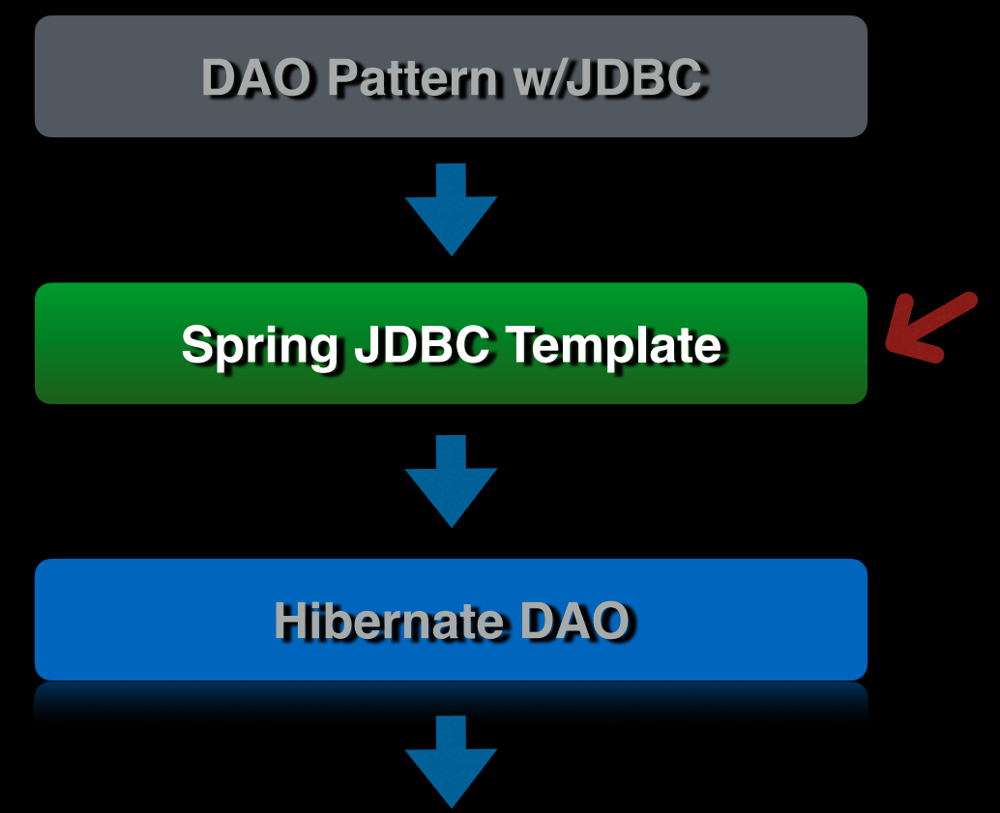

## 73 - Introduction



## 74 - Introduction to Spring JDBC Template

let's create a RowMapper for the Author class.

```java
package chamara.springdatajpasample.sdjpademo.doa;

import chamara.springdatajpasample.sdjpademo.domain.Author;
import org.springframework.jdbc.core.RowMapper;

import java.sql.ResultSet;
import java.sql.SQLException;

public class AuthorRowMapper implements RowMapper<Author> {
    @Override
    public Author mapRow(ResultSet resultSet, int i) throws SQLException {
        Author author = new Author();
        author.setId(resultSet.getLong("id"));
        author.setFirstName(resultSet.getString("first_name"));
        author.setLastName(resultSet.getString("last_name"));
        return author;
    }
}
```

## 75 - Create Row Mapper

```java
package chamara.springdatajpasample.sdjpademo.doa;


private RowMapper<Author> getRowMapper() {
    return new AuthorRowMapper();
}

;
}

```

## 76 - Implement Get Author By Id

```java
package chamara.springdatajpasample.sdjpademo.doa;

import chamara.springdatajpasample.sdjpademo.domain.Author;
import org.springframework.jdbc.core.JdbcTemplate;
import org.springframework.jdbc.core.RowMapper;
import org.springframework.stereotype.Component;

@Component
public class AuthorDoaImpl implements AuthorDoa {

    private final JdbcTemplate jdbcTemplate;

    public AuthorDoaImpl(JdbcTemplate jdbcTemplate) {
        this.jdbcTemplate = jdbcTemplate;
    }

    @Override
    public Author getAuthorById(Long id) {
        return jdbcTemplate.queryForObject("SELECT * FROM author WHERE id = ?", getRowMapper(), id);
    }

    @Override
    public Author findAuthorByFirstName(String firstName) {
        return null;
    }

    @Override
    public Author saveAuthor(Author author) {
        return null;
    }

    @Override
    public Author updateAuthor(Author author) {
        return null;
    }

    @Override
    public Author deleteAuthor(Long id) {
        return null;
    }

    private RowMapper<Author> getRowMapper() {
        return new AuthorRowMapper();
    }
}

```

let's test the getAuthorById method.

```java

@Test
void testGetAuthor() {

    Author author = authorDao.getAuthorById(1L);

    assertThat(author).isNotNull();

}
```

## 77 - Implement Find Author By Name

```java

@Override
public Author findAuthorByFirstName(String firstName) {
    return jdbcTemplate.queryForObject("SELECT * FROM author WHERE first_name = ?", getRowMapper(), firstName);
}

```

let's test the findAuthorByFirstName method.

```java

@Test
void testGetAuthor() {

    Author author = authorDao.getAuthorById(1L);

    assertThat(author).isNotNull();

}
```

## 78 - Save New Author

```java

@Override
public Author saveAuthor(Author author) {
    jdbcTemplate.update("INSERT INTO author (first_name, last_name) VALUES (?, ?)", author.getFirstName(), author.getLastName());
    return jdbcTemplate.queryForObject("SELECT id, first_name, last_name FROM author WHERE first_name = ? AND last_name = ?", getRowMapper(), author.getFirstName(), author.getLastName());
}
```

```java

@Test
void testSaveAuthor() {
    Author author = new Author();
    author.setFirstName("Chamara");
    author.setLastName("Thompson");
    Author saved = authorDao.saveAuthor(author);

    assertThat(saved).isNotNull();
}
```

## 79 - Update Author

```java

@Override
public Author updateAuthor(Author author) {
    jdbcTemplate
            .update(
                    "UPDATE author SET first_name = ?, last_name = ? WHERE id = ?",
                    author.getFirstName(),
                    author.getLastName(),
                    author.getId());
    return jdbcTemplate.queryForObject("SELECT * FROM author WHERE id = ?", getRowMapper(), author.getId());
}
```

```java

@Test
void testUpdateAuthor() {
    Author author = new Author();
    author.setFirstName("john1111");
    author.setLastName("t1111");

    Author saved = authorDao.saveAuthor(author);

    saved.setLastName("Thompson");
    Author updated = authorDao.updateAuthor(saved);

    assertThat(updated.getLastName()).isEqualTo("Thompson");
}
```

## 80 - Delete Author

## 81 - Implement Author with List of Books

