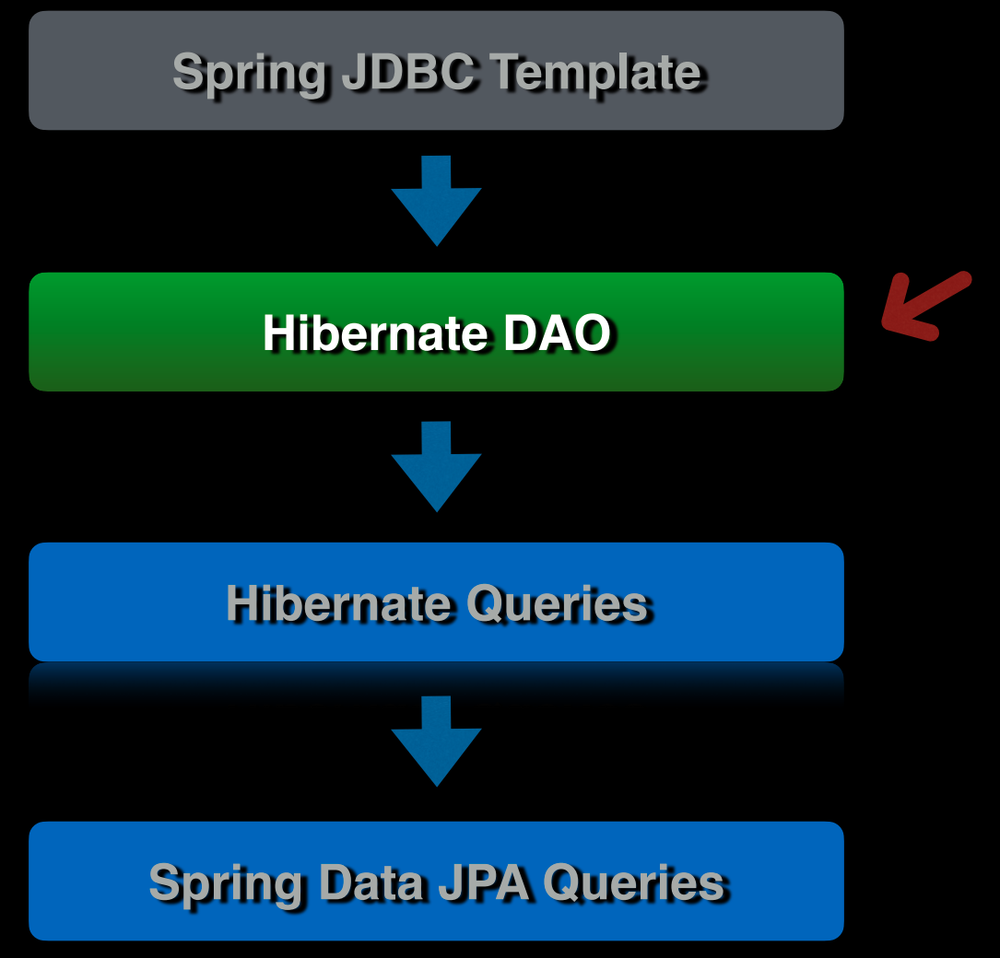
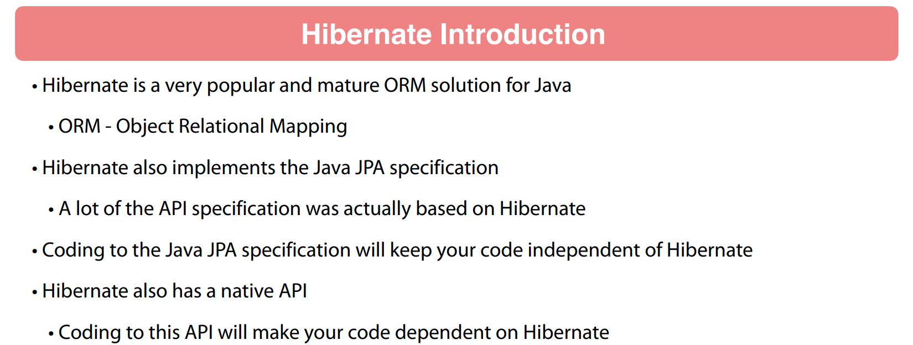
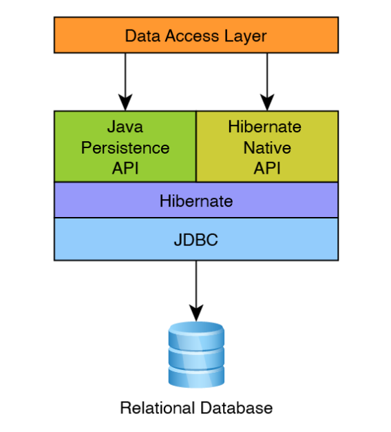
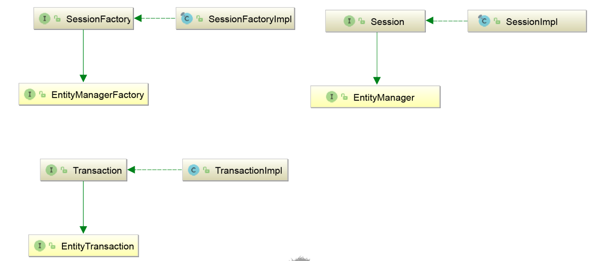
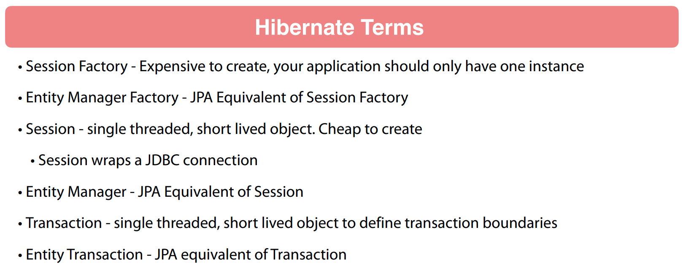
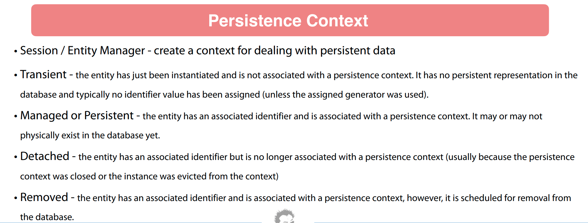
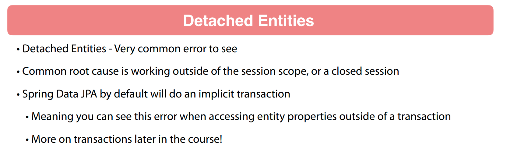
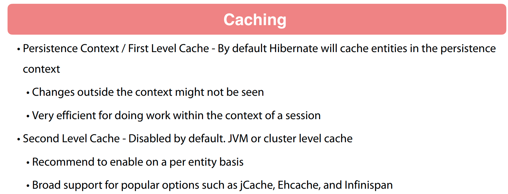
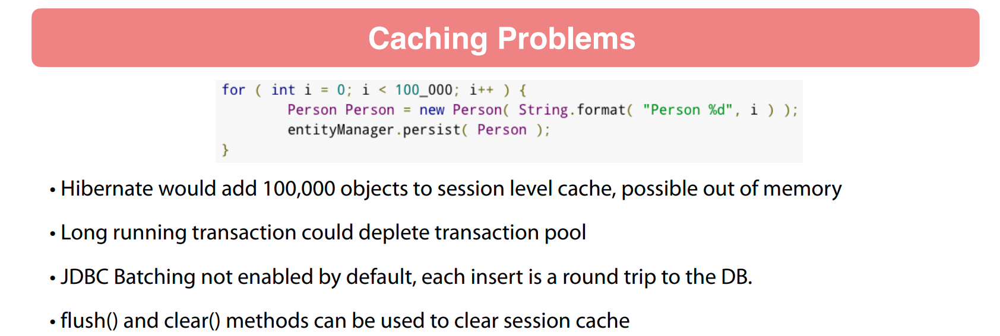

## 82 - Introduction



## 83 - Introduction to Hibernate










## 84 - Project Code Review

## 85 - Implement Get Author By Id

```java
package chamara.springdatajpasample.sdjpademo.doa;

import chamara.springdatajpasample.sdjpademo.domain.Author;
import jakarta.persistence.EntityManager;
import jakarta.persistence.EntityManagerFactory;
import org.springframework.stereotype.Component;

@Component
public class AuthorDaoImpl implements AuthorDoa {
    private final EntityManagerFactory emf;

    public AuthorDaoImpl(EntityManagerFactory emf) {
        this.emf = emf;
    }

    @Override
    public Author getById(Long id) {
        return getEntityManager().find(Author.class, id);
    }

    @Override
    public Author findAuthorByName(String firstName, String lastName) {
        return null;
    }

    @Override
    public Author saveNewAuthor(Author author) {
        return null;
    }

    @Override
    public Author updateAuthor(Author author) {
        return null;
    }

    @Override
    public void deleteAuthorById(Long id) {

    }

    private EntityManager getEntityManager() {
        return emf.createEntityManager();
    }
}
```

## 86 - Implement Find Author By Name

```java
package chamara.springdatajpasample.sdjpademo.doa;

import chamara.springdatajpasample.sdjpademo.domain.Author;
import jakarta.persistence.EntityManager;
import jakarta.persistence.EntityManagerFactory;
import jakarta.persistence.TypedQuery;
import org.springframework.stereotype.Component;

@Component
public class AuthorDaoImpl implements AuthorDoa {
    private final EntityManagerFactory emf;

    public AuthorDaoImpl(EntityManagerFactory emf) {
        this.emf = emf;
    }

    @Override
    public Author getById(Long id) {
        return getEntityManager().find(Author.class, id);
    }

    @Override
    public Author findAuthorByName(String firstName, String lastName) {
        TypedQuery<Author> query = getEntityManager()
                .createQuery("SELECT a FROM Author a WHERE a.firstName = :firstName AND a.lastName = :lastName", Author.class);
        query.setParameter("firstName", firstName);
        query.setParameter("lastName", lastName);

        return query.getSingleResult();
    }

    @Override
    public Author saveNewAuthor(Author author) {
        return null;
    }

    @Override
    public Author updateAuthor(Author author) {
        return null;
    }

    @Override
    public void deleteAuthorById(Long id) {

    }

    private EntityManager getEntityManager() {
        return emf.createEntityManager();
    }
}
```

```java

@Test
void testGetAuthorByName() {
    Author author = authorDao.findAuthorByName("Craig", "Walls");

    assertThat(author).isNotNull();
}
```

## 87 - Save New Author

```java
package chamara.springdatajpasample.sdjpademo.doa;

import chamara.springdatajpasample.sdjpademo.domain.Author;
import jakarta.persistence.EntityManager;
import jakarta.persistence.EntityManagerFactory;
import jakarta.persistence.TypedQuery;
import org.springframework.stereotype.Component;

@Component
public class AuthorDaoImpl implements AuthorDoa {
    private final EntityManagerFactory emf;

    public AuthorDaoImpl(EntityManagerFactory emf) {
        this.emf = emf;
    }

    @Override
    public Author getById(Long id) {
        return getEntityManager().find(Author.class, id);
    }

    @Override
    public Author findAuthorByName(String firstName, String lastName) {
        TypedQuery<Author> query = getEntityManager()
                .createQuery("SELECT a FROM Author a WHERE a.firstName = :firstName AND a.lastName = :lastName", Author.class);
        query.setParameter("firstName", firstName);
        query.setParameter("lastName", lastName);

        return query.getSingleResult();
    }

    @Override
    public Author saveNewAuthor(Author author) {
        EntityManager em = getEntityManager();
        em.getTransaction().begin();
        em.persist(author);
        em.flush();
        em.getTransaction().commit();
        return author;
    }

    @Override
    public Author updateAuthor(Author author) {
        return null;
    }

    @Override
    public void deleteAuthorById(Long id) {

    }

    private EntityManager getEntityManager() {
        return emf.createEntityManager();
    }
}
```

```java

@Test
void testSaveAuthor() {
    Author author = new Author();
    author.setFirstName("John");
    author.setLastName("Thompson");
    Author saved = authorDao.saveNewAuthor(author);

    assertThat(saved).isNotNull();
    assertThat(saved.getId()).isNotNull();
}
```

## 88 - Update Author

```java
package chamara.springdatajpasample.sdjpademo.doa;

import chamara.springdatajpasample.sdjpademo.domain.Author;
import jakarta.persistence.EntityManager;
import jakarta.persistence.EntityManagerFactory;
import jakarta.persistence.TypedQuery;
import org.springframework.stereotype.Component;

@Component
public class AuthorDaoImpl implements AuthorDoa {
    private final EntityManagerFactory emf;

    public AuthorDaoImpl(EntityManagerFactory emf) {
        this.emf = emf;
    }

    @Override
    public Author getById(Long id) {
        return getEntityManager().find(Author.class, id);
    }

    @Override
    public Author findAuthorByName(String firstName, String lastName) {
        TypedQuery<Author> query = getEntityManager()
                .createQuery("SELECT a FROM Author a WHERE a.firstName = :firstName AND a.lastName = :lastName", Author.class);
        query.setParameter("firstName", firstName);
        query.setParameter("lastName", lastName);

        return query.getSingleResult();
    }

    @Override
    public Author saveNewAuthor(Author author) {
        EntityManager em = getEntityManager();
        em.getTransaction().begin();
        em.persist(author);
        em.flush();
        em.getTransaction().commit();
        return author;
    }

    @Override
    /*
     * This method is used to update an existing author in the database.
     * It first retrieves an instance of EntityManager from the EntityManagerFactory.
     * Then it joins the current transaction, if there is one active.
     * The provided author object is merged with the current persistence context.
     * The state of the provided author object is synchronized with the database.
     * The persistence context is then cleared to remove any entities that it might be managing.
     * Finally, it finds and returns the updated author from the database using the author's id.
     *
     * @param author The author object to be updated. This should be a managed entity, i.e., one retrieved from the database.
     * @return The updated author object from the database.
     */
    public Author updateAuthor(Author author) {
        EntityManager em = getEntityManager();
        em.joinTransaction();
        em.merge(author);
        em.flush();
        em.clear();
        return em.find(Author.class, author.getId());
    }

    @Override
    public void deleteAuthorById(Long id) {

    }

    private EntityManager getEntityManager() {
        return emf.createEntityManager();
    }
}
```

```java

@Test
void testSaveAuthor() {
    Author author = new Author();
    author.setFirstName("John");
    author.setLastName("Thompson");
    Author saved = authorDao.saveNewAuthor(author);

    assertThat(saved).isNotNull();
    assertThat(saved.getId()).isNotNull();
}
```

## 89 - Delete Author

```java
package chamara.springdatajpasample.sdjpademo.doa;

import chamara.springdatajpasample.sdjpademo.domain.Author;
import jakarta.persistence.EntityManager;
import jakarta.persistence.EntityManagerFactory;
import jakarta.persistence.TypedQuery;
import org.springframework.stereotype.Component;

@Component
public class AuthorDaoImpl implements AuthorDoa {
    private final EntityManagerFactory emf;

    public AuthorDaoImpl(EntityManagerFactory emf) {
        this.emf = emf;
    }

    @Override
    public Author getById(Long id) {
        return getEntityManager().find(Author.class, id);
    }

    @Override
    public Author findAuthorByName(String firstName, String lastName) {
        TypedQuery<Author> query = getEntityManager()
                .createQuery("SELECT a FROM Author a WHERE a.firstName = :firstName AND a.lastName = :lastName", Author.class);
        query.setParameter("firstName", firstName);
        query.setParameter("lastName", lastName);

        return query.getSingleResult();
    }

    @Override
    public Author saveNewAuthor(Author author) {
        EntityManager em = getEntityManager();
        em.getTransaction().begin();
        em.persist(author);
        em.flush();
        em.getTransaction().commit();
        return author;
    }

    @Override
    /*
     * This method is used to update an existing author in the database.
     * It first retrieves an instance of EntityManager from the EntityManagerFactory.
     * Then it joins the current transaction, if there is one active.
     * The provided author object is merged with the current persistence context.
     * The state of the provided author object is synchronized with the database.
     * The persistence context is then cleared to remove any entities that it might be managing.
     * Finally, it finds and returns the updated author from the database using the author's id.
     *
     * @param author The author object to be updated. This should be a managed entity, i.e., one retrieved from the database.
     * @return The updated author object from the database.
     */
    public Author updateAuthor(Author author) {
        EntityManager em = getEntityManager();
        em.joinTransaction();
        em.merge(author);
        em.flush();
        em.clear();
        return em.find(Author.class, author.getId());
    }

    @Override
    /*
     * This method is used to delete an author from the database by their id.
     * It first retrieves an instance of EntityManager from the EntityManagerFactory.
     * Then it begins a new transaction.
     * It finds the author in the database using the provided id and assigns it to a local variable.
     * The found author is then removed from the database.
     * The state of the database is then synchronized by flushing the EntityManager.
     * Finally, the transaction is committed to permanently remove the author from the database.
     *
     * @param id The id of the author to be deleted.
     */
    public void deleteAuthorById(Long id) {

        EntityManager em = getEntityManager();
        em.getTransaction().begin();
        Author author = em.find(Author.class, id);
        em.remove(author);
        em.flush();
        em.getTransaction().commit();

    }

    private EntityManager getEntityManager() {
        return emf.createEntityManager();
    }
}
```

```java

@Test
void testDeleteAuthor() {
    Author author = new Author();
    author.setFirstName("john");
    author.setLastName("t");

    Author saved = authorDao.saveNewAuthor(author);

    authorDao.deleteAuthorById(saved.getId());

    Author deleted = authorDao.getById(saved.getId());

    assertThat(deleted).isNull();

}

```
      