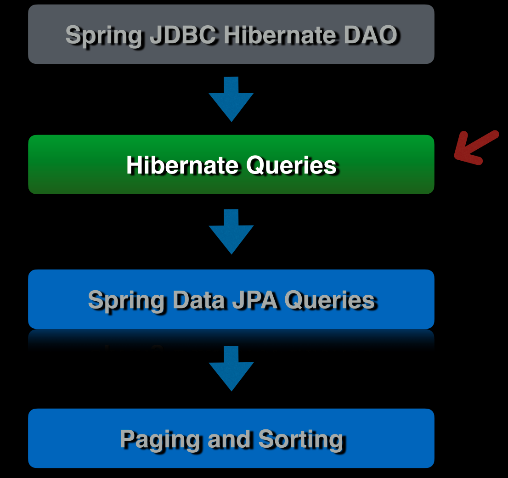

## 90 - Introduction



## 91 - Query

```java
package chamara.springdatajpasample.sdjpademo.doa;

import chamara.springdatajpasample.sdjpademo.domain.Author;
import jakarta.persistence.EntityManager;
import jakarta.persistence.EntityManagerFactory;
import jakarta.persistence.Query;
import jakarta.persistence.TypedQuery;
import org.springframework.stereotype.Component;

import java.util.List;

@Component
public class AuthorDaoImpl implements AuthorDoa {
    private final EntityManagerFactory emf;

    public AuthorDaoImpl(EntityManagerFactory emf) {
        this.emf = emf;
    }

    @Override
    public List<Author> listAuthorByLastNameLike(String lastName) {
        EntityManager em = getEntityManager();
        try {
            Query query = em.createQuery("SELECT a FROM Author a WHERE a.lastName LIKE :lastName", Author.class);
            query.setParameter("lastName", lastName + "%");
            List<Author> authors = query.getResultList();
            return authors;
        } finally {
            em.close();
        }
    }

    @Override
    public Author getById(Long id) {
        return getEntityManager().find(Author.class, id);
    }

    @Override
    public Author findAuthorByName(String firstName, String lastName) {
        TypedQuery<Author> query = getEntityManager()
                .createQuery("SELECT a FROM Author a WHERE a.firstName = :firstName AND a.lastName = :lastName", Author.class);
        query.setParameter("firstName", firstName);
        query.setParameter("lastName", lastName);

        return query.getSingleResult();
    }

    @Override
    public Author saveNewAuthor(Author author) {
        EntityManager em = getEntityManager();
        em.getTransaction().begin();
        em.persist(author);
        em.flush();
        em.getTransaction().commit();
        return author;
    }

    @Override
    /*
     * This method is used to update an existing author in the database.
     * It first retrieves an instance of EntityManager from the EntityManagerFactory.
     * Then it joins the current transaction, if there is one active.
     * The provided author object is merged with the current persistence context.
     * The state of the provided author object is synchronized with the database.
     * The persistence context is then cleared to remove any entities that it might be managing.
     * Finally, it finds and returns the updated author from the database using the author's id.
     *
     * @param author The author object to be updated. This should be a managed entity, i.e., one retrieved from the database.
     * @return The updated author object from the database.
     */
    public Author updateAuthor(Author author) {
        EntityManager em = getEntityManager();
        em.joinTransaction();
        em.merge(author);
        em.flush();
        em.clear();
        return em.find(Author.class, author.getId());
    }

    @Override
    /*
     * This method is used to delete an author from the database by their id.
     * It first retrieves an instance of EntityManager from the EntityManagerFactory.
     * Then it begins a new transaction.
     * It finds the author in the database using the provided id and assigns it to a local variable.
     * The found author is then removed from the database.
     * The state of the database is then synchronized by flushing the EntityManager.
     * Finally, the transaction is committed to permanently remove the author from the database.
     *
     * @param id The id of the author to be deleted.
     */
    public void deleteAuthorById(Long id) {

        EntityManager em = getEntityManager();
        em.getTransaction().begin();
        Author author = em.find(Author.class, id);
        em.remove(author);
        em.flush();
        em.getTransaction().commit();

    }

    private EntityManager getEntityManager() {
        return emf.createEntityManager();
    }
}
```

```java
package chamara.springdatajpasample.sdjpademo.doa;

import chamara.springdatajpasample.sdjpademo.domain.Author;

import java.util.List;

public interface AuthorDoa {

    List<Author> listAuthorByLastNameLike(String lastName);

    Author getById(Long id);

    Author findAuthorByName(String firstName, String lastName);

    Author saveNewAuthor(Author author);

    Author updateAuthor(Author author);

    void deleteAuthorById(Long id);
}

```

```java

@Test
void testListAuthorByLastNameLike() {
    List<Author> authors = authorDao.listAuthorByLastNameLike("Wall");

    assertThat(authors).isNotNull();
    assertThat(authors.size()).isGreaterThan(0);
}
```

## 92 - Typed Query

```java
package chamara.springdatajpasample.sdjpademo.doa;

import chamara.springdatajpasample.sdjpademo.domain.Book;

public interface BookDoa {
    Book findByIsbn(String isbn);

    Book getById(Long id);

    Book findBookByTitle(String title);

    Book saveNewBook(Book book);

    Book updateBook(Book book);

    void deleteBookById(Long id);
}

```

```java
package chamara.springdatajpasample.sdjpademo.doa;

import chamara.springdatajpasample.sdjpademo.domain.Book;
import jakarta.persistence.EntityManager;
import jakarta.persistence.EntityManagerFactory;
import jakarta.persistence.TypedQuery;
import org.springframework.stereotype.Component;

@Component
public class BookDoaImpl implements BookDoa {
    private final EntityManagerFactory emf;

    public BookDoaImpl(EntityManagerFactory emf) {
        this.emf = emf;
    }

    @Override
    public Book findByIsbn(String isbn) {
        EntityManager em = getEntityManager();
        try {
            TypedQuery<Book> query = em
                    .createQuery("SELECT b FROM Book b where b.isbn = :isbn", Book.class);
            query.setParameter("isbn", isbn);
            return query.getSingleResult();
        } finally {
            em.close();
        }
    }

    @Override
    public Book getById(Long id) {
        EntityManager em = getEntityManager();
        Book book = getEntityManager().find(Book.class, id);
        em.close();
        return book;
    }

    @Override
    public Book findBookByTitle(String title) {
        EntityManager em = getEntityManager();
        TypedQuery<Book> query = em
                .createQuery("SELECT b FROM Book b where b.title = :title", Book.class);
        query.setParameter("title", title);
        Book book = query.getSingleResult();
        em.close();
        return book;
    }

    @Override
    public Book saveNewBook(Book book) {
        EntityManager em = getEntityManager();
        em.getTransaction().begin();
        em.persist(book);
        em.flush();
        em.getTransaction().commit();
        em.close();
        return book;
    }

    @Override
    public Book updateBook(Book book) {
        EntityManager em = getEntityManager();
        em.getTransaction().begin();
        em.merge(book);
        em.flush();
        em.clear();
        Book savedBook = em.find(Book.class, book.getId());
        em.getTransaction().commit();
        em.close();
        return savedBook;
    }

    @Override
    public void deleteBookById(Long id) {
        EntityManager em = getEntityManager();
        em.getTransaction().begin();
        Book book = em.find(Book.class, id);
        em.remove(book);
        em.getTransaction().commit();
        em.close();
    }

    private EntityManager getEntityManager() {
        return emf.createEntityManager();
    }
}
```

```java 

@Test
void testGetBookByIsbn() {

    Book book1 = new Book();
    book1.setIsbn("9780132350884");
    book1.setPublisher("Self");
    book1.setTitle("my book");
    book1.setAuthorId(1L);
    bookDao.saveNewBook(book1);

    Book book = bookDao.findByIsbn("9780132350884");

    assertThat(book).isNotNull();
}
```

## 93 - Named Query

## 94 - Named Query with Parameters

## 95 - Criteria Query

## 96 - Native SQL Queries

   