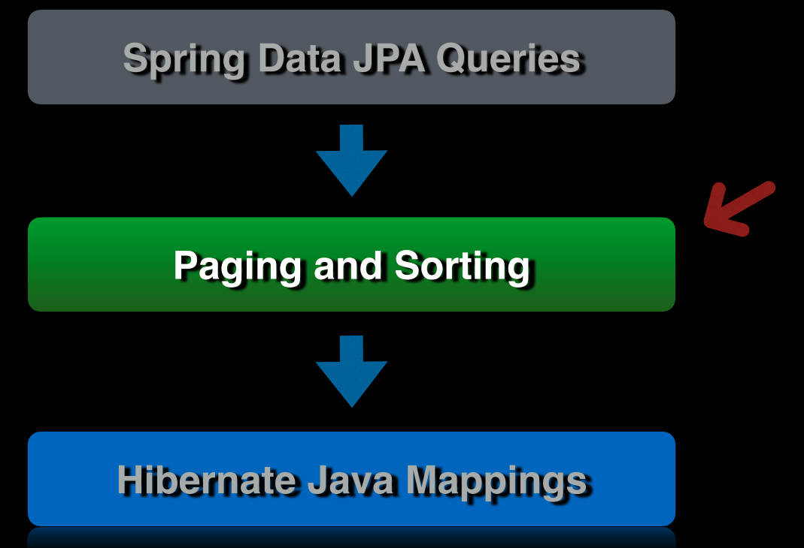
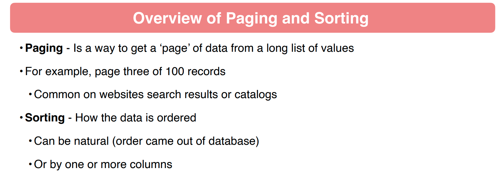
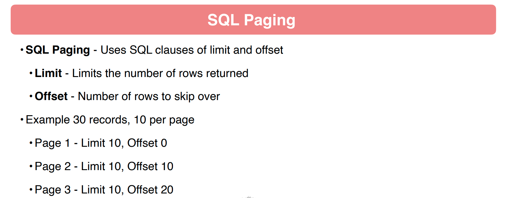
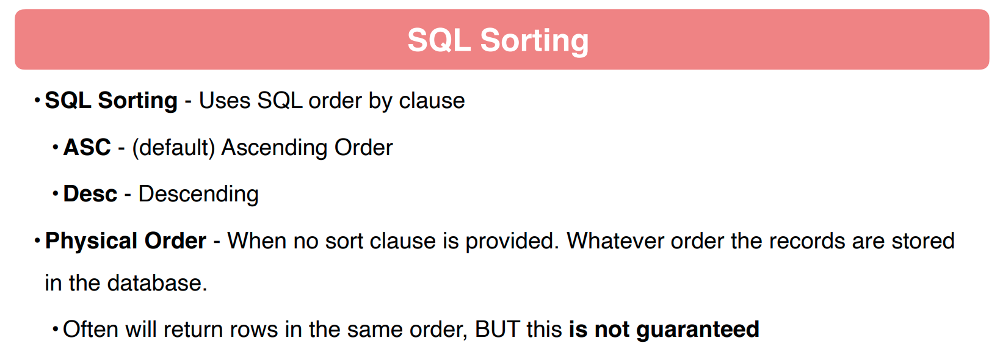
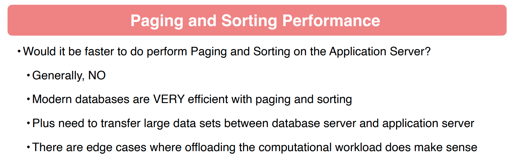

## 110 - Introduction



## 111 - Overview of Paging and Sorting






## 112 - JDBCTemplate Code Review

## 113 - Find All Books with JDBCTemplate

```java
package chamara.springdatajpasample.sdjpademo.doa;

import chamara.springdatajpasample.sdjpademo.domain.Book;

import java.util.List;

public interface BookDoa {
    List<Book> findAllBooks();

    Book getById(Long id);

    Book findBookByTitle(String title);

    Book saveNewBook(Book book);

    Book updateBook(Book book);

    void deleteBookById(Long id);
}

```

```java
package chamara.springdatajpasample.sdjpademo.doa;

import chamara.springdatajpasample.sdjpademo.domain.Book;
import org.springframework.jdbc.core.JdbcTemplate;

import java.util.List;

public class BookDoaJDBCTemplate implements BookDoa {
    private final JdbcTemplate jdbcTemplate;

    public BookDoaJDBCTemplate(JdbcTemplate jdbcTemplate) {
        this.jdbcTemplate = jdbcTemplate;
    }

    @Override
    public List<Book> findAllBooks() {
        return jdbcTemplate.query("SELECT * FROM book", getBookMapper());
    }

    @Override
    public Book getById(Long id) {
        return jdbcTemplate.queryForObject("SELECT * FROM book where id = ?", getBookMapper(), id);
    }

    @Override
    public Book findBookByTitle(String title) {
        return jdbcTemplate.queryForObject("SELECT * FROM book where title = ?", getBookMapper(), title);
    }

    @Override
    public Book saveNewBook(Book book) {
        jdbcTemplate.update("INSERT INTO book (isbn, publisher, title, author_id) VALUES (?, ?, ?, ?)",
                book.getIsbn(), book.getPublisher(), book.getTitle(), book.getAuthorId());

        Long createdId = jdbcTemplate.queryForObject("SELECT LAST_INSERT_ID()", Long.class);

        return this.getById(createdId);
    }

    @Override
    public Book updateBook(Book book) {
        jdbcTemplate.update("UPDATE book set isbn = ?, publisher = ?, title = ?, author_id = ? where id = ?",
                book.getIsbn(), book.getPublisher(), book.getTitle(), book.getAuthorId(), book.getId());

        return this.getById(book.getId());
    }

    @Override
    public void deleteBookById(Long id) {
        jdbcTemplate.update("DELETE from book where id = ?", id);
    }

    private BookMapper getBookMapper() {
        return new BookMapper();
    }
}

```

```java

@Test
void testFindAllBooks() {
    List<Book> books = bookDao.findAllBooks();

    assertThat(books).isNotNull();
    assertThat(books.size()).isGreaterThan(2);
}
```

## 114 - Find All Books with Paging

```java
package chamara.springdatajpasample.sdjpademo.doa;

import chamara.springdatajpasample.sdjpademo.domain.Book;

import java.util.List;

public interface BookDoa {
    List<Book> findAllBooks(int pageSize, int offset);

    List<Book> findAllBooks();

    Book getById(Long id);

    Book findBookByTitle(String title);

    Book saveNewBook(Book book);

    Book updateBook(Book book);

    void deleteBookById(Long id);
}

```

```java
package chamara.springdatajpasample.sdjpademo.doa;

import chamara.springdatajpasample.sdjpademo.domain.Book;
import org.springframework.jdbc.core.JdbcTemplate;

import java.util.List;

public class BookDoaJDBCTemplate implements BookDoa {
    private final JdbcTemplate jdbcTemplate;

    public BookDoaJDBCTemplate(JdbcTemplate jdbcTemplate) {
        this.jdbcTemplate = jdbcTemplate;
    }

    @Override
    public List<Book> findAllBooks(int pageSize, int offset) {
        return jdbcTemplate.query("SELECT * FROM book LIMIT ? OFFSET ?", getBookMapper(), pageSize, offset);
    }

    @Override
    public List<Book> findAllBooks() {
        return jdbcTemplate.query("SELECT * FROM book", getBookMapper());
    }

    @Override
    public Book getById(Long id) {
        return jdbcTemplate.queryForObject("SELECT * FROM book where id = ?", getBookMapper(), id);
    }

    @Override
    public Book findBookByTitle(String title) {
        return jdbcTemplate.queryForObject("SELECT * FROM book where title = ?", getBookMapper(), title);
    }

    @Override
    public Book saveNewBook(Book book) {
        jdbcTemplate.update("INSERT INTO book (isbn, publisher, title, author_id) VALUES (?, ?, ?, ?)",
                book.getIsbn(), book.getPublisher(), book.getTitle(), book.getAuthorId());

        Long createdId = jdbcTemplate.queryForObject("SELECT LAST_INSERT_ID()", Long.class);

        return this.getById(createdId);
    }

    @Override
    public Book updateBook(Book book) {
        jdbcTemplate.update("UPDATE book set isbn = ?, publisher = ?, title = ?, author_id = ? where id = ?",
                book.getIsbn(), book.getPublisher(), book.getTitle(), book.getAuthorId(), book.getId());

        return this.getById(book.getId());
    }

    @Override
    public void deleteBookById(Long id) {
        jdbcTemplate.update("DELETE from book where id = ?", id);
    }

    private BookMapper getBookMapper() {
        return new BookMapper();
    }
}

```

```java

@Test
void findAllBooksInPage1() {
    // given
    List<Book> books = bookDao.findAllBooks(2, 0);
    // when
    // then
    assertThat(books).isNotNull();
    assertThat(books.size()).isEqualTo(2);
}

@Test
void findAllBooksInPage2() {
    // given
    List<Book> books = bookDao.findAllBooks(2, 2);
    // when
    // then
    assertThat(books).isNotNull();
    assertThat(books.size()).isEqualTo(2);
}

@Test
void findAllBooksInPage100() {
    // given
    List<Book> books = bookDao.findAllBooks(2, 200);
    // when
    // then
    assertThat(books).isNotNull();
    assertThat(books.size()).isEqualTo(0);
}

```

## 115 - Find All Books Using Pagable

```java
package chamara.springdatajpasample.sdjpademo.doa;

import chamara.springdatajpasample.sdjpademo.domain.Book;
import org.springframework.data.domain.Pageable;

import java.util.List;

public interface BookDoa {
    List<Book> findAllBooks(Pageable pageable);

    List<Book> findAllBooks(int pageSize, int offset);

    List<Book> findAllBooks();

    Book getById(Long id);

    Book findBookByTitle(String title);

    Book saveNewBook(Book book);

    Book updateBook(Book book);

    void deleteBookById(Long id);
}

```

```java

@Test
void findAllBooksPageable1() {
    // given
    List<Book> books = bookDao.findAllBooks(PageRequest.of(0, 2));
    // when
    // then
    assertThat(books).isNotNull();
    assertThat(books.size()).isEqualTo(2);
}

@Test
void findAllBooksPageable2() {
    // given
    List<Book> books = bookDao.findAllBooks(PageRequest.of(1, 2));
    // when
    // then
    assertThat(books).isNotNull();
    assertThat(books.size()).isEqualTo(2);
}

@Test
void findAllBooksPageable10() {
    // given
    List<Book> books = bookDao.findAllBooks(PageRequest.of(10, 2));
    // when
    // then
    assertThat(books).isNotNull();
    assertThat(books.size()).isEqualTo(0);
}
```

```java
package chamara.springdatajpasample.sdjpademo.doa;

import chamara.springdatajpasample.sdjpademo.domain.Book;
import org.springframework.data.domain.Pageable;
import org.springframework.jdbc.core.JdbcTemplate;

import java.util.List;

public class BookDoaJDBCTemplate implements BookDoa {
    private final JdbcTemplate jdbcTemplate;

    public BookDoaJDBCTemplate(JdbcTemplate jdbcTemplate) {
        this.jdbcTemplate = jdbcTemplate;
    }

    @Override
    public List<Book> findAllBooks(Pageable pageable) {
        return jdbcTemplate.query("SELECT * FROM book LIMIT ? OFFSET ?", getBookMapper(), pageable.getPageSize(), pageable.getOffset());
    }

    @Override
    public List<Book> findAllBooks(int pageSize, int offset) {
        return jdbcTemplate.query("SELECT * FROM book LIMIT ? OFFSET ?", getBookMapper(), pageSize, offset);
    }

    @Override
    public List<Book> findAllBooks() {
        return jdbcTemplate.query("SELECT * FROM book", getBookMapper());
    }

    @Override
    public Book getById(Long id) {
        return jdbcTemplate.queryForObject("SELECT * FROM book where id = ?", getBookMapper(), id);
    }

    @Override
    public Book findBookByTitle(String title) {
        return jdbcTemplate.queryForObject("SELECT * FROM book where title = ?", getBookMapper(), title);
    }

    @Override
    public Book saveNewBook(Book book) {
        jdbcTemplate.update("INSERT INTO book (isbn, publisher, title, author_id) VALUES (?, ?, ?, ?)",
                book.getIsbn(), book.getPublisher(), book.getTitle(), book.getAuthorId());

        Long createdId = jdbcTemplate.queryForObject("SELECT LAST_INSERT_ID()", Long.class);

        return this.getById(createdId);
    }

    @Override
    public Book updateBook(Book book) {
        jdbcTemplate.update("UPDATE book set isbn = ?, publisher = ?, title = ?, author_id = ? where id = ?",
                book.getIsbn(), book.getPublisher(), book.getTitle(), book.getAuthorId(), book.getId());

        return this.getById(book.getId());
    }

    @Override
    public void deleteBookById(Long id) {
        jdbcTemplate.update("DELETE from book where id = ?", id);
    }

    private BookMapper getBookMapper() {
        return new BookMapper();
    }
}

```

## 116 - Find All Books Order By Title

```java
package chamara.springdatajpasample.sdjpademo.doa;

import chamara.springdatajpasample.sdjpademo.domain.Book;
import org.springframework.data.domain.Pageable;

import java.util.List;

public interface BookDoa {
    List<Book> findAllBooksByTitleSorted(Pageable pageable);

    List<Book> findAllBooks(Pageable pageable);

    List<Book> findAllBooks(int pageSize, int offset);

    List<Book> findAllBooks();

    Book getById(Long id);

    Book findBookByTitle(String title);

    Book saveNewBook(Book book);

    Book updateBook(Book book);

    void deleteBookById(Long id);
}

```

```java
package chamara.springdatajpasample.sdjpademo.doa;

import chamara.springdatajpasample.sdjpademo.domain.Book;
import org.springframework.data.domain.Pageable;
import org.springframework.jdbc.core.JdbcTemplate;

import java.util.List;

public class BookDoaJDBCTemplate implements BookDoa {
    private final JdbcTemplate jdbcTemplate;

    public BookDoaJDBCTemplate(JdbcTemplate jdbcTemplate) {
        this.jdbcTemplate = jdbcTemplate;
    }

    @Override
    public List<Book> findAllBooksByTitleSorted(Pageable pageable) {
        String sql = "SELECT * FROM book ORDER BY title " + pageable.getSort().getOrderFor("title").getDirection().name() + " LIMIT ? OFFSET ?";
        return jdbcTemplate.query(sql, getBookMapper(), pageable.getPageSize(), pageable.getOffset());
    }

    @Override
    public List<Book> findAllBooks(Pageable pageable) {
        return jdbcTemplate.query("SELECT * FROM book LIMIT ? OFFSET ?", getBookMapper(), pageable.getPageSize(), pageable.getOffset());
    }

    @Override
    public List<Book> findAllBooks(int pageSize, int offset) {
        return jdbcTemplate.query("SELECT * FROM book LIMIT ? OFFSET ?", getBookMapper(), pageSize, offset);
    }

    @Override
    public List<Book> findAllBooks() {
        return jdbcTemplate.query("SELECT * FROM book", getBookMapper());
    }

    @Override
    public Book getById(Long id) {
        return jdbcTemplate.queryForObject("SELECT * FROM book where id = ?", getBookMapper(), id);
    }

    @Override
    public Book findBookByTitle(String title) {
        return jdbcTemplate.queryForObject("SELECT * FROM book where title = ?", getBookMapper(), title);
    }

    @Override
    public Book saveNewBook(Book book) {
        jdbcTemplate.update("INSERT INTO book (isbn, publisher, title, author_id) VALUES (?, ?, ?, ?)",
                book.getIsbn(), book.getPublisher(), book.getTitle(), book.getAuthorId());

        Long createdId = jdbcTemplate.queryForObject("SELECT LAST_INSERT_ID()", Long.class);

        return this.getById(createdId);
    }

    @Override
    public Book updateBook(Book book) {
        jdbcTemplate.update("UPDATE book set isbn = ?, publisher = ?, title = ?, author_id = ? where id = ?",
                book.getIsbn(), book.getPublisher(), book.getTitle(), book.getAuthorId(), book.getId());

        return this.getById(book.getId());
    }

    @Override
    public void deleteBookById(Long id) {
        jdbcTemplate.update("DELETE from book where id = ?", id);
    }

    private BookMapper getBookMapper() {
        return new BookMapper();
    }
}

```

```java

@Test
void findAllBooksPageableSorted() {
    // given
    Sort title = Sort.by(Sort.Order.asc("title"));
    List<Book> books = bookDao.findAllBooksByTitleSorted(PageRequest.of(0, 2, title));
    // when
    // then
    assertThat(books).isNotNull();
    assertThat(books.size()).isEqualTo(2);
}

```

## 117 - Hibernate Code Review

## 118 - Paging with Hibernate

```java
package chamara.springdatajpasample.sdjpademo.doa;

import chamara.springdatajpasample.sdjpademo.domain.Book;
import jakarta.persistence.EntityManager;
import jakarta.persistence.EntityManagerFactory;
import jakarta.persistence.Query;
import jakarta.persistence.TypedQuery;
import org.springframework.data.domain.Pageable;

import java.util.List;

public class BookDaoHibernate implements BookDoa {
    private final EntityManagerFactory emf;

    public BookDaoHibernate(EntityManagerFactory emf) {
        this.emf = emf;
    }

    @Override
    public List<Book> findAllBooksSortByTitle(Pageable pageable) {
        return null;
    }

    @Override
    public List<Book> findAllBooks(Pageable pageable) {
        EntityManager em = getEntityManager();
        try {
            TypedQuery<Book> query = em.createQuery("SELECT b FROM Book b", Book.class);
            query.setFirstResult(Math.toIntExact(pageable.getOffset()));
            query.setMaxResults(pageable.getPageSize());
            return query.getResultList();
        } finally {
            em.close();
        }
    }

    @Override
    public List<Book> findAllBooks(int pageSize, int offset) {
        return null;
    }

    @Override
    public List<Book> findAllBooks() {
        EntityManager em = getEntityManager();

        try {
            TypedQuery<Book> query = em.createQuery("SELECT b FROM Book b", Book.class);

            return query.getResultList();
        } finally {
            em.close();
        }
    }

    @Override
    public Book getById(Long id) {
        EntityManager em = getEntityManager();
        Book book = getEntityManager().find(Book.class, id);
        em.close();
        return book;
    }

    @Override
    public Book findBookByTitle(String title) {
        EntityManager em = getEntityManager();

        try {
            Query query = em.createNativeQuery("SELECT * FROM book WHERE title = :title", Book.class);

            query.setParameter("title", title);

            return (Book) query.getSingleResult();
        } finally {
            em.close();
            ;
        }
    }

    @Override
    public Book saveNewBook(Book book) {
        EntityManager em = getEntityManager();
        em.getTransaction().begin();
        em.persist(book);
        em.flush();
        em.getTransaction().commit();
        em.close();
        return book;
    }

    @Override
    public Book updateBook(Book book) {
        EntityManager em = getEntityManager();
        em.getTransaction().begin();
        em.merge(book);
        em.flush();
        em.clear();
        Book savedBook = em.find(Book.class, book.getId());
        em.getTransaction().commit();
        em.close();
        return savedBook;
    }

    @Override
    public void deleteBookById(Long id) {
        EntityManager em = getEntityManager();
        em.getTransaction().begin();
        Book book = em.find(Book.class, id);
        em.remove(book);
        em.getTransaction().commit();
        em.close();
    }

    private EntityManager getEntityManager() {
        return emf.createEntityManager();
    }
}

```

```java

@Test
void findAllBooks() {
    List<Book> books = bookDao.findAllBooks(PageRequest.of(0, 2));

    assertThat(books).isNotNull();
    assertThat(books.size()).isEqualTo(2);
}
```

## 119 - Sorting with Hibernate

```java
package chamara.springdatajpasample.sdjpademo.doa;

import chamara.springdatajpasample.sdjpademo.domain.Book;
import jakarta.persistence.EntityManager;
import jakarta.persistence.EntityManagerFactory;
import jakarta.persistence.Query;
import jakarta.persistence.TypedQuery;
import org.springframework.data.domain.Pageable;

import java.util.List;

public class BookDaoHibernate implements BookDoa {
    private final EntityManagerFactory emf;

    public BookDaoHibernate(EntityManagerFactory emf) {
        this.emf = emf;
    }

    @Override
    public List<Book> findAllBooksSortByTitle(Pageable pageable) {
        EntityManager em = getEntityManager();
        try {
            String hql = "SELECT b FROM Book b ORDER BY b.title " + pageable.getSort().getOrderFor("title").getDirection().name();
            TypedQuery<Book> query = em.createQuery(hql, Book.class);
            query.setFirstResult(Math.toIntExact(pageable.getOffset()));
            query.setMaxResults(pageable.getPageSize());
            return query.getResultList();
        } finally {
            em.close();
        }
    }

    @Override
    public List<Book> findAllBooks(Pageable pageable) {
        EntityManager em = getEntityManager();
        try {
            TypedQuery<Book> query = em.createQuery("SELECT b FROM Book b", Book.class);
            query.setFirstResult(Math.toIntExact(pageable.getOffset()));
            query.setMaxResults(pageable.getPageSize());
            return query.getResultList();
        } finally {
            em.close();
        }
    }

    @Override
    public List<Book> findAllBooks(int pageSize, int offset) {
        return null;
    }

    @Override
    public List<Book> findAllBooks() {
        EntityManager em = getEntityManager();

        try {
            TypedQuery<Book> query = em.createQuery("SELECT b FROM Book b", Book.class);

            return query.getResultList();
        } finally {
            em.close();
        }
    }

    @Override
    public Book getById(Long id) {
        EntityManager em = getEntityManager();
        Book book = getEntityManager().find(Book.class, id);
        em.close();
        return book;
    }

    @Override
    public Book findBookByTitle(String title) {
        EntityManager em = getEntityManager();

        try {
            Query query = em.createNativeQuery("SELECT * FROM book WHERE title = :title", Book.class);

            query.setParameter("title", title);

            return (Book) query.getSingleResult();
        } finally {
            em.close();
            ;
        }
    }

    @Override
    public Book saveNewBook(Book book) {
        EntityManager em = getEntityManager();
        em.getTransaction().begin();
        em.persist(book);
        em.flush();
        em.getTransaction().commit();
        em.close();
        return book;
    }

    @Override
    public Book updateBook(Book book) {
        EntityManager em = getEntityManager();
        em.getTransaction().begin();
        em.merge(book);
        em.flush();
        em.clear();
        Book savedBook = em.find(Book.class, book.getId());
        em.getTransaction().commit();
        em.close();
        return savedBook;
    }

    @Override
    public void deleteBookById(Long id) {
        EntityManager em = getEntityManager();
        em.getTransaction().begin();
        Book book = em.find(Book.class, id);
        em.remove(book);
        em.getTransaction().commit();
        em.close();
    }

    private EntityManager getEntityManager() {
        return emf.createEntityManager();
    }
}

```

```java

@Test
void findAllBooksSortByTitle() {
    List<Book> books = bookDao.findAllBooksSortByTitle(PageRequest.of(0, 2, Sort.by(Sort.Order.desc("title"))));

    assertThat(books).isNotNull();
    assertThat(books.size()).isEqualTo(2);
}
```

## 120 - Paging with Spring Data JPA

```java
package chamara.springdatajpasample.sdjpademo.doa;

import chamara.springdatajpasample.sdjpademo.domain.Book;
import chamara.springdatajpasample.sdjpademo.repositories.BookRepository;
import jakarta.persistence.EntityNotFoundException;
import jakarta.transaction.Transactional;
import org.springframework.data.domain.PageRequest;
import org.springframework.data.domain.Pageable;
import org.springframework.stereotype.Component;

import java.util.List;

@Component
public class BookDoaImpl implements BookDoa {
    private final BookRepository bookRepository;

    public BookDoaImpl(BookRepository bookRepository) {
        this.bookRepository = bookRepository;
    }


    @Override
    public List<Book> findAllBooksSortByTitle(Pageable pageable) {
        return null;
    }

    @Override
    public List<Book> findAllBooks(Pageable pageable) {
        return bookRepository.findAll(pageable).getContent();
    }

    @Override
    public List<Book> findAllBooks(int pageSize, int offset) {
        return findAllBooks(PageRequest.of(offset, pageSize));
    }

    @Override
    public List<Book> findAllBooks() {
        return bookRepository.findAll();
    }

    @Override
    public Book getById(Long id) {
        return bookRepository.getById(id);
    }

    @Override
    public Book findBookByTitle(String title) {
        return bookRepository.findBookByTitle(title).orElseThrow(EntityNotFoundException::new);
    }

    @Override
    public Book saveNewBook(Book book) {
        return bookRepository.save(book);
    }

    @Transactional
    @Override
    public Book updateBook(Book book) {
        Book foundBook = bookRepository.getById(book.getId());
        foundBook.setIsbn(book.getIsbn());
        foundBook.setPublisher(book.getPublisher());
        foundBook.setAuthorId(book.getAuthorId());
        foundBook.setTitle(book.getTitle());
        return bookRepository.save(foundBook);
    }

    @Override
    public void deleteBookById(Long id) {
        bookRepository.deleteById(id);
    }
}

```

```java
package chamara.springdatajpasample.sdjpademo.doa;

import chamara.springdatajpasample.sdjpademo.domain.Book;
import org.junit.jupiter.api.Test;
import org.springframework.beans.factory.annotation.Autowired;
import org.springframework.boot.test.autoconfigure.jdbc.AutoConfigureTestDatabase;
import org.springframework.boot.test.autoconfigure.orm.jpa.DataJpaTest;
import org.springframework.context.annotation.ComponentScan;
import org.springframework.data.domain.PageRequest;
import org.springframework.data.domain.Sort;
import org.springframework.orm.jpa.JpaObjectRetrievalFailureException;
import org.springframework.test.context.ActiveProfiles;

import java.util.List;

import static org.assertj.core.api.AssertionsForClassTypes.assertThat;
import static org.junit.jupiter.api.Assertions.assertThrows;

@ActiveProfiles("local")
@DataJpaTest
@ComponentScan(basePackages = "chamara.springdatajpasample.sdjpademo.doa")
@AutoConfigureTestDatabase(replace = AutoConfigureTestDatabase.Replace.NONE)
class BookDoaImplTest {
    @Autowired
    BookDoa bookDao;

    @Test
    void findAllBooksPage1_SortByTitle() {
        List<Book> books = bookDao.findAllBooksSortByTitle(PageRequest.of(0, 2,
                Sort.by(Sort.Order.desc("title"))));

        assertThat(books).isNotNull();
        assertThat(books.size()).isEqualTo(2);
    }

    @Test
    void findAllBooksPage1_pageable() {
        List<Book> books = bookDao.findAllBooks(PageRequest.of(0, 2));

        assertThat(books).isNotNull();
        assertThat(books.size()).isEqualTo(2);
    }

    @Test
    void findAllBooksPage2_pageable() {
        List<Book> books = bookDao.findAllBooks(PageRequest.of(1, 2));

        assertThat(books).isNotNull();
        assertThat(books.size()).isEqualTo(2);
    }

    @Test
    void findAllBooksPage10_pageable() {
        List<Book> books = bookDao.findAllBooks(PageRequest.of(10, 10));

        assertThat(books).isNotNull();
        assertThat(books.size()).isEqualTo(0);
    }

    @Test
    void findAllBooksPage1() {
        List<Book> books = bookDao.findAllBooks(2, 0);

        assertThat(books).isNotNull();
        assertThat(books.size()).isEqualTo(2);
    }

    @Test
    void findAllBooksPage2() {
        List<Book> books = bookDao.findAllBooks(2, 2);

        assertThat(books).isNotNull();
        assertThat(books.size()).isEqualTo(2);
    }

    @Test
    void findAllBooksPage10() {
        List<Book> books = bookDao.findAllBooks(10, 100);

        assertThat(books).isNotNull();
        assertThat(books.size()).isEqualTo(0);
    }

    @Test
    void testFindAllBooks() {
        List<Book> books = bookDao.findAllBooks();

        assertThat(books).isNotNull();
        assertThat(books.size()).isGreaterThan(5);
    }

    @Test
    void getById() {
        Book book = bookDao.getById(3L);

        assertThat(book.getId()).isNotNull();
    }

    @Test
    void findBookByTitle() {
        Book book = bookDao.findBookByTitle("Clean Code");

        assertThat(book).isNotNull();
    }

    @Test
    void saveNewBook() {
        Book book = new Book();
        book.setIsbn("1234");
        book.setPublisher("Self");
        book.setTitle("my book");
        book.setAuthorId(1L);

        Book saved = bookDao.saveNewBook(book);

        assertThat(saved).isNotNull();
    }

    @Test
    void updateBook() {
        Book book = new Book();
        book.setIsbn("1234");
        book.setPublisher("Self");
        book.setTitle("my book");
        book.setAuthorId(1L);
        Book saved = bookDao.saveNewBook(book);

        saved.setTitle("New Book");
        bookDao.updateBook(saved);

        Book fetched = bookDao.getById(saved.getId());

        assertThat(fetched.getTitle()).isEqualTo("New Book");
    }

    @Test
    void deleteBookById() {

        Book book = new Book();
        book.setIsbn("1234");
        book.setPublisher("Self");
        book.setTitle("my book");
        Book saved = bookDao.saveNewBook(book);

        bookDao.deleteBookById(saved.getId());

        assertThrows(JpaObjectRetrievalFailureException.class, () -> {
            bookDao.getById(saved.getId());
        });
    }
}
```

## 121 - Sorting with Spring Data JPA

```java

@Override
public List<Book> findAllBooksSortByTitle(Pageable pageable) {
    Page<Book> books = bookRepository.findAll(pageable);
    return books.getContent();
}

```

```java

@Test
void findAllBooksPage1_SortByTitle() {
    List<Book> books = bookDao.findAllBooksSortByTitle(PageRequest.of(0, 2,
            Sort.by(Sort.Order.desc("title"))));

    assertThat(books).isNotNull();
    assertThat(books.size()).isEqualTo(2);
}
```

## 122 - Query Paging and Sorting with Spring Data JPA

```java
package chamara.springdatajpasample.sdjpademo.doa;

import chamara.springdatajpasample.sdjpademo.domain.Author;
import org.springframework.data.domain.Pageable;

import java.util.List;

public interface AuthorDoa {
    List<Author> findAllAuthorsByLastName(String lastName, Pageable pageable);

    Author getById(Long id);

    Author findAuthorByName(String firstName, String lastName);

    Author saveNewAuthor(Author author);

    Author updateAuthor(Author author);

    void deleteAuthorById(Long id);
}

```    

```java

@Override
public List<Author> findAllAuthorsByLastName(String lastName, Pageable pageable) {
    return authorRepository.findAuthorByLastName(lastName, pageable).getContent();
}

```

```java
package chamara.springdatajpasample.sdjpademo.repositories;

import chamara.springdatajpasample.sdjpademo.domain.Author;
import org.springframework.data.domain.Page;
import org.springframework.data.domain.Pageable;
import org.springframework.data.jpa.repository.JpaRepository;

import java.util.Optional;

public interface AuthorRepository extends JpaRepository<Author, Long> {
    Optional<Author> findAuthorByFirstNameAndLastName(String firstName, String lastName);

    Page<Author> findAuthorByLastName(String lastName, Pageable pageable);
}

```

```java

@Test
void findAllAuthorsByLastName() {
    List<Author> authors = authorDao.findAllAuthorsByLastName("Walls", PageRequest.of(0, 2));

    assertThat(authors).isNotNull();
    assertThat(authors.size()).isEqualTo(1);
}
```