## 123 - Introduction

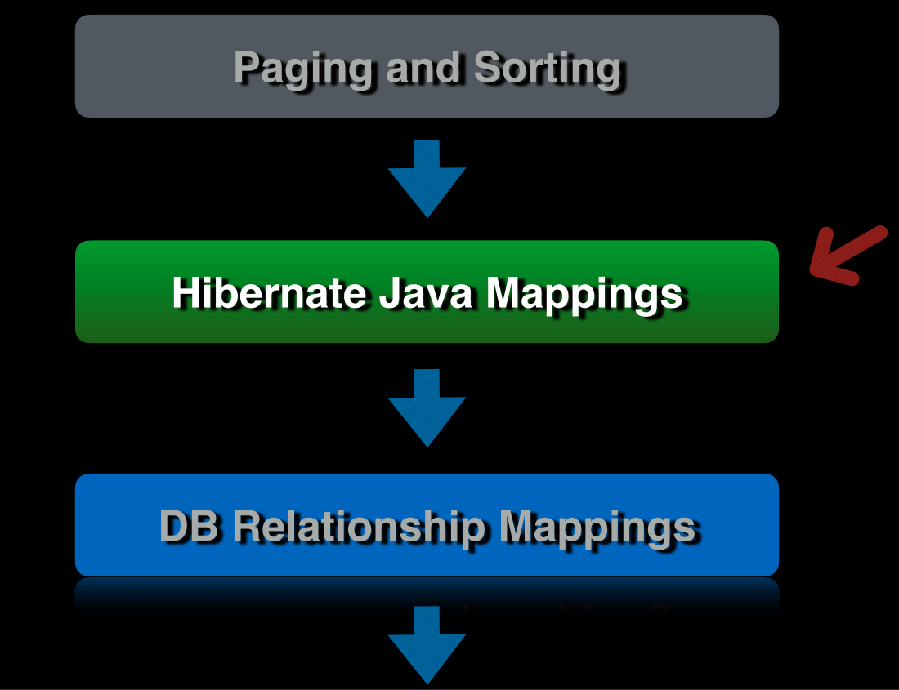

## 124 - JPA Inheritance

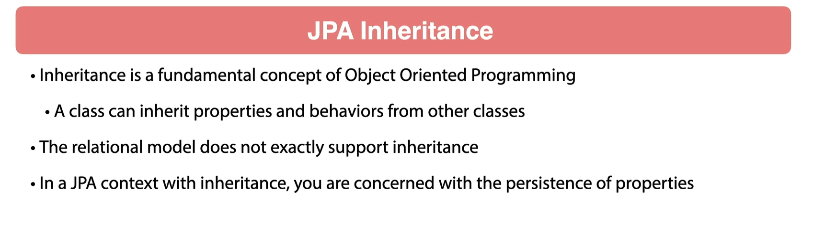
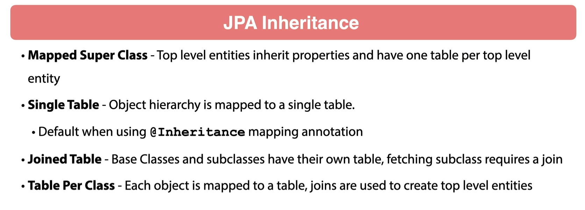
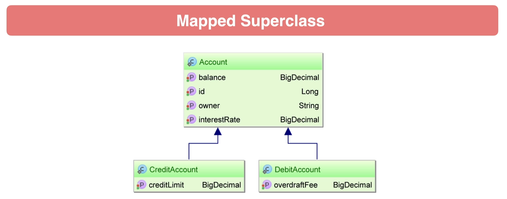
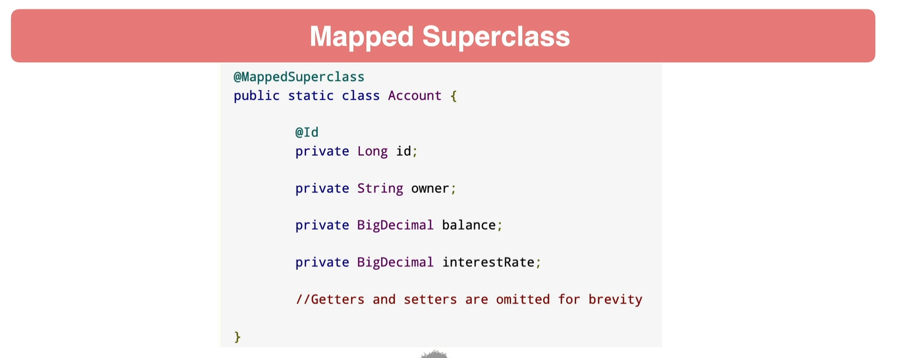
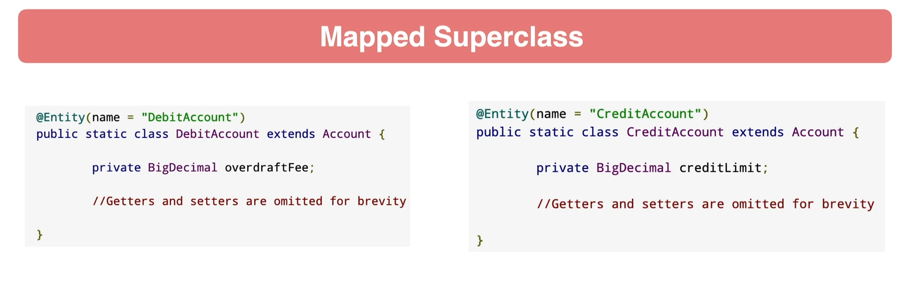

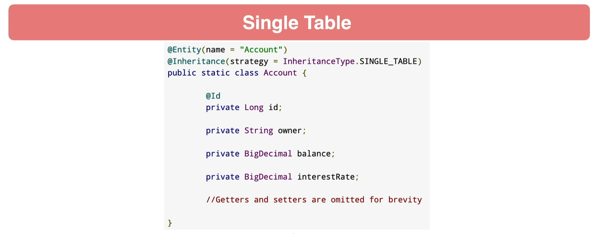
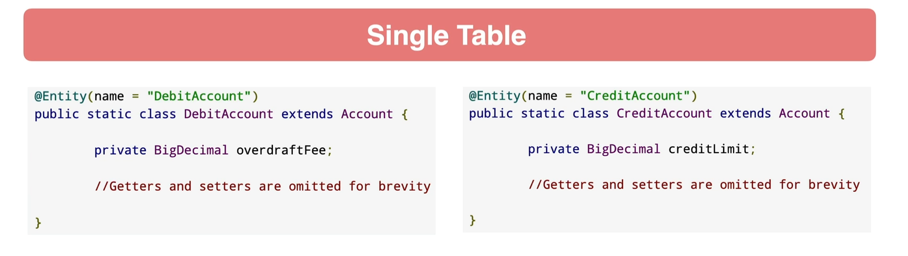
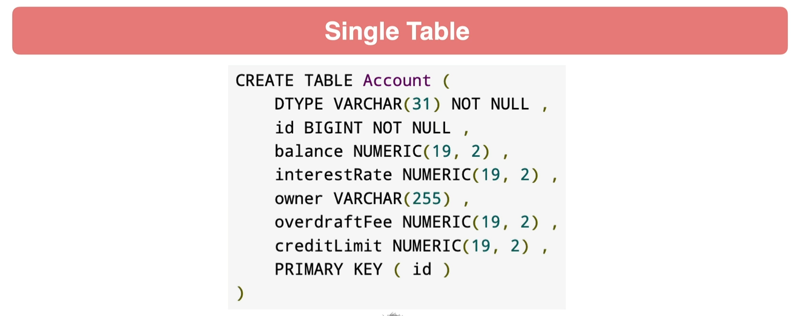
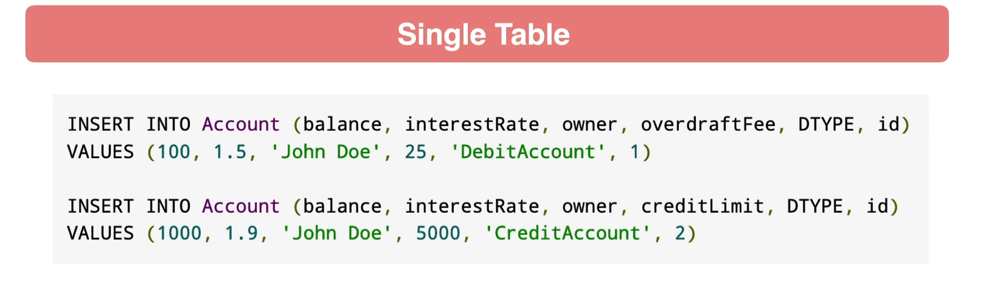
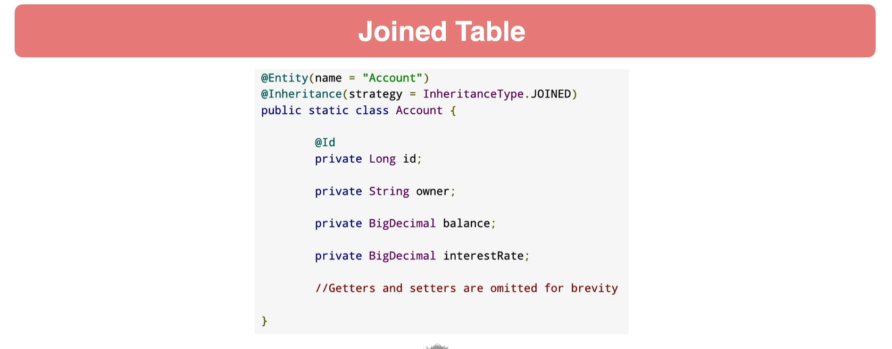

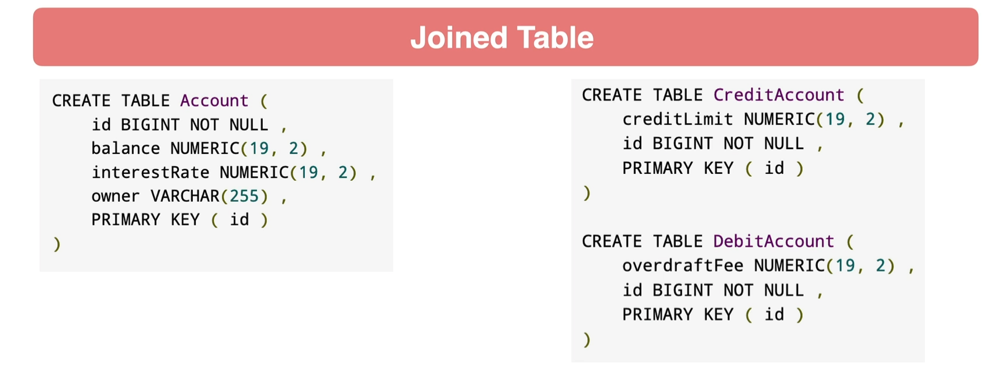
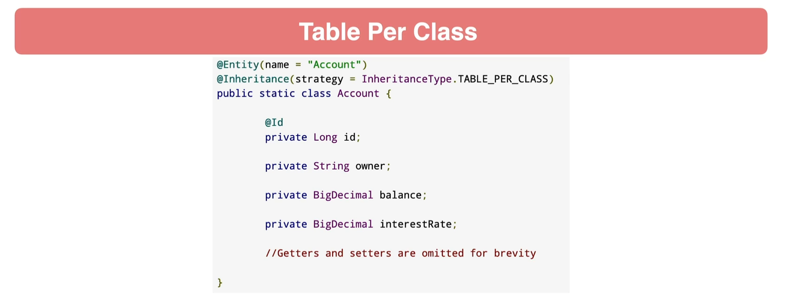
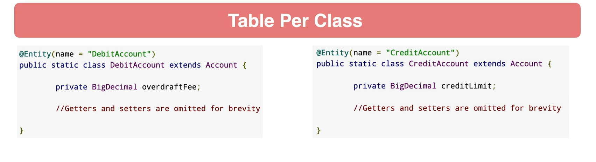
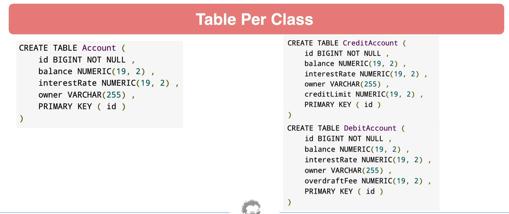
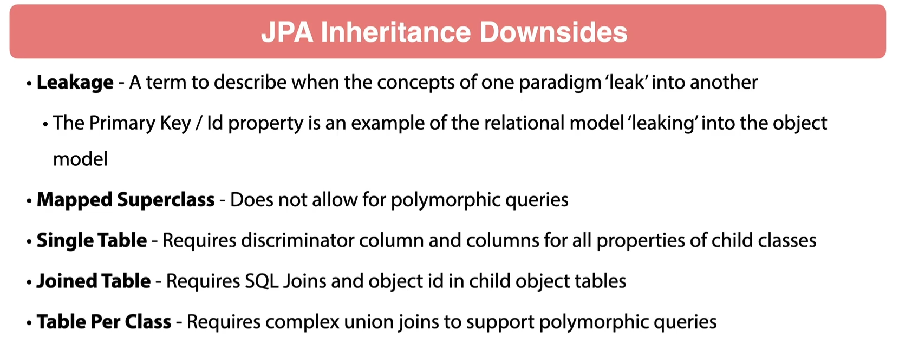
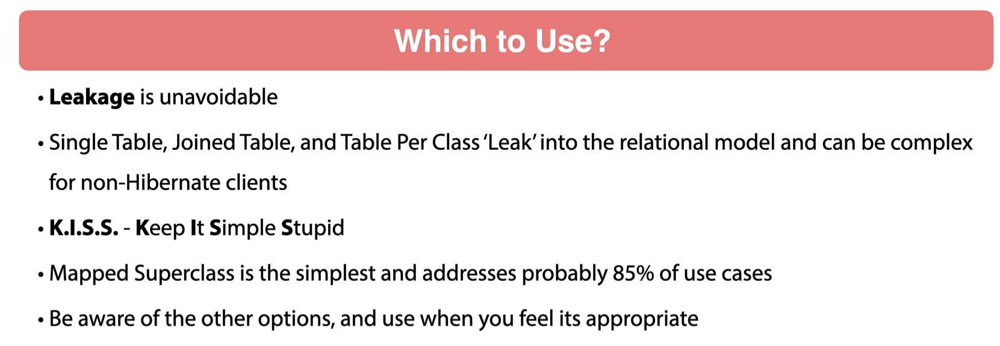

## 125 - JPA Mapped Super Class

let's create a BaseEntity class.

```java
package guru.springframework.orderservice.domain;

import jakarta.persistence.GeneratedValue;
import jakarta.persistence.GenerationType;
import jakarta.persistence.Id;
import jakarta.persistence.MappedSuperclass;

import java.util.Objects;

@MappedSuperclass
public abstract class BaseEntity {
    @Id
    @GeneratedValue(strategy = GenerationType.IDENTITY)
    private Long id;

    public Long getId() {
        return id;
    }

    public void setId(Long id) {
        this.id = id;
    }

    @Override
    public boolean equals(Object o) {
        if (this == o) return true;
        if (o == null || getClass() != o.getClass()) return false;
        BaseEntity that = (BaseEntity) o;
        return Objects.equals(id, that.id);
    }

    @Override
    public int hashCode() {
        return Objects.hash(id);
    }
}

```

since we have added the `@MappedSuperclass` annotation, this class will not be created in the database.
since we moved the `@Id` and `@GeneratedValue` annotations to the `BaseEntity` class, we can remove them from
the `OrderHeader` class.

```java
package guru.springframework.orderservice.domain;

import jakarta.persistence.Entity;
import jakarta.persistence.GeneratedValue;
import jakarta.persistence.GenerationType;
import jakarta.persistence.Id;

import java.util.Objects;

/**
 * Created by jt on 12/5/21.
 */
@Entity
public class OrderHeader extends BaseEntity {


    private String customer;

    public String getCustomer() {
        return customer;
    }

    public void setCustomer(String customer) {
        this.customer = customer;
    }

    @Override
    public boolean equals(Object o) {
        if (this == o) {
            return true;
        }

        if (o == null || getClass() != o.getClass()) {
            return false;
        }

        if (!super.equals(o)) {
            return false;
        }

        OrderHeader that = (OrderHeader) o;
        return Objects.equals(customer, that.customer);
    }

    @Override
    public int hashCode() {
        return Objects.hash(super.hashCode(), customer);
    }
}

```

let's test the code.

```java
package guru.springframework.orderservice.domain;

import org.junit.jupiter.api.BeforeEach;
import org.junit.jupiter.api.Test;

import static org.junit.jupiter.api.Assertions.*;

class OrderHeaderTest {

    @BeforeEach
    void setUp() {
    }

    @Test
    void orderHeaderEqualsShouldReturnTrueWhenComparingSameId() {
        // given
        OrderHeader orderHeader = new OrderHeader();
        orderHeader.setId(1L);

        OrderHeader orderHeader2 = new OrderHeader();
        orderHeader2.setId(1L);
        // when
        // then
        assertEquals(orderHeader, orderHeader2);
    }

    @Test
    void orderHeaderEqualsShouldReturnFalseWhenComparingDifferentId() {
        // given
        OrderHeader orderHeader = new OrderHeader();
        orderHeader.setId(1L);

        OrderHeader orderHeader2 = new OrderHeader();
        orderHeader2.setId(2L);
        // when
        // then
        assertFalse(orderHeader.equals(orderHeader2));
    }

    @Test
    void orderHeaderEqualsShouldReturnTrueWhenComparingSameObject() {
        OrderHeader orderHeader = new OrderHeader();
        orderHeader.setCustomer("Customer1");

        assertTrue(orderHeader.equals(orderHeader));
    }

    @Test
    void equalsShouldReturnFalseWhenComparingWithNull() {
        OrderHeader orderHeader = new OrderHeader();
        orderHeader.setCustomer("Customer1");

        assertFalse(orderHeader.equals(null));
    }

    //
    @Test
    void equalsShouldReturnFalseWhenComparingWithDifferentClass() {
        OrderHeader orderHeader = new OrderHeader();
        orderHeader.setCustomer("Customer1");

        assertNotEquals(orderHeader, new String());
    }

    @Test
    void equalsShouldReturnFalseWhenComparingWithDifferentCustomer() {
        OrderHeader orderHeader1 = new OrderHeader();
        orderHeader1.setCustomer("Customer1");

        OrderHeader orderHeader2 = new OrderHeader();
        orderHeader2.setCustomer("Customer2");

        assertFalse(orderHeader1.equals(orderHeader2));
    }

    @Test
    void equalsShouldReturnTrueWhenComparingWithSameCustomer() {
        OrderHeader orderHeader1 = new OrderHeader();
        orderHeader1.setCustomer("Customer1");

        OrderHeader orderHeader2 = new OrderHeader();
        orderHeader2.setCustomer("Customer1");

        assertTrue(orderHeader1.equals(orderHeader2));
    }

}
```

## 126 - Embedded Types

let's create a new migration for add new column to the `OrderLine` table.

```sql
alter table order_header
    add column shipping_address  varchar(30),
    add column shipping_city     varchar(30),
    add column shipping_state    varchar(30),
    add column shipping_zip_code varchar(30),
    add column bill_to_address   varchar(30),
    add column bill_to_city      varchar(30),
    add column bill_to_state     varchar(30),
    add column bill_to_zip_code  varchar(30);
```

let's create a new Address class.

```java
package guru.springframework.orderservice.domain;

import jakarta.persistence.Embeddable;

import java.util.Objects;

@Embeddable
public class Address {
    private String address;
    private String city;
    private String state;
    private String zipCode;

    public String getAddress() {
        return address;
    }

    public void setAddress(String address) {
        this.address = address;
    }

    public String getCity() {
        return city;
    }

    public void setCity(String city) {
        this.city = city;
    }

    public String getState() {
        return state;
    }

    public void setState(String state) {
        this.state = state;
    }

    public String getZipCode() {
        return zipCode;
    }

    public void setZipCode(String zipCode) {
        this.zipCode = zipCode;
    }

    @Override
    public boolean equals(Object o) {
        if (this == o) return true;
        if (o == null || getClass() != o.getClass()) return false;

        Address address1 = (Address) o;

        if (!Objects.equals(address, address1.address)) return false;
        if (!Objects.equals(city, address1.city)) return false;
        if (!Objects.equals(state, address1.state)) return false;
        return Objects.equals(zipCode, address1.zipCode);
    }

    @Override
    public int hashCode() {
        int result = address != null ? address.hashCode() : 0;
        result = 31 * result + (city != null ? city.hashCode() : 0);
        result = 31 * result + (state != null ? state.hashCode() : 0);
        result = 31 * result + (zipCode != null ? zipCode.hashCode() : 0);
        return result;
    }
}

```

let's integrate the `Address` class to the `OrderHeader` class.

```java
package guru.springframework.orderservice.domain;

import jakarta.persistence.*;

import java.util.Objects;

/**
 * Created by jt on 12/5/21.
 */
@Entity
@AttributeOverrides({
        @AttributeOverride(name = "shippingAddress.address", column = @Column(name = "shipping_address")),
        @AttributeOverride(name = "shippingAddress.city", column = @Column(name = "shipping_city")),
        @AttributeOverride(name = "shippingAddress.state", column = @Column(name = "shipping_state")),
        @AttributeOverride(name = "shippingAddress.zipCode", column = @Column(name = "shipping_zip_code")),
        @AttributeOverride(name = "billiToAddress.address", column = @Column(name = "bill_to_address")),
        @AttributeOverride(name = "billiToAddress.city", column = @Column(name = "bill_to_city")),
        @AttributeOverride(name = "billiToAddress.state", column = @Column(name = "bill_to_state")),
        @AttributeOverride(name = "billiToAddress.zipCode", column = @Column(name = "bill_to_zip_code"))
})
public class OrderHeader extends BaseEntity {
    private String customer;
    private Address shippingAddress;
    private Address billiToAddress;

    public String getCustomer() {
        return customer;
    }

    public void setCustomer(String customer) {
        this.customer = customer;
    }

    @Override
    public boolean equals(Object o) {
        if (this == o) return true;
        if (o == null || getClass() != o.getClass()) return false;
        if (!super.equals(o)) return false;

        OrderHeader that = (OrderHeader) o;

        if (!Objects.equals(customer, that.customer)) return false;
        if (!Objects.equals(shippingAddress, that.shippingAddress))
            return false;
        return Objects.equals(billiToAddress, that.billiToAddress);
    }

    @Override
    public int hashCode() {
        int result = super.hashCode();
        result = 31 * result + (customer != null ? customer.hashCode() : 0);
        result = 31 * result + (shippingAddress != null ? shippingAddress.hashCode() : 0);
        result = 31 * result + (billiToAddress != null ? billiToAddress.hashCode() : 0);
        return result;
    }
}
```

## 127 - Java Enumerated Types

let's add the schema

```sql
alter table order_header
    add column order_status varchar(30);
```

let's add a enum type to the `OrderHeader` class.

```java
package guru.springframework.orderservice.domain;

import jakarta.persistence.*;

import java.util.Objects;

/**
 * Created by jt on 12/5/21.
 */
@Entity
@AttributeOverrides({
        @AttributeOverride(name = "shippingAddress.address", column = @Column(name = "shipping_address")),
        @AttributeOverride(name = "shippingAddress.city", column = @Column(name = "shipping_city")),
        @AttributeOverride(name = "shippingAddress.state", column = @Column(name = "shipping_state")),
        @AttributeOverride(name = "shippingAddress.zipCode", column = @Column(name = "shipping_zip_code")),
        @AttributeOverride(name = "billiToAddress.address", column = @Column(name = "bill_to_address")),
        @AttributeOverride(name = "billiToAddress.city", column = @Column(name = "bill_to_city")),
        @AttributeOverride(name = "billiToAddress.state", column = @Column(name = "bill_to_state")),
        @AttributeOverride(name = "billiToAddress.zipCode", column = @Column(name = "bill_to_zip_code"))
})
public class OrderHeader extends BaseEntity {
    private String customer;
    private Address shippingAddress;
    private Address billiToAddress;
    @Enumerated(EnumType.STRING)
    private OrderStatus orderStatus;

    public Address getShippingAddress() {
        return shippingAddress;
    }

    public void setShippingAddress(Address shippingAddress) {
        this.shippingAddress = shippingAddress;
    }

    public Address getBilliToAddress() {
        return billiToAddress;
    }

    public void setBilliToAddress(Address billiToAddress) {
        this.billiToAddress = billiToAddress;
    }

    public OrderStatus getOrderStatus() {
        return orderStatus;
    }

    public void setOrderStatus(OrderStatus orderStatus) {
        this.orderStatus = orderStatus;
    }

    public String getCustomer() {
        return customer;
    }

    public void setCustomer(String customer) {
        this.customer = customer;
    }

    @Override
    public boolean equals(Object o) {
        if (this == o) return true;
        if (o == null || getClass() != o.getClass()) return false;
        if (!super.equals(o)) return false;

        OrderHeader that = (OrderHeader) o;

        if (!Objects.equals(customer, that.customer)) return false;
        if (!Objects.equals(shippingAddress, that.shippingAddress))
            return false;
        if (!Objects.equals(billiToAddress, that.billiToAddress))
            return false;
        return orderStatus == that.orderStatus;
    }

    @Override
    public int hashCode() {
        int result = super.hashCode();
        result = 31 * result + (customer != null ? customer.hashCode() : 0);
        result = 31 * result + (shippingAddress != null ? shippingAddress.hashCode() : 0);
        result = 31 * result + (billiToAddress != null ? billiToAddress.hashCode() : 0);
        result = 31 * result + (orderStatus != null ? orderStatus.hashCode() : 0);
        return result;
    }
}

```

order status enum class.

```java
package guru.springframework.orderservice.domain;

public enum OrderStatus {
    NEW,
    IN_PROGRESS,
    COMPLETED,
}
```

## 128 - Hibernate Created Date

## 129 - Hibernate Update Date

        

