## 38 - Introduction

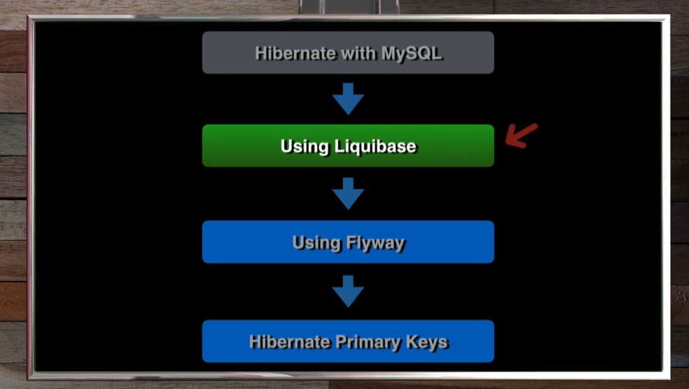

there are main two popular ways to database management tools:

`Flyway`: Flyway is an open-source database migration tool. It strongly favors simplicity and convention over configuration. It is based around just 6 basic commands: Migrate, Clean, Info, Validate, Baseline and Repair. Migrations can be written in SQL (database-specific syntax (such as PL/SQL, T-SQL, ...) is supported) or Java (for advanced data transformations or dealing with LOBs). It has a Command-line tool, a Java API, Maven plugin, Gradle plugin, SBT plugin, Ant tasks and a few more. It is available on the Maven Central Repository and can be easily integrated with Spring applications using Spring Boot starters and other Spring-centric features.

`Liquibase`: Liquibase is an open-source database-independent library for tracking, managing and applying database schema changes. It was started in 2006 to allow easier tracking of database changes, especially in an agile software development environment. It is a tool for managing database changes, and can be used as an alternative to manually writing SQL scripts for database changes. It supports XML, YAML and SQL formats for writing the changes. It has a Command-line tool, a Java API, a Spring Boot starter, a Maven plugin, an Ant task, a Grails plugin, a Play plugin, a Dropwizard plugin, a Clojure wrapper and a few more. It is available on the Maven Central Repository and can be easily integrated with Spring applications using Spring Boot starters and other Spring-centric features.

## 39 - OverviewOfLiquidbase

### what is migration?

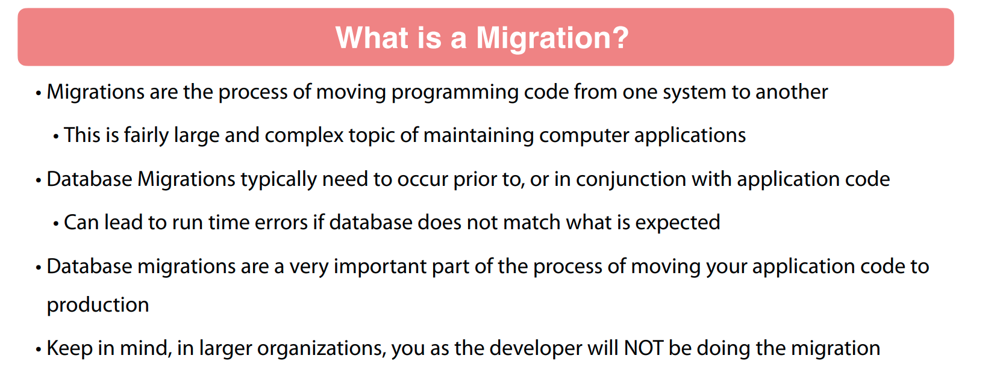

### why use a migration tool?

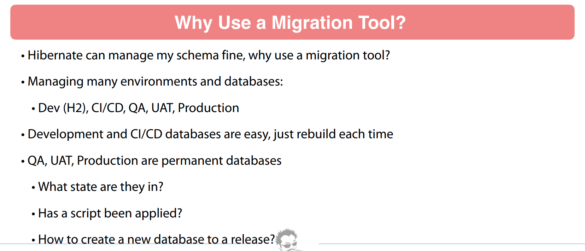


Liquibase and Flyway

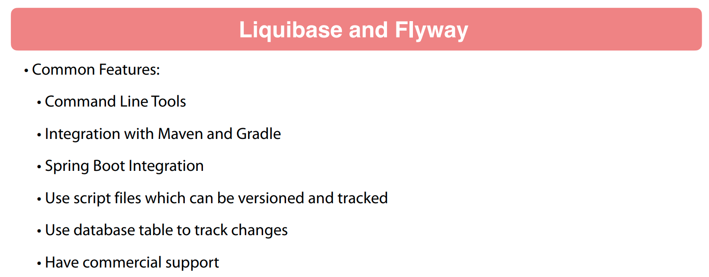

Springboot support both of them


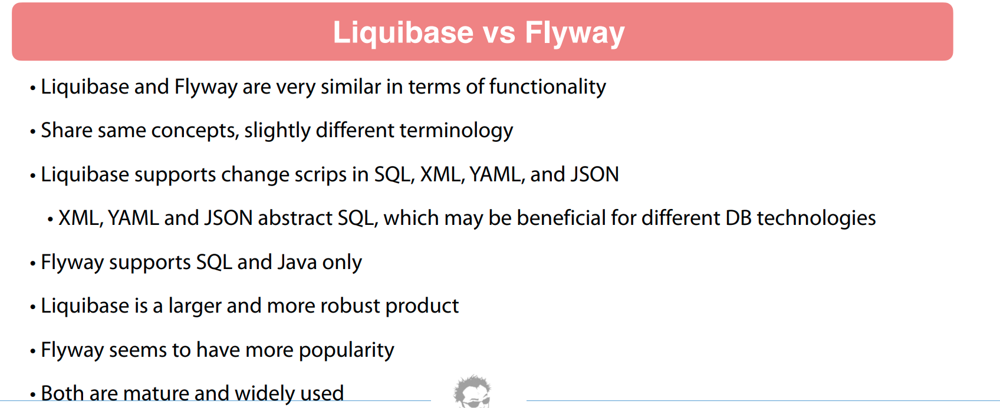

which one to choose?

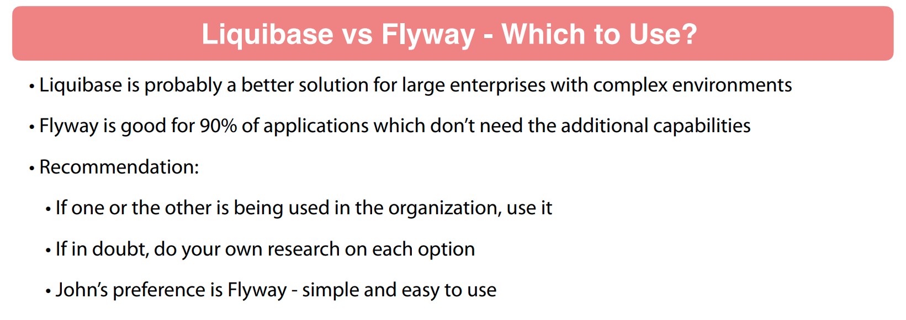

### Liquibase 


### Liquibase Terminology
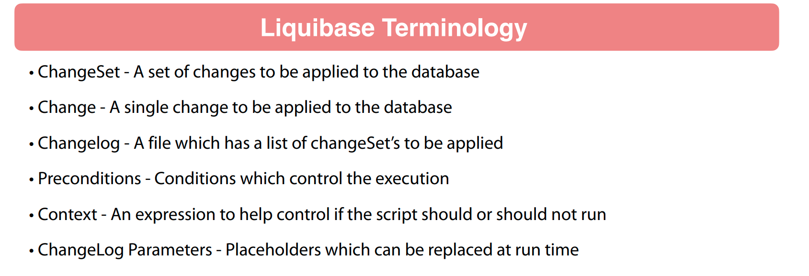

### Liquibase Best Practices
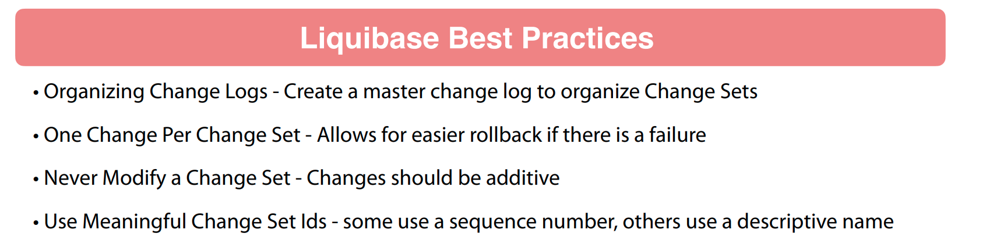

### Running Liquibase
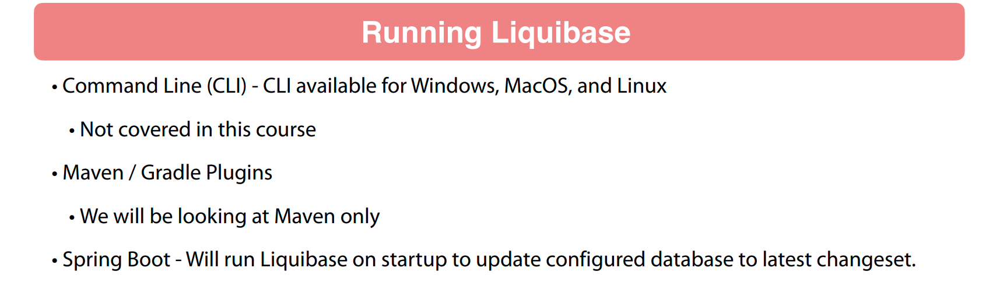
### Next Steps
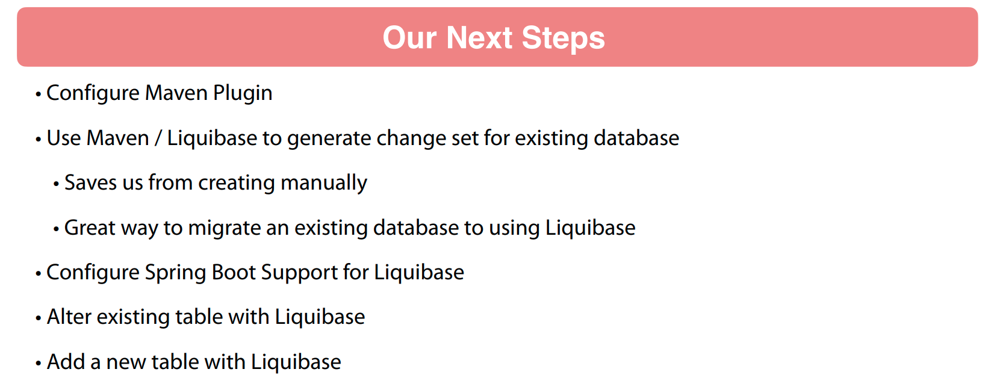
## 40 - Liquibase Maven Plugin

```xml
			<plugin>
				<groupId>org.springframework.boot</groupId>
				<artifactId>spring-boot-maven-plugin</artifactId>
			</plugin>
			<plugin>
				<!--start with basic information to get Liquibase plugin:
                include <groupId>, <artifactID>, and <version> elements-->
				<groupId>org.liquibase</groupId>
				<artifactId>liquibase-maven-plugin</artifactId>
				<configuration>
					<url>jdbc:mysql://127.0.0.1:3306/bookdb?useUnicode=true&amp;characterEncoding=UTF-8&amp;ServerTimezone=UTC</url>
					<username>bookadmin</username>
					<password>password</password>
					<!--set values for Liquibase properties and settings
                    for example, the location of a properties file to use-->
<!--					<propertyFile>liquibase.properties</propertyFile>-->
				</configuration>
				<dependencies>
					<!--set up any dependencies for Liquibase to function in your
                    environment for example, a database-specific plugin-->
					<dependency>
						<groupId>org.liquibase.ext</groupId>
						<artifactId>liquibase-mysql</artifactId>
						<version>4.25.1</version>
					</dependency>
					<dependency>
						<groupId>mysql</groupId>
						<artifactId>mysql-connector-java</artifactId>
						<version>${mysql.version}</version>
					</dependency>
				</dependencies>
			</plugin>
```

## 41 - Generate Changeset from Database

```xml
<?xml version="1.0" encoding="UTF-8"?>
<project xmlns="http://maven.apache.org/POM/4.0.0" xmlns:xsi="http://www.w3.org/2001/XMLSchema-instance"
	xsi:schemaLocation="http://maven.apache.org/POM/4.0.0 https://maven.apache.org/xsd/maven-4.0.0.xsd">
	<modelVersion>4.0.0</modelVersion>
	<parent>
		<groupId>org.springframework.boot</groupId>
		<artifactId>spring-boot-starter-parent</artifactId>
		<version>3.3.0-M1</version>
		<relativePath/> <!-- lookup parent from repository -->
	</parent>
	<groupId>chamara.springdatajpasample</groupId>
	<artifactId>sdjpa-demo</artifactId>
	<version>0.0.1-SNAPSHOT</version>
	<name>sdjpa-demo</name>
	<description>Demo project for Spring Boot</description>
	<properties>
		<java.version>21</java.version>
	</properties>
	<dependencies>

		<dependency>
			<groupId>org.springframework.boot</groupId>
			<artifactId>spring-boot-starter-actuator</artifactId>
		</dependency>

		<dependency>
			<groupId>org.springframework.boot</groupId>
			<artifactId>spring-boot-starter-data-jpa</artifactId>
		</dependency>
		<dependency>
			<groupId>org.springframework.boot</groupId>
			<artifactId>spring-boot-starter-web</artifactId>
		</dependency>

		<dependency>
			<groupId>com.h2database</groupId>
			<artifactId>h2</artifactId>
			<scope>test</scope>
		</dependency>
		<dependency>
			<groupId>com.mysql</groupId>
			<artifactId>mysql-connector-j</artifactId>
			<version>8.3.0</version>
		</dependency>
		<dependency>
			<groupId>org.springframework.boot</groupId>
			<artifactId>spring-boot-starter-test</artifactId>
			<scope>test</scope>
		</dependency>
	</dependencies>

	<build>
		<plugins>
			<plugin>
				<groupId>org.springframework.boot</groupId>
				<artifactId>spring-boot-maven-plugin</artifactId>
			</plugin>
			<plugin>
				<groupId>org.liquibase</groupId>
				<artifactId>liquibase-maven-plugin</artifactId>
				<configuration>
					<outputChangeLogFile>changelog.mysql.sql</outputChangeLogFile>
					<propertyFile>liquibase.properties</propertyFile>
				</configuration>
				<dependencies>
					<dependency>
						<groupId>com.mysql</groupId>
						<artifactId>mysql-connector-j</artifactId>
						<version>8.3.0</version>
					</dependency>
				</dependencies>
			</plugin>
		</plugins>
	</build>
	<profiles>
		<profile>
			<id>h2</id>
			<dependencies>
			<dependency>
				<groupId>com.h2database</groupId>
				<artifactId>h2</artifactId>
			</dependency>
			</dependencies>
		</profile>
	</profiles>
	<repositories>
		<repository>
			<id>spring-milestones</id>
			<name>Spring Milestones</name>
			<url>https://repo.spring.io/milestone</url>
			<snapshots>
				<enabled>false</enabled>
			</snapshots>
		</repository>
	</repositories>
	<pluginRepositories>
		<pluginRepository>
			<id>spring-milestones</id>
			<name>Spring Milestones</name>
			<url>https://repo.spring.io/milestone</url>
			<snapshots>
				<enabled>false</enabled>
			</snapshots>
		</pluginRepository>
	</pluginRepositories>

</project>

```

create the liquibase.properties file in the resources folder

```properties
url=jdbc:mysql://127.0.0.1:3306/bookdb?useUnicode=true&characterEncoding=UTF-8&ServerTimezone=UTC
username=bookadmin
password=password
changeSetAuthor=chamara
defaultSchemaName=bookdb
```
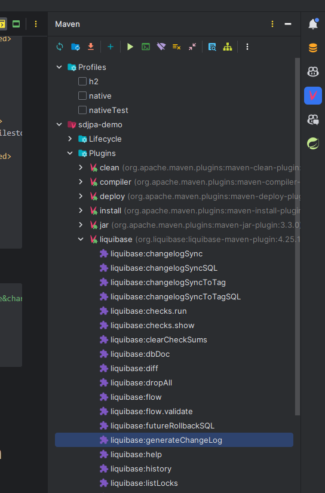

it will generate the changelog.mysql.sql file in the resources folder

```sql
-- liquibase formatted sql

-- changeset chamara:1708753296657-1
CREATE TABLE book (id BIGINT NOT NULL, isbn VARCHAR(255) NULL, publisher VARCHAR(255) NULL, title VARCHAR(255) NULL, CONSTRAINT PK_BOOK PRIMARY KEY (id));

-- changeset chamara:1708753296657-2
CREATE TABLE book_seq (next_val BIGINT NULL);
```
## 42 - Organizing Change Logs
## 43 - Spring Boot Configuration
## 44 - Initializing Data with Spring
## 45 - Alter Table with Liquibase
