## 46 - Introduction
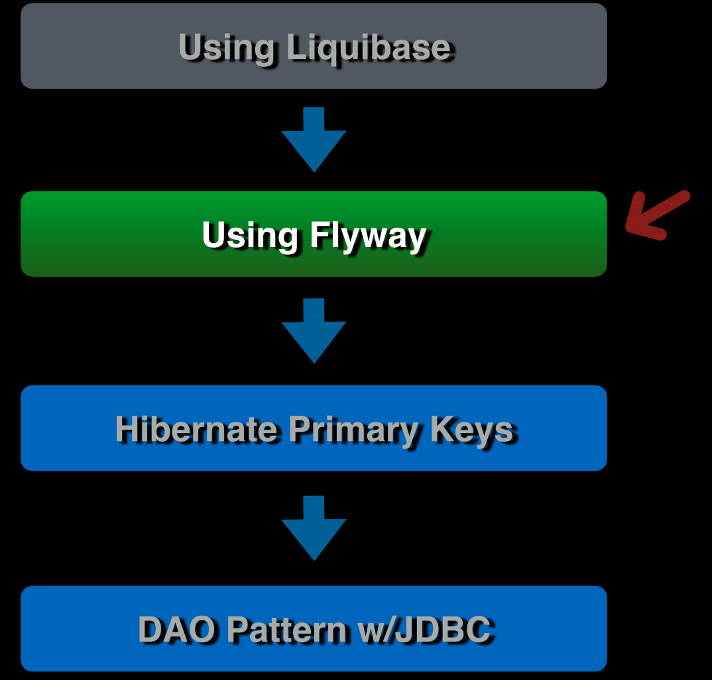

## 47 - Overview of Flyway
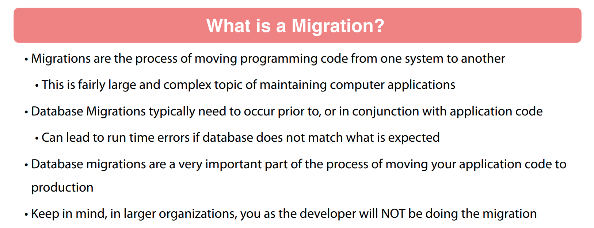
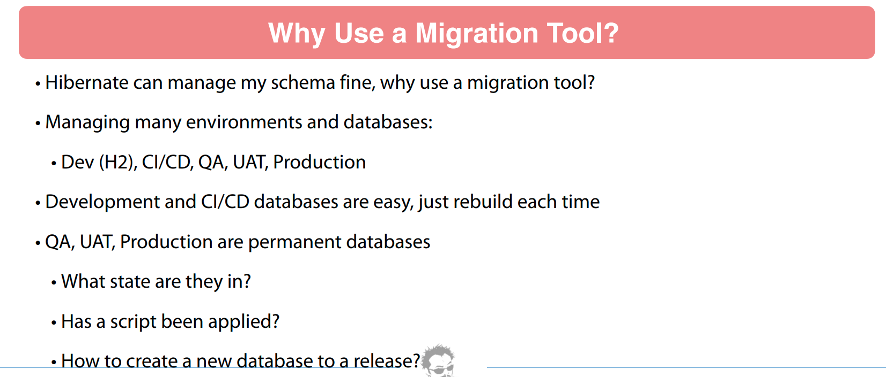
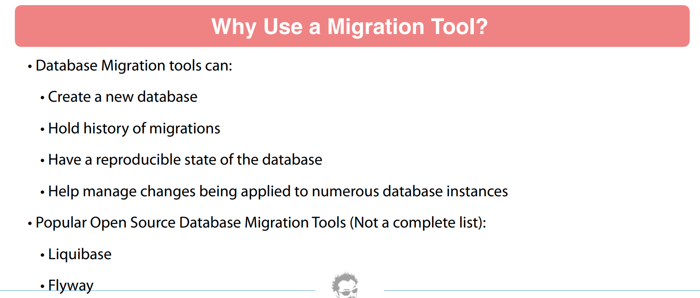
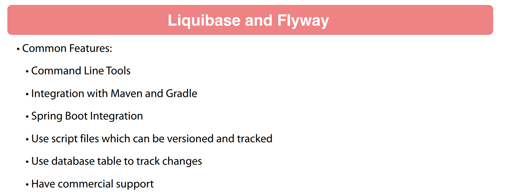
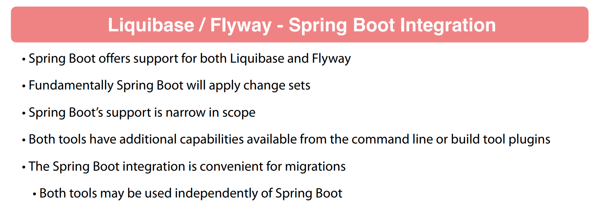
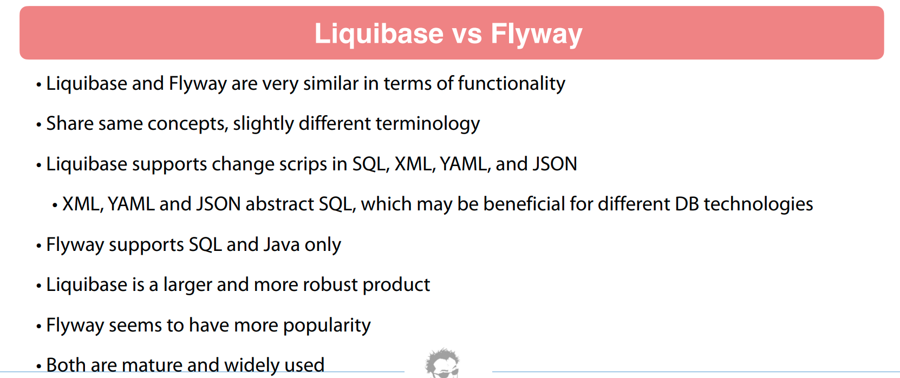
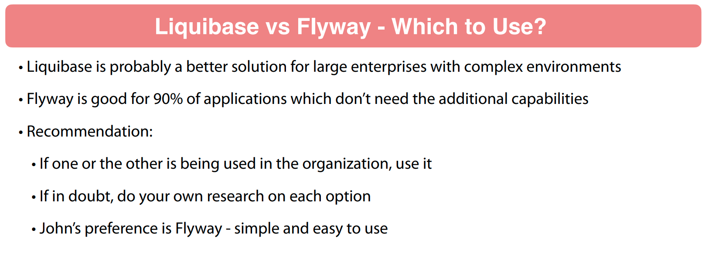

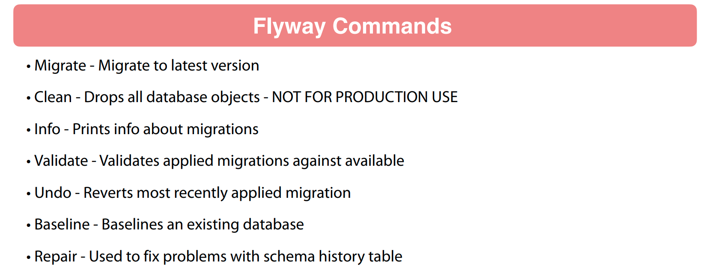
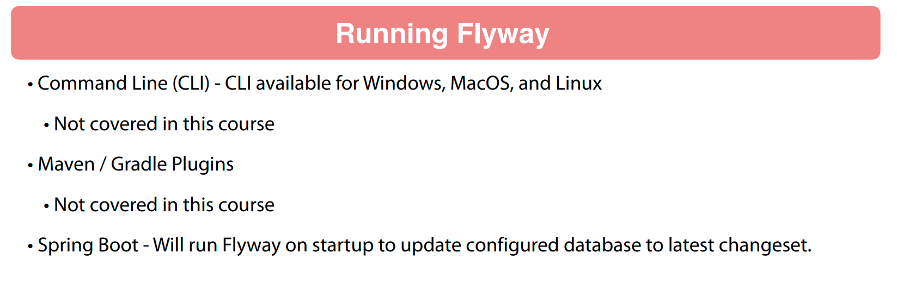
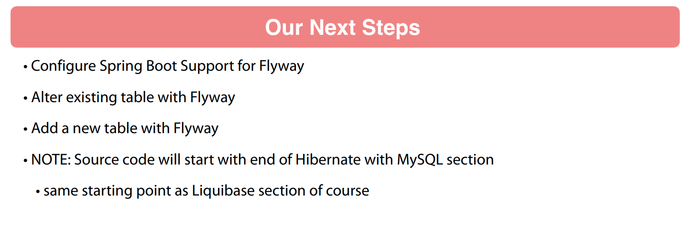
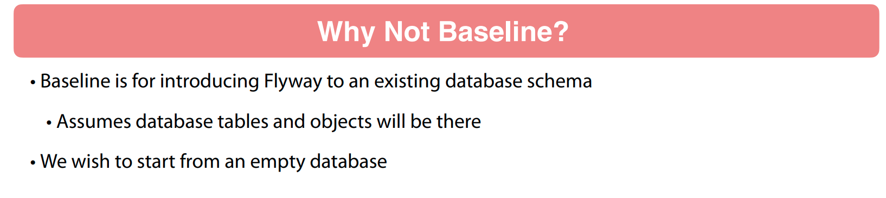

## 48 - Spring Boot Configuration
make sure the profile is local
so, it will override the default profile

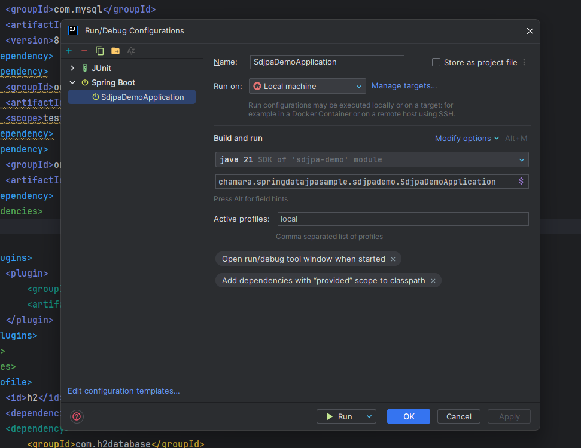

add the flyway dependency
```xml
<dependency>
    <groupId>org.flywaydb</groupId>
    <artifactId>flyway-core</artifactId>
</dependency>
<dependency>
<groupId>org.flywaydb</groupId>
<artifactId>flyway-mysql</artifactId>
</dependency>
```

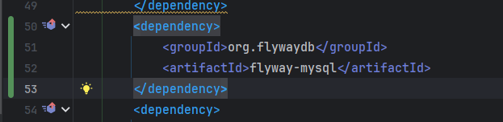

let's add the flyway configuration in the application.local.properties
```properties
spring.datasource.username=bookuser
spring.datasource.password=password
spring.datasource.url=jdbc:mysql://127.0.0.1:3306/bookdb?useUnicode=true&characterEncoding=UTF-8&ServerTimezone=UTC
spring.jpa.hibernate.ddl-auto=validate
spring.sql.init.mode=always

spring.flyway.user=bookadmin
spring.flyway.password=password
```
let's move the sql file to the resources/db/migration folder
```sql
drop table if exists book;
drop table if exists book_seq;

create table book
(
    id        bigint not null,
    isbn      varchar(255),
    publisher varchar(255),
    title     varchar(255),
    primary key (id)
) engine = InnoDB;

create table book_seq
(
    next_val bigint
) engine = InnoDB;

insert into book_seq
values (1);
```

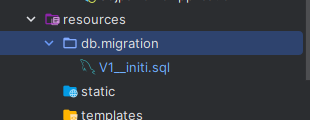
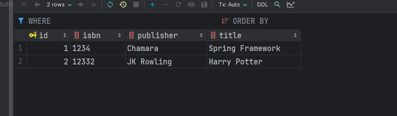
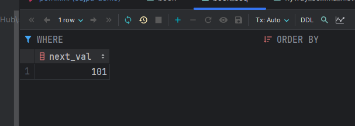
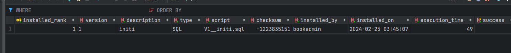
## 49 - Alter Table with Flyway
let's add a author class
```java
package chamara.springdatajpasample.sdjpademo.domain;

import jakarta.persistence.*;

@Entity
public class Author {
    @Id
    @GeneratedValue(strategy = GenerationType.AUTO)
    private Long id;

    private String firstName;

    private String lastName;

    public Author() {
    }

    public Author(String firstName, String lastName) {
        this.firstName = firstName;
        this.lastName = lastName;
    }
}
```

```sql
drop table if exists book;
drop table if exists book_seq;

create table book (
                      id bigint not null,
                      isbn varchar(255),
                      publisher varchar(255),
                      title varchar(255),
                      primary key (id)
) engine=InnoDB;

create table book_seq (
                          next_val bigint
) engine=InnoDB;

insert into book_seq values ( 1 );
```
```sql
drop table if exists author;
drop table if exists author_seq;

create table author
(
    id         bigint not null,
    first_name varchar(255),
    last_name varchar(255),
    primary key (id)
) engine = InnoDB;

create table author_seq (
                            next_val bigint
) engine=InnoDB;

insert into author_seq values ( 1 );
```
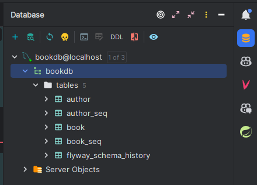

## 50 - Clean and Rebuild with Flyway
