### 51 - Introduction
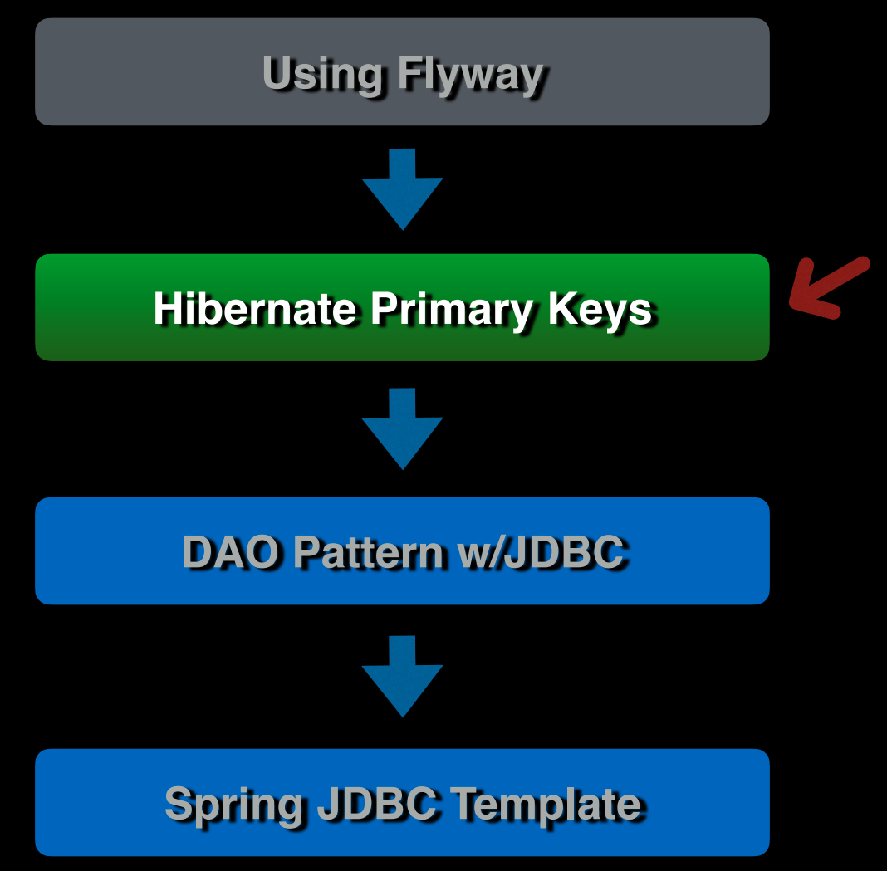
### 52 - Hibernate Primary Keys Overview
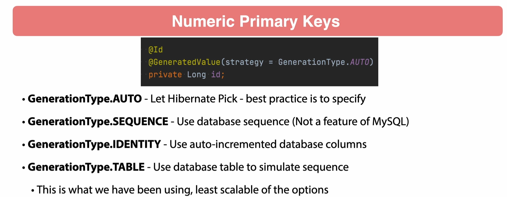
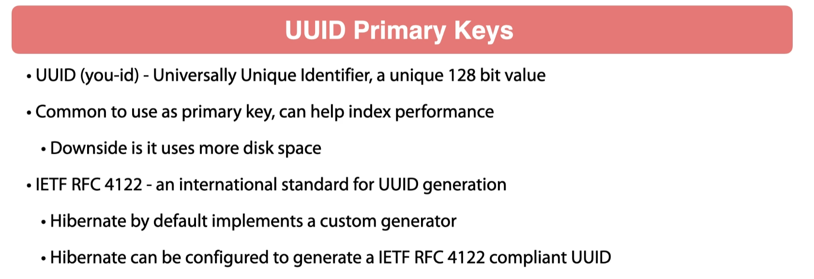
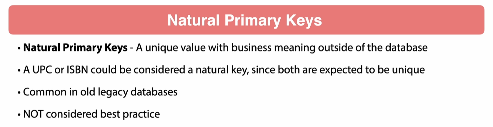
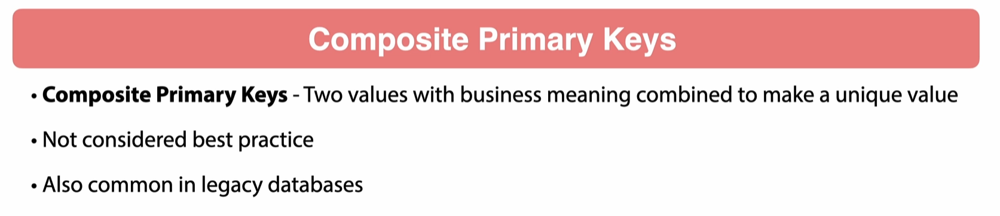
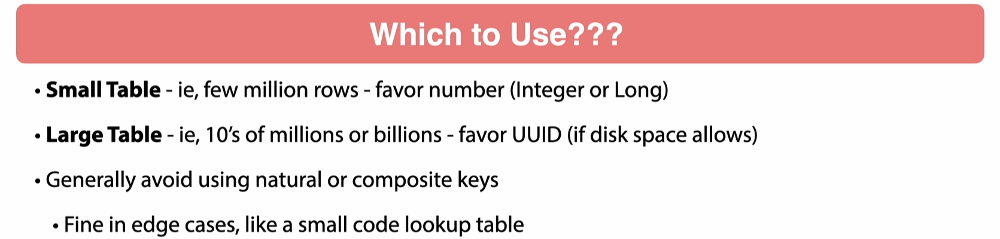
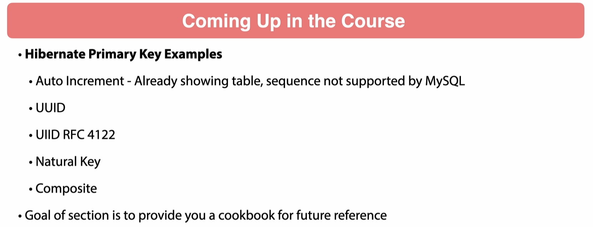
### 53 - Auto Incremented Primary Key

let's change the `id` field to `Long` and add `@GeneratedValue(strategy = GenerationType.IDENTITY)` to the `id` field.

```java
@Entity
public class Author {
    @Id
    @GeneratedValue(strategy = GenerationType.IDENTITY)
    private Long id;
```
let's do the same for the Author class.

```java

@Entity
public class Author {
    @Id
    @GeneratedValue(strategy = GenerationType.IDENTITY)
    private Long id;
```
`@GeneratedValue(strategy = GenerationType.IDENTITY)` is used to generate a value for the primary key field.
The `strategy` attribute is used to specify the generation strategy. The `GenerationType.IDENTITY` strategy is used to generate a value for the primary key field using the `auto-increment` feature of the database.

`@GeneratedValue(strategy = GenerationType.AUTO)` is used to generate a value for the primary key field.
The `strategy` attribute is used to specify the generation strategy. The `GenerationType.AUTO` Hibernate
is going to use a sequence table to generate the table.

using auto increment is the best way to generate primary keys.it is the most efficient way to generate primary keys.
it is also the most portable way to generate primary keys.
it is more performant than using a sequence table.

what is a sql sequence?
a sequence is a database object that generates a sequence of numbers. it is often used to generate unique primary keys.

what is a sequence table?
a sequence table is a database table that is used to generate a sequence of numbers. it is often used to generate unique primary keys.

let's create a new flyway migration.

```sql
alter table book change id id BIGINT auto_increment;
alter table author change id id BIGINT auto_increment;
```
and run the application.

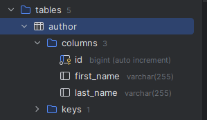

```sql
create table bookdb.author
(
    id         bigint auto_increment
        primary key,
    first_name varchar(255) null,
    last_name  varchar(255) null
);


```

### 54 - Vendor Specific Flyway Migrations

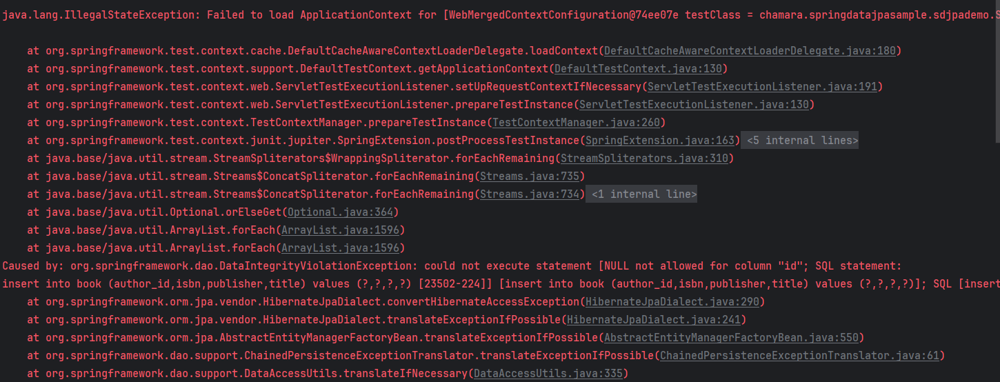
let's move the file structure in the db folder

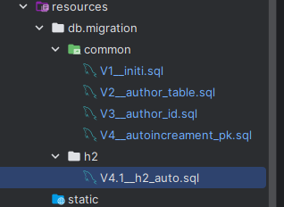

`V4.1__h2_auto.sql`

```sql
drop table if exists book;
drop table if exists author;

create table book (
    id BIGINT GENERATED BY DEFAULT AS IDENTITY NOT NULL,
    isbn VARCHAR(255),
    publisher VARCHAR(255),
    title VARCHAR(255),
    author_id BIGINT,
    PRIMARY KEY (id)
);

create table author (
    id BIGINT GENERATED BY DEFAULT AS IDENTITY NOT NULL,
    first_name VARCHAR(255),
    last_name VARCHAR(255),
    PRIMARY KEY (id)
);
```
and change the `application.properties` file to use the h2 database.

```properties
spring.flyway.locations=classpath:db/migration/common,classpath:db/migration/{vendor}
```
### 55 - UUID Primary Key
let's create a new entity class called `AuthorUuid`

```java
package chamara.springdatajpasample.sdjpademo.domain;

import jakarta.persistence.*;
import org.hibernate.annotations.JdbcTypeCode;

import java.sql.Types;
import java.util.Objects;
import java.util.UUID;

@Entity
public class AuthorUuid {
    @Id
    @GeneratedValue(strategy = GenerationType.AUTO)
    @JdbcTypeCode(value = Types.VARCHAR)
    @Column(nullable = false,length = 36, columnDefinition = "VARCHAR(36)",updatable = false)
    private UUID id;

    private String firstName;

    private String lastName;

    public AuthorUuid() {
    }

    public AuthorUuid(String firstName, String lastName) {
        this.firstName = firstName;
        this.lastName = lastName;
    }

    public UUID getId() {
        return id;
    }

    public void setId(UUID id) {
        this.id = id;
    }

    public String getFirstName() {
        return firstName;
    }

    public void setFirstName(String firstName) {
        this.firstName = firstName;
    }

    public String getLastName() {
        return lastName;
    }

    public void setLastName(String lastName) {
        this.lastName = lastName;
    }

    @Override
    public boolean equals(Object o) {
        if (this == o) return true;
        if (o == null || getClass() != o.getClass()) return false;
        AuthorUuid author = (AuthorUuid) o;
        return Objects.equals(id, author.id) && Objects.equals(firstName, author.firstName) && Objects.equals(lastName, author.lastName);
    }

    @Override
    public int hashCode() {
        return Objects.hash(id, firstName, lastName);
    }

    @Override
    public String toString() {
        return "Author{" +
                "id=" + id +
                ", firstName='" + firstName + '\'' +
                ", lastName='" + lastName + '\'' +
                '}';
    }
}

```
let's create a repository for the `AuthorUuid` class.

```java
package chamara.springdatajpasample.sdjpademo.repositories;

import chamara.springdatajpasample.sdjpademo.domain.AuthorUuid;
import org.springframework.data.jpa.repository.JpaRepository;

public interface AuthUuidRepository extends JpaRepository<AuthorUuid, Long> {
}
```

let's add sample data to the `AuthorUuid` class.

```java
package chamara.springdatajpasample.sdjpademo.bootstrap;

import chamara.springdatajpasample.sdjpademo.domain.AuthorUuid;
import chamara.springdatajpasample.sdjpademo.domain.Book;
import chamara.springdatajpasample.sdjpademo.repositories.AuthUuidRepository;
import chamara.springdatajpasample.sdjpademo.repositories.BookRepository;
import org.springframework.boot.CommandLineRunner;
import org.springframework.context.annotation.Profile;
import org.springframework.stereotype.Component;

@Component
@Profile({"local", "default"})
public class DataInitializer implements CommandLineRunner {
    private final BookRepository bookRepository;
    private final AuthUuidRepository authUuidRepository;
    public DataInitializer(BookRepository bookRepository,AuthUuidRepository authUuidRepository) {
        this.bookRepository = bookRepository;
        this.authUuidRepository = authUuidRepository;

    }

    @Override
    public void run(String... args) throws Exception {
        System.out.println("Bootstrap started");
        System.out.println("Clearing all data");
        bookRepository.deleteAll();
        System.out.println("Clearing all data completed");

        Book book = new Book("1234", "Spring Framework", "Chamara",null);
        System.out.println("Book ID: " + book.getId());
        Book savedResponse1 = bookRepository.save(book);
        System.out.println("Book ID: " + savedResponse1.getId());

        Book book1 = new Book("12332", "Harry Potter", "JK Rowling",null);
        System.out.println("Book ID: " + book1.getId());
        Book savedResponse2 = bookRepository.save(book1);
        System.out.println("Book ID: " + savedResponse2.getId());

        bookRepository.findAll().forEach(book2 -> {
            System.out.println(book2.getId());
            System.out.println(book2.getTitle());
        });

        AuthorUuid authorUuid = new AuthorUuid();
        authorUuid.setFirstName("Chamara");
        authorUuid.setLastName("Sumanapala");
        AuthorUuid saved = authUuidRepository.save(authorUuid);
        System.out.println("Author ID: " + saved.getId());

    }
}
```

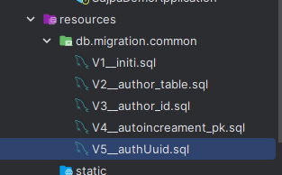

let's create a new flyway migration file.
```sql
create table author_uuid(
    id varchar(36) not null,
    first_name varchar(255),
    last_name varchar(255),
    primary key (id)
) engine = InnoDB;
```
### 56 - UUID RFC 4122 Primary Key
`BookUuid` class.
```java
package chamara.springdatajpasample.sdjpademo.domain;

import jakarta.persistence.*;
import org.hibernate.annotations.GenericGenerator;

import java.util.Objects;
import java.util.UUID;

@Entity
public class BookUuid {
    private String isbn;
    private String title;
    private String publisher;
    @Id
    @GeneratedValue(generator = "uuid2")
    @GenericGenerator(name = "uuid2", strategy = "uuid2")
    @Column(columnDefinition = "BINARY(16)",updatable = false, nullable = false)
    private UUID id;
    @Column
    private Long authorId;

    public BookUuid() {

    }
    public BookUuid(String isbn, String title, String publisher, Long authorId) {
        this.isbn = isbn;
        this.title = title;
        this.publisher = publisher;
        this.authorId = authorId;
    }
    public String getIsbn() {
        return isbn;
    }

    public void setIsbn(String isbn) {
        this.isbn = isbn;
    }

    public String getTitle() {
        return title;
    }

    public void setTitle(String title) {
        this.title = title;
    }

    public String getPublisher() {
        return publisher;
    }

    public void setPublisher(String publisher) {
        this.publisher = publisher;
    }

    public void setId(UUID id) {
        this.id = id;
    }

    public UUID getId() {
        return id;
    }
    public Long getAuthorId() {
        return authorId;
    }

    public void setAuthorId(Long authorId) {
        this.authorId = authorId;
    }
    @Override
    public boolean equals(Object o) {
        if (this == o) return true;
        if (o == null || getClass() != o.getClass()) return false;
        BookUuid book = (BookUuid) o;
        return Objects.equals(id, book.id);
    }

    @Override
    public int hashCode() {
        return Objects.hash(id);
    }
}
```

Repository for the `BookUuid` class.

```java
package chamara.springdatajpasample.sdjpademo.repositories;

import chamara.springdatajpasample.sdjpademo.domain.BookUuid;
import org.springframework.data.jpa.repository.JpaRepository;

public interface BookUuidRepository extends JpaRepository<BookUuid, Long> {
}


```

```java
package chamara.springdatajpasample.sdjpademo.bootstrap;

import chamara.springdatajpasample.sdjpademo.domain.AuthorUuid;
import chamara.springdatajpasample.sdjpademo.domain.Book;
import chamara.springdatajpasample.sdjpademo.domain.BookUuid;
import chamara.springdatajpasample.sdjpademo.repositories.AuthUuidRepository;
import chamara.springdatajpasample.sdjpademo.repositories.BookRepository;
import chamara.springdatajpasample.sdjpademo.repositories.BookUuidRepository;
import org.springframework.boot.CommandLineRunner;
import org.springframework.context.annotation.Profile;
import org.springframework.stereotype.Component;

@Component
@Profile({"local", "default"})
public class DataInitializer implements CommandLineRunner {
    private final BookRepository bookRepository;
    private final AuthUuidRepository authUuidRepository;
    private final BookUuidRepository bookUuidRepository;
    public DataInitializer(BookRepository bookRepository, AuthUuidRepository authUuidRepository, BookUuidRepository bookUuidRepository) {
        this.bookRepository = bookRepository;
        this.authUuidRepository = authUuidRepository;
        this.bookUuidRepository = bookUuidRepository;

    }

    @Override
    public void run(String... args) throws Exception {
        System.out.println("Bootstrap started");
        System.out.println("Clearing all data");
        bookRepository.deleteAll();
        System.out.println("Clearing all data completed");

        Book book = new Book("1234", "Spring Framework", "Chamara",null);
        System.out.println("Book ID: " + book.getId());
        Book savedResponse1 = bookRepository.save(book);
        System.out.println("Book ID: " + savedResponse1.getId());

        Book book1 = new Book("12332", "Harry Potter", "JK Rowling",null);
        System.out.println("Book ID: " + book1.getId());
        Book savedResponse2 = bookRepository.save(book1);
        System.out.println("Book ID: " + savedResponse2.getId());

        bookRepository.findAll().forEach(book2 -> {
            System.out.println(book2.getId());
            System.out.println(book2.getTitle());
        });

        AuthorUuid authorUuid = new AuthorUuid();
        authorUuid.setFirstName("Chamara");
        authorUuid.setLastName("Sumanapala");
        AuthorUuid saved = authUuidRepository.save(authorUuid);
        System.out.println("Author ID: " + saved.getId());

        BookUuid bookUuid = new BookUuid();
        bookUuid.setTitle("Spring Framework");

        BookUuid savedBookUuid = bookUuidRepository.save(bookUuid);
        System.out.println("Book UUID: " + savedBookUuid.getId());

    }
}

```
and the flyway migration file.

```sql
create table book_uuid (
                      id binary(16) not null,
                      isbn varchar(255),
                      publisher varchar(255),
                      title varchar(255),
                      author_id bigint,
                      primary key (id)
) engine=InnoDB;
```

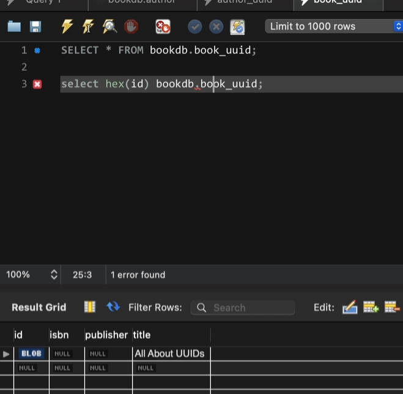
### 57 - H2 Workaround
### 58 - Natural Primary Key
### 59 - Composite Primary Key
### 60 - Embedded Composite Primary Key
