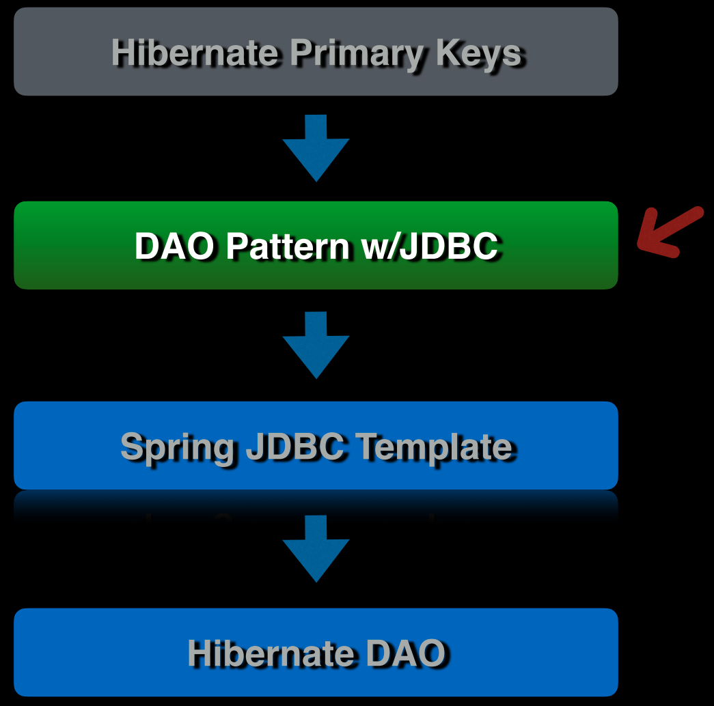
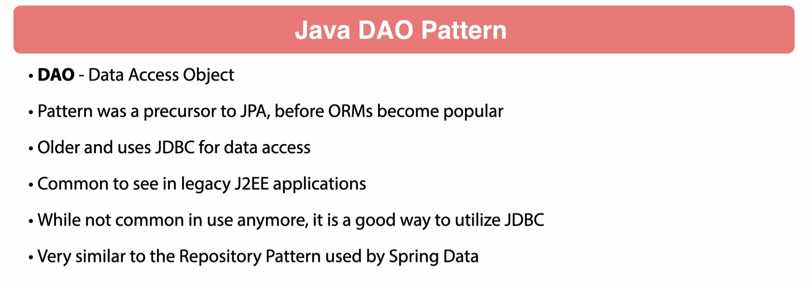
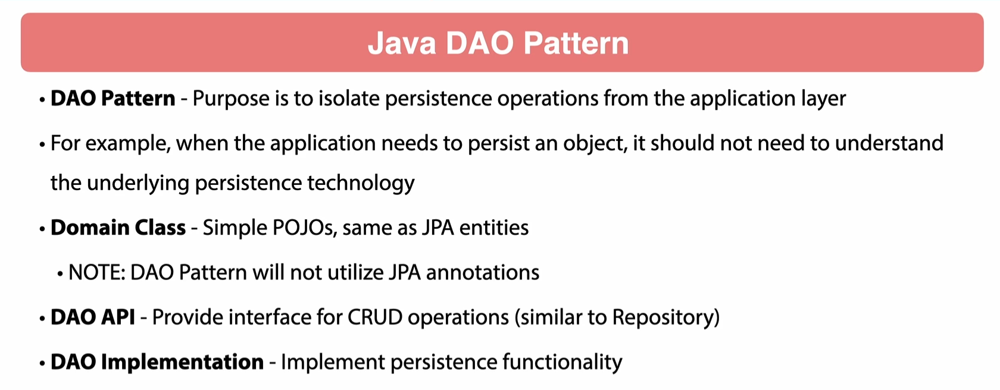
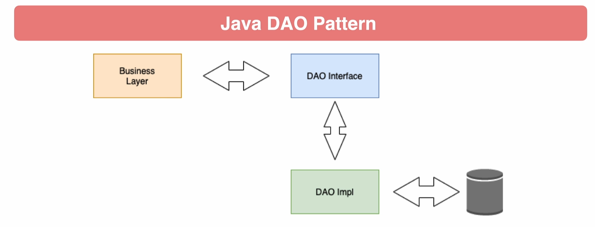
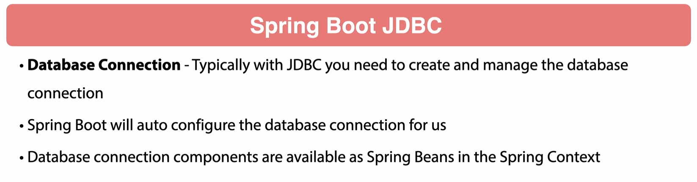
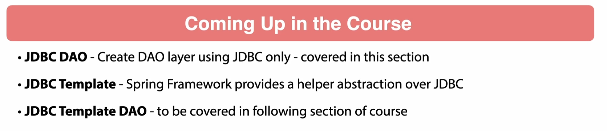
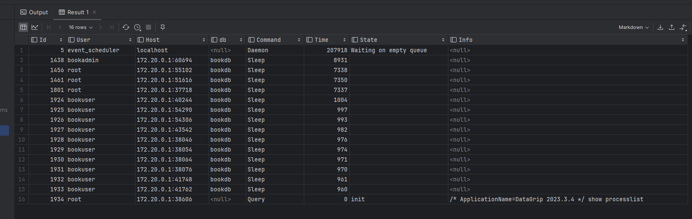
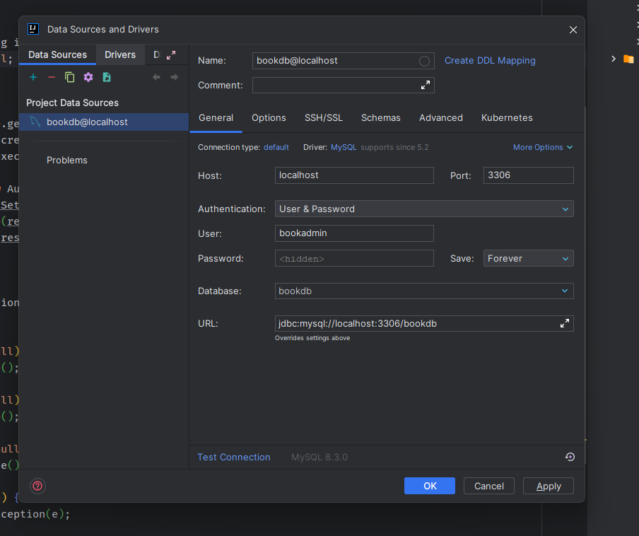

### 61 - Introduction



### 62 - Introduction to DAO Pattern







### 63 - Create Author DAO

let's create the DAO interface and the implementation class for the `Author` entity.

```java
package chamara.springdatajpasample.sdjpademo.doa;

import chamara.springdatajpasample.sdjpademo.domain.Author;

public interface AuthorDoa {
    Author getAuthorById(Long id);
}
```

```java
package chamara.springdatajpasample.sdjpademo.doa;

import chamara.springdatajpasample.sdjpademo.domain.Author;
import org.springframework.stereotype.Component;

@Component
public class AuthorDoaImpl implements AuthorDoa {
    @Override
    public Author getAuthorById(Long id) {
        return null;
    }
}

```

let's create a test class to test the `AuthorDoa` implementation.

```java
package chamara.springdatajpasample.sdjpademo.doa;

import chamara.springdatajpasample.sdjpademo.domain.Author;
import org.junit.jupiter.api.Test;
import org.springframework.beans.factory.annotation.Autowired;
import org.springframework.boot.test.autoconfigure.jdbc.AutoConfigureTestDatabase;
import org.springframework.boot.test.autoconfigure.orm.jpa.DataJpaTest;
import org.springframework.context.annotation.ComponentScan;
import org.springframework.test.context.ActiveProfiles;

import static org.assertj.core.api.Assertions.assertThat;

@ActiveProfiles("local")
@DataJpaTest
@ComponentScan(basePackages = "chamara.springdatajpasample.sdjpademo.doa")
@AutoConfigureTestDatabase(replace = AutoConfigureTestDatabase.Replace.NONE)
class AuthorDoaImplTest {
    @Autowired
    AuthorDoa authorDoa;

    @Test
    void itShouldName() {
        Author author = authorDoa.getAuthorById(1L);
        assertThat(author).isNotNull();
    }
}
```

### 64 - Implement Get Author By Id

```java
package chamara.springdatajpasample.sdjpademo.doa;

import chamara.springdatajpasample.sdjpademo.domain.Author;
import org.springframework.stereotype.Component;

import javax.sql.DataSource;
import java.sql.Connection;
import java.sql.ResultSet;
import java.sql.SQLException;
import java.sql.Statement;

@Component
public class AuthorDoaImpl implements AuthorDoa {

    private final DataSource dataSource;

    public AuthorDoaImpl(DataSource dataSource) {
        this.dataSource = dataSource;
    }

    @Override
    public Author getAuthorById(Long id) {
        Connection connection = null;
        Statement statement = null;
        ResultSet resultSet = null;
        try {
            connection = dataSource.getConnection();
            statement = connection.createStatement();
            resultSet = statement.executeQuery("SELECT * FROM author WHERE id = " + id);
            if (resultSet.next()) {
                Author author = new Author();
                author.setId(resultSet.getLong("id"));
                author.setFirstName(resultSet.getString("first_name"));
                author.setLastName(resultSet.getString("last_name"));
                return author;
            }
        } catch (SQLException e) {
            throw new RuntimeException(e);
        }
        return null;
    }
}

```

### 65 - Release Database Resources



springboot will create a connection pool and manage the connections. so we don't need to close the connection manually.
but we need to close the `Statement` and `ResultSet` manually.

how to check the connection pool is working?

```sql
show processlist;
```

let's close the `Statement` and `ResultSet` manually.

```java
package chamara.springdatajpasample.sdjpademo.doa;

import chamara.springdatajpasample.sdjpademo.domain.Author;
import org.springframework.stereotype.Component;

import javax.sql.DataSource;
import java.sql.Connection;
import java.sql.ResultSet;
import java.sql.SQLException;
import java.sql.Statement;

@Component
public class AuthorDoaImpl implements AuthorDoa {

    private final DataSource dataSource;

    public AuthorDoaImpl(DataSource dataSource) {
        this.dataSource = dataSource;
    }

    @Override
    public Author getAuthorById(Long id) {
        Connection connection = null;
        Statement statement = null;
        ResultSet resultSet = null;
        try {
            connection = dataSource.getConnection();
            statement = connection.createStatement();
            resultSet = statement.executeQuery("SELECT * FROM author WHERE id = " + id);
            if (resultSet.next()) {
                Author author = new Author();
                author.setId(resultSet.getLong("id"));
                author.setFirstName(resultSet.getString("first_name"));
                author.setLastName(resultSet.getString("last_name"));
                return author;
            }
        } catch (SQLException e) {
            throw new RuntimeException(e);
        } finally {
            try {
                // Check if the ResultSet object is not null
                if (resultSet != null) {
                    // If it's not null, close the ResultSet
                    resultSet.close();
                }
                // Check if the Statement object is not null
                if (statement != null) {
                    // If it's not null, close the Statement
                    statement.close();
                }
                // Check if the Connection object is not null
                if (connection != null) {
                    // If it's not null, close the Connection
                    connection.close();
                }
            } catch (SQLException e) {
                // If any SQLException occurs during the closing of ResultSet, Statement, or Connection,
                // it's caught and a new RuntimeException is thrown with the caught exception as its cause.
                throw new RuntimeException(e);
            }
        }
    }
```

### 66 - IntelliJ Database Configuration

let's configure the database in the IntelliJ IDEA.



### 67 - Using Prepared Statements

why we should use prepared statements instead of statements?

- SQL Injection
- Performance

let's use prepared statements instead of statements.

```java
package chamara.springdatajpasample.sdjpademo.doa;

import chamara.springdatajpasample.sdjpademo.domain.Author;
import org.springframework.stereotype.Component;

import javax.sql.DataSource;
import java.sql.Connection;
import java.sql.PreparedStatement;
import java.sql.ResultSet;
import java.sql.SQLException;

@Component
public class AuthorDoaImpl implements AuthorDoa {

    private final DataSource dataSource;

    public AuthorDoaImpl(DataSource dataSource) {
        this.dataSource = dataSource;
    }

    @Override
    public Author getAuthorById(Long id) {
        Connection connection = null;
        ResultSet resultSet = null;
        PreparedStatement preparedStatement = null;
        try {
            connection = dataSource.getConnection();
            preparedStatement = connection.prepareStatement("SELECT * FROM author WHERE id = ?");
            preparedStatement.setLong(1, id);
//            this is not safe to use in production
//            this could lead to SQL injection
//            resultSet = statement.executeQuery("SELECT * FROM author WHERE id = " + id);
            resultSet = preparedStatement.executeQuery();
            if (resultSet.next()) {
                Author author = new Author();
                author.setId(resultSet.getLong("id"));
                author.setFirstName(resultSet.getString("first_name"));
                author.setLastName(resultSet.getString("last_name"));
                return author;
            }
        } catch (SQLException e) {
            throw new RuntimeException(e);
        } finally {
            try {
                if (resultSet != null) {
                    resultSet.close();
                }
                if (connection != null) {
                    connection.close();
                }
                if (preparedStatement != null) {
                    preparedStatement.close();
                }
            } catch (SQLException e) {
                throw new RuntimeException(e);
            }
        }
        return null;
    }
}
```

### 68 - Refactoring Duplicate Code

```java
package chamara.springdatajpasample.sdjpademo.doa;

import chamara.springdatajpasample.sdjpademo.domain.Author;

public interface AuthorDoa {
    Author getAuthorById(Long id);

    Author findAuthorByFirstName(String firstName);
}

```

```java
package chamara.springdatajpasample.sdjpademo.doa;

import chamara.springdatajpasample.sdjpademo.domain.Author;
import org.springframework.stereotype.Component;

import javax.sql.DataSource;
import java.sql.Connection;
import java.sql.PreparedStatement;
import java.sql.ResultSet;
import java.sql.SQLException;

@Component
public class AuthorDoaImpl implements AuthorDoa {

    private final DataSource dataSource;

    public AuthorDoaImpl(DataSource dataSource) {
        this.dataSource = dataSource;
    }

    private Author getAuthor(ResultSet resultSet) throws SQLException {
        Author author = new Author();
        author.setId(resultSet.getLong("id"));
        author.setFirstName(resultSet.getString("first_name"));
        author.setLastName(resultSet.getString("last_name"));
        return author;
    }

    @Override
    public Author getAuthorById(Long id) {
        Connection connection = null;
        ResultSet resultSet = null;
        PreparedStatement preparedStatement = null;
        try {
            connection = dataSource.getConnection();
            preparedStatement = connection.prepareStatement("SELECT * FROM author WHERE id = ?");
            preparedStatement.setLong(1, id);
            resultSet = preparedStatement.executeQuery();
            if (resultSet.next()) {
                return getAuthor(resultSet);
            }
        } catch (SQLException e) {
            throw new RuntimeException(e);
        } finally {
            try {
                closeAllConnections(connection, resultSet, preparedStatement);
            } catch (SQLException e) {
                throw new RuntimeException(e);
            }
        }
        return null;
    }

    private void closeAllConnections(Connection connection, ResultSet resultSet, PreparedStatement preparedStatement) throws SQLException {
        try {
            if (resultSet != null) {
                resultSet.close();
            }
            if (connection != null) {
                connection.close();
            }
            if (preparedStatement != null) {
                preparedStatement.close();
            }
        } catch (SQLException e) {
            e.printStackTrace();
        }
    }

    @Override
    public Author findAuthorByFirstName(String firstName) {
        Connection connection = null;
        ResultSet resultSet = null;
        PreparedStatement preparedStatement = null;
        try {
            connection = dataSource.getConnection();
            preparedStatement = connection.prepareStatement("SELECT * FROM author WHERE first_name = ?");
            preparedStatement.setString(1, firstName);
            resultSet = preparedStatement.executeQuery();
            if (resultSet.next()) {
                return getAuthor(resultSet);
            }
        } catch (SQLException e) {
            throw new RuntimeException(e);
        } finally {
            try {
                closeAllConnections(connection, resultSet, preparedStatement);
            } catch (SQLException e) {
                e.printStackTrace();
            }
        }
        return null;
    }
}

```

```java
package chamara.springdatajpasample.sdjpademo.doa;

import chamara.springdatajpasample.sdjpademo.domain.Author;
import org.junit.jupiter.api.Test;
import org.springframework.beans.factory.annotation.Autowired;
import org.springframework.boot.test.autoconfigure.jdbc.AutoConfigureTestDatabase;
import org.springframework.boot.test.autoconfigure.orm.jpa.DataJpaTest;
import org.springframework.context.annotation.ComponentScan;
import org.springframework.test.context.ActiveProfiles;

import static org.assertj.core.api.Assertions.assertThat;

@ActiveProfiles("local")
@DataJpaTest
@ComponentScan(basePackages = "chamara.springdatajpasample.sdjpademo.doa")
@AutoConfigureTestDatabase(replace = AutoConfigureTestDatabase.Replace.NONE)
class AuthorDoaImplTest {
    @Autowired
    AuthorDoa authorDoa;

    @Test
    void itShouldReturnAuthorWhenIdIsProvided() {
        Author author = authorDoa.getAuthorById(1L);
        assertThat(author).isNotNull();
    }

    @Test
    void itShouldReturnAuthorWhenFirstNameIsProvided() {
        Author author = authorDoa.findAuthorByFirstName("Craig");
        assertThat(author).isNotNull();
    }
}
```

### 69 - Save New Author

```java
package chamara.springdatajpasample.sdjpademo.doa;

import chamara.springdatajpasample.sdjpademo.domain.Author;

public interface AuthorDoa {
    Author getAuthorById(Long id);

    Author findAuthorByFirstName(String firstName);

    Author saveAuthor(Author author);
}

```

```java
package chamara.springdatajpasample.sdjpademo.doa;

@Override
public Author saveAuthor(Author author) {
    Connection connection = null;
    ResultSet resultSet = null;
    PreparedStatement preparedStatement = null;
    try {
        connection = dataSource.getConnection();
        preparedStatement = connection.prepareStatement("INSERT INTO author (first_name, last_name) VALUES (?, ?)");
        preparedStatement.setString(1, author.getFirstName());
        preparedStatement.setString(2, author.getLastName());
        preparedStatement.executeUpdate();
        preparedStatement = connection.prepareStatement("SELECT * FROM author WHERE first_name = ?");
        preparedStatement.setString(1, author.getFirstName());
        resultSet = preparedStatement.executeQuery();
        if (resultSet.next()) {
            return getAuthor(resultSet);
        }
    } catch (SQLException e) {
        throw new RuntimeException(e);
    } finally {
        try {
            closeAllConnections(connection, resultSet, preparedStatement);
        } catch (SQLException e) {
            throw new RuntimeException(e);
        }
    }
    return null;
}
```

```java
package chamara.springdatajpasample.sdjpademo.doa;

@Test
void itShouldSaveAuthor() {
    Author author = new Author();
    author.setFirstName("John");
    author.setLastName("Doe");
    Author savedAuthor = authorDoa.saveAuthor(author);
    assertThat(savedAuthor).isNotNull();
}
```

### 70 - Update Author

let's write the test case for the `update` method.

```java
package chamara.springdatajpasample.sdjpademo.doa;

@Test
void itShouldUpdateAuthor() {
    // given
    Author author = new Author();
    author.setFirstName("John");
    author.setLastName("Doe");
    Author savedAuthor = authorDoa.saveAuthor(author);
    savedAuthor.setLastName("Updated");

    // when
    Author updateAuthor = authorDoa.updateAuthor(savedAuthor);
    // then
    assertThat(savedAuthor.getLastName()).isEqualTo(updateAuthor.getLastName());
}
```

let's add the new method to the `AuthorDoa` interface.

```java
package chamara.springdatajpasample.sdjpademo.doa;

import chamara.springdatajpasample.sdjpademo.domain.Author;

public interface AuthorDoa {
    Author getAuthorById(Long id);

    Author findAuthorByFirstName(String firstName);

    Author saveAuthor(Author author);

    Author updateAuthor(Author author);
}
```

let's implement the `update` method.

```java

@Override
public Author updateAuthor(Author author) {
    Connection connection = null;
    ResultSet resultSet = null;
    PreparedStatement preparedStatement = null;
    try {
        connection = dataSource.getConnection();
        preparedStatement = connection.prepareStatement("UPDATE author SET first_name = ?, last_name = ? WHERE id = ?");
        preparedStatement.setString(1, author.getFirstName());
        preparedStatement.setString(2, author.getLastName());
        preparedStatement.setLong(3, author.getId());
        preparedStatement.executeUpdate();
        preparedStatement = connection.prepareStatement("SELECT * FROM author WHERE first_name = ?");
        preparedStatement.setString(1, author.getFirstName());
        resultSet = preparedStatement.executeQuery();
        if (resultSet.next()) {
            return getAuthor(resultSet);
        }
    } catch (SQLException e) {
        throw new RuntimeException(e);
    } finally {
        try {
            closeAllConnections(connection, resultSet, preparedStatement);
        } catch (SQLException e) {
            throw new RuntimeException(e);
        }
    }
    return null;
}
```

### 71 - Delete Author

```java
package chamara.springdatajpasample.sdjpademo.doa;

import chamara.springdatajpasample.sdjpademo.domain.Author;

public interface AuthorDoa {
    Author getAuthorById(Long id);

    Author findAuthorByFirstName(String firstName);

    Author saveAuthor(Author author);

    Author updateAuthor(Author author);

    Author deleteAuthor(Long id);
}

```

```java
package chamara.springdatajpasample.sdjpademo.doa;

@Override
public Author deleteAuthor(Long id) {

    Connection connection = null;
    ResultSet resultSet = null;
    PreparedStatement preparedStatement = null;
    Author deletedAuthor = null;
    try {
        connection = dataSource.getConnection();
        preparedStatement = connection.prepareStatement("SELECT * FROM author WHERE id = ?");
        preparedStatement.setLong(1, id);
        resultSet = preparedStatement.executeQuery();
        if (resultSet.next()) {
            deletedAuthor = getAuthor(resultSet);
        }
        preparedStatement = connection.prepareStatement("DELETE FROM author WHERE id = ?");
        preparedStatement.setLong(1, id);
        preparedStatement.executeUpdate();
        return deletedAuthor;
    } catch (SQLException e) {
        throw new RuntimeException(e);
    } finally {
        try {
            closeAllConnections(connection, resultSet, preparedStatement);
        } catch (SQLException e) {
            throw new RuntimeException(e);
        }
    }
}
```

```java
package chamara.springdatajpasample.sdjpademo.doa;

@Test
void itShouldDeleteTheAuthor() {
    // given
    Author author = new Author();
    author.setFirstName("John");
    author.setLastName("Doe");
    Author savedAuthor = authorDoa.saveAuthor(author);
    Long id = savedAuthor.getId();
    // when
    Author deletedAuthorId = authorDoa.deleteAuthor(id);
    // then
    assertThat(savedAuthor.getId()).isEqualTo(deletedAuthorId.getId());
}
```

### 72 - Refactor Author id to Author

###                                          

###                                          

###                                          

###                                          

###                                          