```xml
            <plugin>
                <groupId>org.codehaus.mojo</groupId>
                <artifactId>versions-maven-plugin</artifactId>
                <version>2.17.1</version>
                <configuration>
                    <ruleSet>
                        <!-- zero or more elements -->
                        <ignoreVersions>
                            <!-- zero or more elements -->
                            <ignoreVersion>
                                <version>1.0.0</version>
                            </ignoreVersion>
                            <ignoreVersion>
                                <!-- can be either: 'exact' (default), 'regex' or 'range' -->
                                <type>regex</type>
                                <version>(.+-SNAPSHOT|.+-M\d)</version>
                            </ignoreVersion>
                            <ignoreVersion>
                                <type>regex</type>
                                <version>.+-(alpha|beta)</version>
                            </ignoreVersion>
                        </ignoreVersions>
                    </ruleSet>
                    <allowMajorUpdates>false</allowMajorUpdates> <!-- Add this line -->
                    <allowSnapshots>false</allowSnapshots> <!-- Add this line -->
                </configuration>
            </plugin>
```

we can use the report goal to see parent pom versions that are not up to date:
```bash
 <reporting>
        <plugins>
            <plugin>
                <groupId>org.codehaus.mojo</groupId>
                <artifactId>versions-maven-plugin</artifactId>
                <version>2.17.1</version>
                <configuration>
                   <formats>
                        <format>xml</format>
                    </formats>
                </configuration>
                <reportSets>
                    <reportSet>
                        <reports>
                            <report>parent-updates-report</report>
                        </reports>
                    </reportSet>
                </reportSets>
            </plugin>
        </plugins>
    </reporting>
```

how to use maven versions plugin to decide whether a parent pom version is available or not:
we can use a git hook to run the versions plugin and check if the parent pom version is available or not.
```bash
#!/bin/sh

# let's run the command in the root of the project

ROOT_DIRECTORY=$(git rev-parse --show-toplevel)

# Ensure the mvnw command is executable
chmod +x "$ROOT_DIRECTORY/mvnw"

# check the maven version
"$ROOT_DIRECTORY/mvnw" -v

# let's run the mvn versions:display-dependency-updates

output="$("$ROOT_DIRECTORY/mvnw" versions:display-parent-updates)"
if echo "$output" | grep -q "The parent project is the latest version"; then
  UPTO_DATE=true
else
  UPTO_DATE=false
fi

echo "UPTO_DATE: $UPTO_DATE"

exit 0

```

to run the above maven command we need to add the plugin below 

```xml
            <plugin>
                <groupId>org.codehaus.mojo</groupId>
                <artifactId>versions-maven-plugin</artifactId>
                <version>2.17.1</version>
                <configuration>
                    <ruleSet>
                        <!-- zero or more elements -->
                        <ignoreVersions>
                            <ignoreVersion>
                                <!-- can be either: 'exact' (default), 'regex' or 'range' -->
                                <type>regex</type>
                                <version>(.+-SNAPSHOT|.+-M\d)</version>
                            </ignoreVersion>
                            <ignoreVersion>
                                <type>regex</type>
                                <version>.+-(alpha|beta)</version>
                            </ignoreVersion>
                        </ignoreVersions>
                    </ruleSet>
                    <allowMajorUpdates>false</allowMajorUpdates> <!-- Add this line -->
                    <allowSnapshots>false</allowSnapshots> <!-- Add this line -->
                </configuration>
            </plugin>
```

if we have a parent pom version available we can use openrewrite to update the parent pom version:
for a spring boot project we can use the below command to update the parent pom version:
```xml
<plugin>
    <groupId>org.openrewrite.maven</groupId>
    <artifactId>rewrite-maven-plugin</artifactId>
    <version>5.37.0</version>
    <configuration>
        <exportDatatables>true</exportDatatables>
        <scope>compile</scope>
        <overrideTransitive>true</overrideTransitive>
        <addMarkers>true</addMarkers>
        <activeRecipes>
            <recipe>org.openrewrite.java.spring.boot3.UpgradeSpringBoot_3_3</recipe>
            <recipe>org.openrewrite.java.dependencies.DependencyVulnerabilityCheck</recipe>
        </activeRecipes>
    </configuration>
    <dependencies>
        <dependency>
            <groupId>org.openrewrite.recipe</groupId>
            <artifactId>rewrite-java-dependencies</artifactId>
            <version>1.14.0</version>
        </dependency>
        <dependency>
            <groupId>org.openrewrite.recipe</groupId>
            <artifactId>rewrite-spring</artifactId>
            <version>5.16.0</version>
            <scope>runtime</scope>
        </dependency>
    </dependencies>
</plugin>
```

and we need to create a yml configuration file to specify the parent pom version to be updated:
```yaml
type: specs.openrewrite.org/v1beta/recipe
name: com.yourorg.UpgradeSpringBootParentVersion
displayName: Upgrade Spring Boot Parent Version
recipeList:
  - org.openrewrite.maven.ChangeParentPomVersion:
      groupId: org.springframework.boot
      artifactId: spring-boot-starter-parent
      version: 3.3.2
  - org.openrewrite.java.spring.boot3.UpgradeSpringBoot_3_3
```

let's write a hook command to add the above plugin to the parent pom:
```bash
#!/bin/sh

# let's run the command in the root of the project

ROOT_DIRECTORY=$(git rev-parse --show-toplevel)
# Define the file to be checked and modified
FILE="$ROOT_DIRECTORY/rewrite.yml"
POM_FILE="$ROOT_DIRECTORY/pom.xml"
# Ensure the mvnw command is executable
chmod +x "$ROOT_DIRECTORY/mvnw"

# check the maven version
"$ROOT_DIRECTORY/mvnw" -v

# let's run the mvn versions:display-dependency-updates

output="$("$ROOT_DIRECTORY/mvnw" versions:display-parent-updates)"
echo "$output"
if echo "$output" | grep -q "The parent project is the latest version"; then
  NOT_UPTO_DATE=false
else
  NOT_UPTO_DATE=true
fi

echo "NOT_UPTO_DATE: $NOT_UPTO_DATE"

# if the parent is not up to date, add the 
# Define the recipe to be added
RECIPE="						<recipe>org.openrewrite.java.spring.boot3.UpgradeSpringBoot_3_3</recipe>"

# Define the recipe to be added
RECIPE_SECTION_TO_ADD=$(cat <<EOF
---
type: specs.openrewrite.org/v1beta/recipe
name: com.yourorg.UpgradeSpringBootParentVersion
displayName: Upgrade Spring Boot Parent Version
recipeList:
  - org.openrewrite.maven.ChangeParentPomVersion:
      groupId: org.springframework.boot
      artifactId: spring-boot-starter-parent
      version: 3.3.2
  - org.openrewrite.java.spring.boot3.UpgradeSpringBoot_3_3
EOF
)


# Check if the recipe already exists in the file
if ! grep -q "<recipe>org.openrewrite.java.spring.boot3.UpgradeSpringBoot_3_3</recipe>" "$POM_FILE"; then
    # Check the condition
    if [ "$NOT_UPTO_DATE" = true ]; then
        # Add the recipe inside the <activeRecipes> tag
        sed -i '/<activeRecipes>/a\'"$RECIPE"'' pom.xml
        echo "Recipe added to pom.xml"
        if grep -q "name: com.yourorg.UpgradeSpringBootParentVersion" "$FILE"; then
            echo "Recipe already exists in $FILE"
        else
            # Append the recipe to the file
            echo "$RECIPE_SECTION_TO_ADD" >> "$FILE"
            echo "Recipe appended to $FILE"
        fi
    else
        echo "Condition not met, recipe not added"
    fi
else
    echo "Recipe already exists in $FILE"
fi


# Check if the recipe already exists in the file

exit 0
```

## How to add dependency check to the maven build:

we can use the dependency-check-maven plugin to check for vulnerabilities in the dependencies:
```xml

    <build>
        <plugins>
            <plugin>
                <groupId>org.owasp</groupId>
                <artifactId>dependency-check-maven</artifactId>
                <version>10.0.3</version>
                <configuration>
                    <format>CSV</format>
                    <prettyPrint>true</prettyPrint>
                </configuration>
                <executions>
                    <execution>
                        <goals>
                            <goal>check</goal>
                        </goals>
                    </execution>
                </executions>
            </plugin>
        </plugins>
    </build>
```

and we can use the below command to run the dependency check:

```bash
./mvnw dependency-check-maven:check
```

with this configuration, we can run the dependency check on every build, but we can also use a git hook to run the dependency check before the commit:

```bash
#!/bin/sh

# let's run the command in the root of the project

ROOT_DIRECTORY=$(git rev-parse --show-toplevel)

# Ensure the mvnw command is executable

chmod +x "$ROOT_DIRECTORY/mvnw"

# check the maven version

"$ROOT_DIRECTORY/mvnw" -v

# let's run the mvn dependency-check-maven:check

"$ROOT_DIRECTORY/mvnw" dependency-check-maven:check

exit 0
```

| Project | ScanDate | DependencyName | DependencyPath | Description | License | Md5 | Sha1 | Identifiers | CPE | CVE | CWE | Vulnerability | Source | CVSSv2\_Severity | CVSSv2\_Score | CVSSv2 | CVSSv3\_BaseSeverity | CVSSv3\_BaseScore | CVSSv3 | CPE Confidence | Evidence Count | VendorProject | Product | Name | DateAdded | ShortDescription | RequiredAction | DueDate | Notes |
| :--- | :--- | :--- | :--- | :--- | :--- | :--- | :--- | :--- | :--- | :--- | :--- | :--- | :--- | :--- | :--- | :--- | :--- | :--- | :--- | :--- | :--- | :--- | :--- | :--- | :--- | :--- | :--- | :--- | :--- |
| sdjpa-demo | Tue, 13 Aug 2024 08:59:02 +0530 | jackson-databind-2.14.3.jar | C:\\Users\\chama\\.m2\\repository\\com\\fasterxml\\jackson\\core\\jackson-databind\\2.14.3\\jackson-databind-2.14.3.jar | General data-binding functionality for Jackson: works on core streaming API | The Apache Software License, Version 2.0: https://www.apache.org/licenses/LICENSE-2.0.txt | d9aed5b42f6769cb06d6802250aed19b | ba0373b04bf0f03b0cd268cd2e5e8444aaaf9208 | pkg:maven/com.fasterxml.jackson.core/jackson-databind@2.14.3 | cpe:2.3:a:fasterxml:jackson-databind:2.14.3:\*:\*:\*:\*:\*:\*:\*, cpe:2.3:a:fasterxml:jackson-modules-java8:2.14.3:\*:\*:\*:\*:\*:\*:\* | CVE-2023-35116 | CWE-770 Allocation of Resources Without Limits or Throttling | jackson-databind through 2.15.2 allows attackers to cause a denial of service or other unspecified impact via a crafted object that uses cyclic dependencies. NOTE: the vendor's perspective is that this is not a valid vulnerability report, because the steps of constructing a cyclic data structure and trying to serialize it cannot be achieved by an external attacker. | NVD |  |  |  | MEDIUM | 4.7 | CVSS:3.1/AV:L/AC:H/PR:L/UI:N/S:U/C:N/I:N/A:H/E:1.0/RC:R/MAV:A | HIGH | 41 |  |  |  |  |  |  |  |  |
| sdjpa-demo | Tue, 13 Aug 2024 08:59:02 +0530 | logback-core-1.4.7.jar | C:\\Users\\chama\\.m2\\repository\\ch\\qos\\logback\\logback-core\\1.4.7\\logback-core-1.4.7.jar | logback-core module | http://www.eclipse.org/legal/epl-v10.html, http://www.gnu.org/licenses/old-licenses/lgpl-2.1.html | 9ede7e4dd41876089777578092b713e3 | a2948dae4013d0e9486141b4d638d8951becb767 | pkg:maven/ch.qos.logback/logback-core@1.4.7 | cpe:2.3:a:qos:logback:1.4.7:\*:\*:\*:\*:\*:\*:\* | CVE-2023-6378 | CWE-502 Deserialization of Untrusted Data | A serialization vulnerability in logback receiver component part of  logback version 1.4.11 allows an attacker to mount a Denial-Of-Service  attack by sending poisoned data. | NVD |  |  |  | HIGH | 7.5 | CVSS:3.1/AV:N/AC:L/PR:N/UI:N/S:U/C:N/I:N/A:H/E:3.9/RC:R/MAV:A | HIGH | 36 |  |  |  |  |  |  |  |  |
| sdjpa-demo | Tue, 13 Aug 2024 08:59:02 +0530 | snakeyaml-1.33.jar | C:\\Users\\chama\\.m2\\repository\\org\\yaml\\snakeyaml\\1.33\\snakeyaml-1.33.jar | YAML 1.1 parser and emitter for Java | Apache License, Version 2.0: http://www.apache.org/licenses/LICENSE-2.0.txt | e0164a637c691c8cf01d29f90a709c02 | 2cd0a87ff7df953f810c344bdf2fe3340b954c69 | pkg:maven/org.yaml/snakeyaml@1.33 | cpe:2.3:a:snakeyaml\_project:snakeyaml:1.33:\*:\*:\*:\*:\*:\*:\* | CVE-2022-1471 | CWE-502 Deserialization of Untrusted Data, CWE-20 Improper Input Validation | SnakeYaml's Constructor\(\) class does not restrict types which can be instantiated during deserialization. Deserializing yaml content provided by an attacker can lead to remote code execution. We recommend using SnakeYaml's SafeConsturctor when parsing untrusted content to restrict deserialization. We recommend upgrading to version 2.0 and beyond. | NVD |  |  |  | CRITICAL | 9.8 | CVSS:3.1/AV:N/AC:L/PR:N/UI:N/S:U/C:H/I:H/A:H/E:3.9/RC:R/MAV:A | HIGH | 40 |  |  |  |  |  |  |  |  |
| sdjpa-demo | Tue, 13 Aug 2024 08:59:02 +0530 | spring-boot-3.0.7.jar | C:\\Users\\chama\\.m2\\repository\\org\\springframework\\boot\\spring-boot\\3.0.7\\spring-boot-3.0.7.jar | Spring Boot | Apache License, Version 2.0: https://www.apache.org/licenses/LICENSE-2.0 | 0e3564ea25c354c59b26f96909d431e0 | 7e31cd733c6469feaefb32a5dd473e096967eb16 | pkg:maven/org.springframework.boot/spring-boot@3.0.7 | cpe:2.3:a:vmware:spring\_boot:3.0.7:\*:\*:\*:\*:\*:\*:\* | CVE-2023-34055 | NVD-CWE-noinfo | In Spring Boot versions 2.7.0 - 2.7.17, 3.0.0-3.0.12 and 3.1.0-3.1.5, it is possible for a user to provide specially crafted HTTP requests that may cause a denial-of-service \(DoS\) condition.  Specifically, an application is vulnerable when all of the following are true:    \*  the application uses Spring MVC or Spring WebFlux   \*  org.springframework.boot:spring-boot-actuator is on the classpath | NVD |  |  |  | MEDIUM | 6.5 | CVSS:3.1/AV:N/AC:L/PR:L/UI:N/S:U/C:N/I:N/A:H/E:2.8/RC:R/MAV:A | HIGH | 38 |  |  |  |  |  |  |  |  |
| sdjpa-demo | Tue, 13 Aug 2024 08:59:02 +0530 | spring-boot-starter-web-3.0.7.jar | C:\\Users\\chama\\.m2\\repository\\org\\springframework\\boot\\spring-boot-starter-web\\3.0.7\\spring-boot-starter-web-3.0.7.jar | Starter for building web, including RESTful, applications using Spring MVC. Uses Tomcat as the default embedded container | Apache License, Version 2.0: https://www.apache.org/licenses/LICENSE-2.0 | 7c58e8f07b858c599fbd1ec5adcee24d | 6fd83cc63305158f43e1ccb5d218cb64a5a07306 | pkg:maven/org.springframework.boot/spring-boot-starter-web@3.0.7 | cpe:2.3:a:vmware:spring\_boot:3.0.7:\*:\*:\*:\*:\*:\*:\*, cpe:2.3:a:web\_project:web:3.0.7:\*:\*:\*:\*:\*:\*:\* | CVE-2023-34055 | NVD-CWE-noinfo | In Spring Boot versions 2.7.0 - 2.7.17, 3.0.0-3.0.12 and 3.1.0-3.1.5, it is possible for a user to provide specially crafted HTTP requests that may cause a denial-of-service \(DoS\) condition.  Specifically, an application is vulnerable when all of the following are true:    \*  the application uses Spring MVC or Spring WebFlux   \*  org.springframework.boot:spring-boot-actuator is on the classpath | NVD |  |  |  | MEDIUM | 6.5 | CVSS:3.1/AV:N/AC:L/PR:L/UI:N/S:U/C:N/I:N/A:H/E:2.8/RC:R/MAV:A | HIGH | 36 |  |  |  |  |  |  |  |  |
| sdjpa-demo | Tue, 13 Aug 2024 08:59:02 +0530 | spring-core-6.0.9.jar | C:\\Users\\chama\\.m2\\repository\\org\\springframework\\spring-core\\6.0.9\\spring-core-6.0.9.jar | Spring Core | Apache License, Version 2.0: https://www.apache.org/licenses/LICENSE-2.0 | 4efa3cfffd3e6f6bf25b0c667df9fca1 | 284ed111fa0b49b29f6fea6ac0afa402b809e427 | pkg:maven/org.springframework/spring-core@6.0.9 | cpe:2.3:a:pivotal\_software:spring\_framework:6.0.9:\*:\*:\*:\*:\*:\*:\*, cpe:2.3:a:springsource:spring\_framework:6.0.9:\*:\*:\*:\*:\*:\*:\*, cpe:2.3:a:vmware:spring\_framework:6.0.9:\*:\*:\*:\*:\*:\*:\* | CVE-2023-34053 | NVD-CWE-noinfo | In Spring Framework versions 6.0.0 - 6.0.13, it is possible for a user to provide specially crafted HTTP requests that may cause a denial-of-service \(DoS\) condition.  Specifically, an application is vulnerable when all of the following are true:    \*  the application uses Spring MVC or Spring WebFlux   \*  io.micrometer:micrometer-core is on the classpath   \*  an ObservationRegistry is configured in the application to record observations   Typically, Spring Boot applications need the org.springframework.boot:spring-boot-actuator dependency to meet all conditions. | NVD |  |  |  | HIGH | 7.5 | CVSS:3.1/AV:N/AC:L/PR:N/UI:N/S:U/C:N/I:N/A:H/E:3.9/RC:R/MAV:A | HIGH | 37 |  |  |  |  |  |  |  |  |
| sdjpa-demo | Tue, 13 Aug 2024 08:59:02 +0530 | spring-core-6.0.9.jar | C:\\Users\\chama\\.m2\\repository\\org\\springframework\\spring-core\\6.0.9\\spring-core-6.0.9.jar | Spring Core | Apache License, Version 2.0: https://www.apache.org/licenses/LICENSE-2.0 | 4efa3cfffd3e6f6bf25b0c667df9fca1 | 284ed111fa0b49b29f6fea6ac0afa402b809e427 | pkg:maven/org.springframework/spring-core@6.0.9 | cpe:2.3:a:pivotal\_software:spring\_framework:6.0.9:\*:\*:\*:\*:\*:\*:\*, cpe:2.3:a:springsource:spring\_framework:6.0.9:\*:\*:\*:\*:\*:\*:\*, cpe:2.3:a:vmware:spring\_framework:6.0.9:\*:\*:\*:\*:\*:\*:\* | CVE-2024-22233 | CWE-noinfo | In Spring Framework versions 6.0.15 and 6.1.2, it is possible for a user to provide specially crafted HTTP requests that may cause a denial-of-service \(DoS\) condition.  Specifically, an application is vulnerable when all of the following are true:    \*  the application uses Spring MVC   \*  Spring Security 6.1.6+ or 6.2.1+ is on the classpath   Typically, Spring Boot applications need the org.springframework.boot:spring-boot-starter-web and org.springframework.boot:spring-boot-starter-security dependencies to meet all conditions.     Sonatype's research suggests that this CVE's details differ from those defined at NVD. See https://ossindex.sonatype.org/vulnerability/CVE-2024-22233 for details | OSSINDEX |  |  |  | HIGH | 7.5 | CVSS:3.1/AV:N/AC:L/PR:N/UI:N/S:U/C:N/I:N/A:H | HIGH | 37 |  |  |  |  |  |  |  |  |
| sdjpa-demo | Tue, 13 Aug 2024 08:59:02 +0530 | spring-tx-6.0.9.jar | C:\\Users\\chama\\.m2\\repository\\org\\springframework\\spring-tx\\6.0.9\\spring-tx-6.0.9.jar | Spring Transaction | Apache License, Version 2.0: https://www.apache.org/licenses/LICENSE-2.0 | 5d90473eafedca56843ddea5f540b288 | 89818f4cc656107709d3db6b238ed9b776d3dbb4 | pkg:maven/org.springframework/spring-tx@6.0.9 | cpe:2.3:a:pivotal\_software:spring\_framework:6.0.9:\*:\*:\*:\*:\*:\*:\*, cpe:2.3:a:springsource:spring\_framework:6.0.9:\*:\*:\*:\*:\*:\*:\*, cpe:2.3:a:vmware:spring\_framework:6.0.9:\*:\*:\*:\*:\*:\*:\* | CVE-2023-34053 | NVD-CWE-noinfo | In Spring Framework versions 6.0.0 - 6.0.13, it is possible for a user to provide specially crafted HTTP requests that may cause a denial-of-service \(DoS\) condition.  Specifically, an application is vulnerable when all of the following are true:    \*  the application uses Spring MVC or Spring WebFlux   \*  io.micrometer:micrometer-core is on the classpath   \*  an ObservationRegistry is configured in the application to record observations   Typically, Spring Boot applications need the org.springframework.boot:spring-boot-actuator dependency to meet all conditions. | NVD |  |  |  | HIGH | 7.5 | CVSS:3.1/AV:N/AC:L/PR:N/UI:N/S:U/C:N/I:N/A:H/E:3.9/RC:R/MAV:A | HIGH | 35 |  |  |  |  |  |  |  |  |
| sdjpa-demo | Tue, 13 Aug 2024 08:59:02 +0530 | spring-web-6.0.9.jar | C:\\Users\\chama\\.m2\\repository\\org\\springframework\\spring-web\\6.0.9\\spring-web-6.0.9.jar | Spring Web | Apache License, Version 2.0: https://www.apache.org/licenses/LICENSE-2.0 | 8f6decc9821673e04d6c86ba7e98e1ec | 2837dec8a75ecfdad367d6c30ce9cbdfc89caa7a | pkg:maven/org.springframework/spring-web@6.0.9 | cpe:2.3:a:pivotal\_software:spring\_framework:6.0.9:\*:\*:\*:\*:\*:\*:\*, cpe:2.3:a:springsource:spring\_framework:6.0.9:\*:\*:\*:\*:\*:\*:\*, cpe:2.3:a:vmware:spring\_framework:6.0.9:\*:\*:\*:\*:\*:\*:\*, cpe:2.3:a:web\_project:web:6.0.9:\*:\*:\*:\*:\*:\*:\* | CVE-2024-22243 | CWE-20 Improper Input Validation | Applications that use UriComponentsBuilder to parse an externally provided URL \(e.g. through a query parameter\) AND perform validation checks on the host of the parsed URL may be vulnerable to a  open redirect https://cwe.mitre.org/data/definitions/601.html  attack or to a SSRF attack if the URL is used after passing validation checks.   Sonatype's research suggests that this CVE's details differ from those defined at NVD. See https://ossindex.sonatype.org/vulnerability/CVE-2024-22243 for details | OSSINDEX |  |  |  | HIGH | 8.100000381469727 | CVSS:3.1/AV:N/AC:L/PR:N/UI:R/S:U/C:H/I:H/A:N | HIGH | 35 |  |  |  |  |  |  |  |  |
| sdjpa-demo | Tue, 13 Aug 2024 08:59:02 +0530 | spring-web-6.0.9.jar | C:\\Users\\chama\\.m2\\repository\\org\\springframework\\spring-web\\6.0.9\\spring-web-6.0.9.jar | Spring Web | Apache License, Version 2.0: https://www.apache.org/licenses/LICENSE-2.0 | 8f6decc9821673e04d6c86ba7e98e1ec | 2837dec8a75ecfdad367d6c30ce9cbdfc89caa7a | pkg:maven/org.springframework/spring-web@6.0.9 | cpe:2.3:a:pivotal\_software:spring\_framework:6.0.9:\*:\*:\*:\*:\*:\*:\*, cpe:2.3:a:springsource:spring\_framework:6.0.9:\*:\*:\*:\*:\*:\*:\*, cpe:2.3:a:vmware:spring\_framework:6.0.9:\*:\*:\*:\*:\*:\*:\*, cpe:2.3:a:web\_project:web:6.0.9:\*:\*:\*:\*:\*:\*:\* | CVE-2024-22262 | CWE-20 Improper Input Validation | Applications that use UriComponentsBuilder to parse an externally provided URL \(e.g. through a query parameter\) AND perform validation checks on the host of the parsed URL may be vulnerable to a  open redirect https://cwe.mitre.org/data/definitions/601.html  attack or to a SSRF attack if the URL is used after passing validation checks.  This is the same as  CVE-2024-22259 https://spring.io/security/cve-2024-22259  and  CVE-2024-22243 https://spring.io/security/cve-2024-22243 , but with different input. | OSSINDEX |  |  |  | HIGH | 8.100000381469727 | CVSS:3.1/AV:N/AC:L/PR:N/UI:R/S:U/C:H/I:H/A:N | HIGH | 35 |  |  |  |  |  |  |  |  |
| sdjpa-demo | Tue, 13 Aug 2024 08:59:02 +0530 | spring-web-6.0.9.jar | C:\\Users\\chama\\.m2\\repository\\org\\springframework\\spring-web\\6.0.9\\spring-web-6.0.9.jar | Spring Web | Apache License, Version 2.0: https://www.apache.org/licenses/LICENSE-2.0 | 8f6decc9821673e04d6c86ba7e98e1ec | 2837dec8a75ecfdad367d6c30ce9cbdfc89caa7a | pkg:maven/org.springframework/spring-web@6.0.9 | cpe:2.3:a:pivotal\_software:spring\_framework:6.0.9:\*:\*:\*:\*:\*:\*:\*, cpe:2.3:a:springsource:spring\_framework:6.0.9:\*:\*:\*:\*:\*:\*:\*, cpe:2.3:a:vmware:spring\_framework:6.0.9:\*:\*:\*:\*:\*:\*:\*, cpe:2.3:a:web\_project:web:6.0.9:\*:\*:\*:\*:\*:\*:\* | CVE-2023-34053 | NVD-CWE-noinfo | In Spring Framework versions 6.0.0 - 6.0.13, it is possible for a user to provide specially crafted HTTP requests that may cause a denial-of-service \(DoS\) condition.  Specifically, an application is vulnerable when all of the following are true:    \*  the application uses Spring MVC or Spring WebFlux   \*  io.micrometer:micrometer-core is on the classpath   \*  an ObservationRegistry is configured in the application to record observations   Typically, Spring Boot applications need the org.springframework.boot:spring-boot-actuator dependency to meet all conditions. | NVD |  |  |  | HIGH | 7.5 | CVSS:3.1/AV:N/AC:L/PR:N/UI:N/S:U/C:N/I:N/A:H/E:3.9/RC:R/MAV:A | HIGH | 35 |  |  |  |  |  |  |  |  |
| sdjpa-demo | Tue, 13 Aug 2024 08:59:02 +0530 | spring-webmvc-6.0.9.jar | C:\\Users\\chama\\.m2\\repository\\org\\springframework\\spring-webmvc\\6.0.9\\spring-webmvc-6.0.9.jar | Spring Web MVC | Apache License, Version 2.0: https://www.apache.org/licenses/LICENSE-2.0 | 01c1412126a8a3f735543c0249255fe8 | e127c07a23403832d0c6292f4a0bf8c7a2b7329f | pkg:maven/org.springframework/spring-webmvc@6.0.9 | cpe:2.3:a:pivotal\_software:spring\_framework:6.0.9:\*:\*:\*:\*:\*:\*:\*, cpe:2.3:a:springsource:spring\_framework:6.0.9:\*:\*:\*:\*:\*:\*:\*, cpe:2.3:a:vmware:spring\_framework:6.0.9:\*:\*:\*:\*:\*:\*:\*, cpe:2.3:a:web\_project:web:6.0.9:\*:\*:\*:\*:\*:\*:\* | CVE-2023-34053 | NVD-CWE-noinfo | In Spring Framework versions 6.0.0 - 6.0.13, it is possible for a user to provide specially crafted HTTP requests that may cause a denial-of-service \(DoS\) condition.  Specifically, an application is vulnerable when all of the following are true:    \*  the application uses Spring MVC or Spring WebFlux   \*  io.micrometer:micrometer-core is on the classpath   \*  an ObservationRegistry is configured in the application to record observations   Typically, Spring Boot applications need the org.springframework.boot:spring-boot-actuator dependency to meet all conditions. | NVD |  |  |  | HIGH | 7.5 | CVSS:3.1/AV:N/AC:L/PR:N/UI:N/S:U/C:N/I:N/A:H/E:3.9/RC:R/MAV:A | HIGH | 37 |  |  |  |  |  |  |  |  |
| sdjpa-demo | Tue, 13 Aug 2024 08:59:02 +0530 | tomcat-embed-core-10.1.8.jar | C:\\Users\\chama\\.m2\\repository\\org\\apache\\tomcat\\embed\\tomcat-embed-core\\10.1.8\\tomcat-embed-core-10.1.8.jar | Core Tomcat implementation | Apache License, Version 2.0: http://www.apache.org/licenses/LICENSE-2.0.txt | 6205f6802e5f49dd8c48342087ab88ba | ec4b884806c65c80c86bb3db134f6f6f99e79ed8 | pkg:maven/org.apache.tomcat.embed/tomcat-embed-core@10.1.8 | cpe:2.3:a:apache:tomcat:10.1.8:\*:\*:\*:\*:\*:\*:\*, cpe:2.3:a:apache\_tomcat:apache\_tomcat:10.1.8:\*:\*:\*:\*:\*:\*:\* | CVE-2023-34981 | NVD-CWE-noinfo | A regression in the fix for bug 66512 in Apache Tomcat 11.0.0-M5, 10.1.8, 9.0.74 and 8.5.88 meant that, if a response did not include any HTTP headers no AJP SEND\_HEADERS messare woudl be sent for the response which in turn meant that at least one AJP proxy \(mod\_proxy\_ajp\) would use the response headers from the previous request leading to an information leak. | NVD |  |  |  | HIGH | 7.5 | CVSS:3.1/AV:N/AC:L/PR:N/UI:N/S:U/C:H/I:N/A:N/E:3.9/RC:R/MAV:A | HIGH | 63 |  |  |  |  |  |  |  |  |
| sdjpa-demo | Tue, 13 Aug 2024 08:59:02 +0530 | tomcat-embed-core-10.1.8.jar | C:\\Users\\chama\\.m2\\repository\\org\\apache\\tomcat\\embed\\tomcat-embed-core\\10.1.8\\tomcat-embed-core-10.1.8.jar | Core Tomcat implementation | Apache License, Version 2.0: http://www.apache.org/licenses/LICENSE-2.0.txt | 6205f6802e5f49dd8c48342087ab88ba | ec4b884806c65c80c86bb3db134f6f6f99e79ed8 | pkg:maven/org.apache.tomcat.embed/tomcat-embed-core@10.1.8 | cpe:2.3:a:apache:tomcat:10.1.8:\*:\*:\*:\*:\*:\*:\*, cpe:2.3:a:apache\_tomcat:apache\_tomcat:10.1.8:\*:\*:\*:\*:\*:\*:\* | CVE-2023-44487 | CWE-400 Uncontrolled Resource Consumption | The HTTP/2 protocol allows a denial of service \(server resource consumption\) because request cancellation can reset many streams quickly, as exploited in the wild in August through October 2023. | NVD |  |  |  | HIGH | 7.5 | CVSS:3.1/AV:N/AC:L/PR:N/UI:N/S:U/C:N/I:N/A:H/E:3.9/RC:R/MAV:A | HIGH | 63 | IETF | HTTP/2 | HTTP/2 Rapid Reset Attack Vulnerability | 2023-10-10 | HTTP/2 contains a rapid reset vulnerability that allows for a distributed denial-of-service attack \(DDoS\). | Apply mitigations per vendor instructions or discontinue use of the product if mitigations are unavailable. | 2023-10-31 | This vulnerability affects a common open-source component, third-party library, or a protocol used by different products. Please check with specific vendors for information on patching status.   For more information, please see: https://blog.cloudflare.com/technical-breakdown-http2-rapid-reset-ddos-attack/ |
| sdjpa-demo | Tue, 13 Aug 2024 08:59:02 +0530 | tomcat-embed-core-10.1.8.jar | C:\\Users\\chama\\.m2\\repository\\org\\apache\\tomcat\\embed\\tomcat-embed-core\\10.1.8\\tomcat-embed-core-10.1.8.jar | Core Tomcat implementation | Apache License, Version 2.0: http://www.apache.org/licenses/LICENSE-2.0.txt | 6205f6802e5f49dd8c48342087ab88ba | ec4b884806c65c80c86bb3db134f6f6f99e79ed8 | pkg:maven/org.apache.tomcat.embed/tomcat-embed-core@10.1.8 | cpe:2.3:a:apache:tomcat:10.1.8:\*:\*:\*:\*:\*:\*:\*, cpe:2.3:a:apache\_tomcat:apache\_tomcat:10.1.8:\*:\*:\*:\*:\*:\*:\* | CVE-2023-46589 | CWE-444 Inconsistent Interpretation of HTTP Requests \('HTTP Request/Response Smuggling'\) | Improper Input Validation vulnerability in Apache Tomcat.Tomcat from 11.0.0-M1 through 11.0.0-M10, from 10.1.0-M1 through 10.1.15, from 9.0.0-M1 through 9.0.82 and from 8.5.0 through 8.5.95 did not correctly parse HTTP trailer headers. A trailer header that exceeded the header size limit could cause Tomcat to treat a single  request as multiple requests leading to the possibility of request  smuggling when behind a reverse proxy.  Users are recommended to upgrade to version 11.0.0-M11 onwards, 10.1.16 onwards, 9.0.83 onwards or 8.5.96 onwards, which fix the issue. | NVD |  |  |  | HIGH | 7.5 | CVSS:3.1/AV:N/AC:L/PR:N/UI:N/S:U/C:N/I:H/A:N/E:3.9/RC:R/MAV:A | HIGH | 63 |  |  |  |  |  |  |  |  |
| sdjpa-demo | Tue, 13 Aug 2024 08:59:02 +0530 | tomcat-embed-core-10.1.8.jar | C:\\Users\\chama\\.m2\\repository\\org\\apache\\tomcat\\embed\\tomcat-embed-core\\10.1.8\\tomcat-embed-core-10.1.8.jar | Core Tomcat implementation | Apache License, Version 2.0: http://www.apache.org/licenses/LICENSE-2.0.txt | 6205f6802e5f49dd8c48342087ab88ba | ec4b884806c65c80c86bb3db134f6f6f99e79ed8 | pkg:maven/org.apache.tomcat.embed/tomcat-embed-core@10.1.8 | cpe:2.3:a:apache:tomcat:10.1.8:\*:\*:\*:\*:\*:\*:\*, cpe:2.3:a:apache\_tomcat:apache\_tomcat:10.1.8:\*:\*:\*:\*:\*:\*:\* | CVE-2023-41080 | CWE-601 URL Redirection to Untrusted Site \('Open Redirect'\) | URL Redirection to Untrusted Site \('Open Redirect'\) vulnerability in FORM authentication feature Apache Tomcat.This issue affects Apache Tomcat: from 11.0.0-M1 through 11.0.0-M10, from 10.1.0-M1 through 10.0.12, from 9.0.0-M1 through 9.0.79 and from 8.5.0 through 8.5.92.  The vulnerability is limited to the ROOT \(default\) web application. | NVD |  |  |  | MEDIUM | 6.1 | CVSS:3.1/AV:N/AC:L/PR:N/UI:R/S:C/C:L/I:L/A:N/E:2.8/RC:R/MAV:A | HIGH | 63 |  |  |  |  |  |  |  |  |
| sdjpa-demo | Tue, 13 Aug 2024 08:59:02 +0530 | tomcat-embed-core-10.1.8.jar | C:\\Users\\chama\\.m2\\repository\\org\\apache\\tomcat\\embed\\tomcat-embed-core\\10.1.8\\tomcat-embed-core-10.1.8.jar | Core Tomcat implementation | Apache License, Version 2.0: http://www.apache.org/licenses/LICENSE-2.0.txt | 6205f6802e5f49dd8c48342087ab88ba | ec4b884806c65c80c86bb3db134f6f6f99e79ed8 | pkg:maven/org.apache.tomcat.embed/tomcat-embed-core@10.1.8 | cpe:2.3:a:apache:tomcat:10.1.8:\*:\*:\*:\*:\*:\*:\*, cpe:2.3:a:apache\_tomcat:apache\_tomcat:10.1.8:\*:\*:\*:\*:\*:\*:\* | CVE-2023-42795 | CWE-459 Incomplete Cleanup | Incomplete Cleanup vulnerability in Apache Tomcat.When recycling various internal objects in Apache Tomcat from 11.0.0-M1 through 11.0.0-M11, from 10.1.0-M1 through 10.1.13, from 9.0.0-M1 through 9.0.80 and from 8.5.0 through 8.5.93, an error could  cause Tomcat to skip some parts of the recycling process leading to  information leaking from the current request/response to the next.  Users are recommended to upgrade to version 11.0.0-M12 onwards, 10.1.14 onwards, 9.0.81 onwards or 8.5.94 onwards, which fixes the issue. | NVD |  |  |  | MEDIUM | 5.3 | CVSS:3.1/AV:N/AC:L/PR:N/UI:N/S:U/C:L/I:N/A:N/E:3.9/RC:R/MAV:A | HIGH | 63 |  |  |  |  |  |  |  |  |
| sdjpa-demo | Tue, 13 Aug 2024 08:59:02 +0530 | tomcat-embed-core-10.1.8.jar | C:\\Users\\chama\\.m2\\repository\\org\\apache\\tomcat\\embed\\tomcat-embed-core\\10.1.8\\tomcat-embed-core-10.1.8.jar | Core Tomcat implementation | Apache License, Version 2.0: http://www.apache.org/licenses/LICENSE-2.0.txt | 6205f6802e5f49dd8c48342087ab88ba | ec4b884806c65c80c86bb3db134f6f6f99e79ed8 | pkg:maven/org.apache.tomcat.embed/tomcat-embed-core@10.1.8 | cpe:2.3:a:apache:tomcat:10.1.8:\*:\*:\*:\*:\*:\*:\*, cpe:2.3:a:apache\_tomcat:apache\_tomcat:10.1.8:\*:\*:\*:\*:\*:\*:\* | CVE-2023-45648 | CWE-20 Improper Input Validation, NVD-CWE-Other | Improper Input Validation vulnerability in Apache Tomcat.Tomcat from 11.0.0-M1 through 11.0.0-M11, from 10.1.0-M1 through 10.1.13, from 9.0.0-M1 through 9.0.81 and from 8.5.0 through 8.5.93 did not correctly parse HTTP trailer headers. A specially  crafted, invalid trailer header could cause Tomcat to treat a single  request as multiple requests leading to the possibility of request  smuggling when behind a reverse proxy.  Users are recommended to upgrade to version 11.0.0-M12 onwards, 10.1.14 onwards, 9.0.81 onwards or 8.5.94 onwards, which fix the issue. | NVD |  |  |  | MEDIUM | 5.3 | CVSS:3.1/AV:N/AC:L/PR:N/UI:N/S:U/C:N/I:L/A:N/E:3.9/RC:R/MAV:A | HIGH | 63 |  |  |  |  |  |  |  |  |


### dependency version comparison

```json

[
  {
    "C2": "org.springframework",
    "C3": "CVE-2024-22243",
    "C4": "spring-web",
    "C5": "6.0.9",
    "C6": "",
    "C7": "false",
    "C8": "Spring Web vulnerable to Open Redirect or Server Side Request Forgery",
    "C9": "HIGH",
    "C10": "1",
    "C11": ""
  }
  ,
    {
      "C2": "org.springframework",
      "C3": "CVE-2024-22259",
      "C4": "spring-web",
      "C5": "6.0.9",
      "C6": "6.0.18",
      "C7": "false",
      "C8": "Spring Framework URL Parsing with Host Validation Vulnerability",
      "C9": "HIGH",
      "C10": "1",
      "C11": "CWE-601"
    }
    ,
      {
        "C2": "org.springframework",
        "C3": "CVE-2024-22262",
        "C4": "spring-web",
        "C5": "6.0.9",
        "C6": "6.0.19",
        "C7": "false",
        "C8": "Spring Framework URL Parsing with Host Validation",
        "C9": "HIGH",
        "C10": "1",
        "C11": ""
      }
    
  ]


```

6.0.9
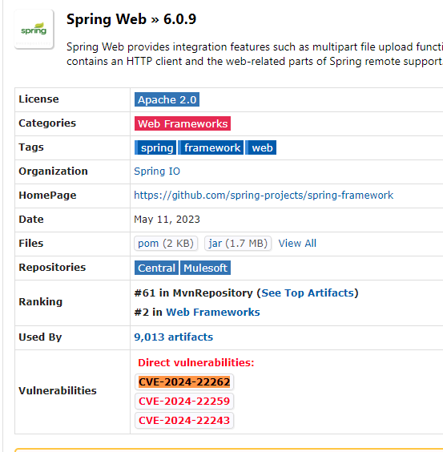
6.0.18
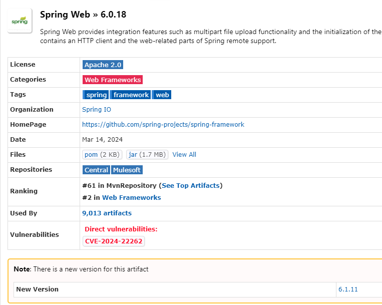
6.0.19
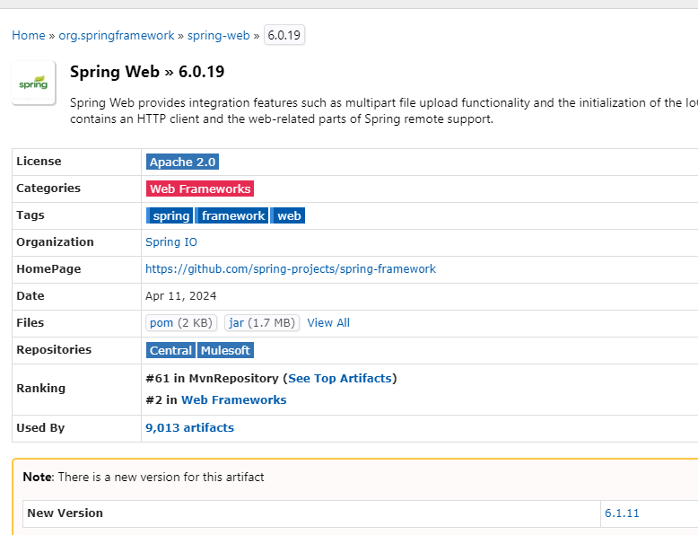
```json


{
"DependencyName": "spring-web-6.0.9.jar",
"Description": "Spring Web",
"License": "Apache License, Version 2.0: https://www.apache.org/licenses/LICENSE-2.0",
"Md5": "8f6decc9821673e04d6c86ba7e98e1ec",
"Sha1": "2837dec8a75ecfdad367d6c30ce9cbdfc89caa7a",
"Identifiers": "pkg:maven/org.springframework/spring-web@6.0.9",
"CPE": "cpe:2.3:a:pivotal_software:spring_framework:6.0.9:*:*:*:*:*:*:*, cpe:2.3:a:springsource:spring_framework:6.0.9:*:*:*:*:*:*:*, cpe:2.3:a:vmware:spring_framework:6.0.9:*:*:*:*:*:*:*, cpe:2.3:a:web_project:web:6.0.9:*:*:*:*:*:*:*",
"CVE": "CVE-2024-22243",
"CWE": "CWE-20 Improper Input Validation",
"Vulnerability": "Applications that use UriComponentsBuilder to parse an externally provided URL (e.g. through a query parameter) AND perform validation checks on the host of the parsed URL may be vulnerable to a  open redirect https://cwe.mitre.org/data/definitions/601.html  attack or to a SSRF attack if the URL is used after passing validation checks.   Sonatype's research suggests that this CVE's details differ from those defined at NVD. See https://ossindex.sonatype.org/vulnerability/CVE-2024-22243 for details",
"Source": "OSSINDEX",
"CVSSv2_Severity": "",
"CVSSv2_Score": "",
"CVSSv2": "",
"CVSSv3_BaseSeverity": "HIGH",
"CVSSv3_BaseScore": "8.100000381469727",
"CVSSv3": "CVSS:3.1/AV:N/AC:L/PR:N/UI:R/S:U/C:H/I:H/A:N",
"CPE Confidence": "HIGH",
"Evidence Count": "35",
"VendorProject": "",
"Product": "",
"Name": "",
"DateAdded": "",
"ShortDescription": "",
"RequiredAction": "",
"DueDate": "",
"Notes": ""
}
```

## spring-webmvc

```json
[
  {
    "C2": "org.springframework",
    "C3": "CVE-2023-34053",
    "C4": "spring-webmvc",
    "C5": "6.0.9",
    "C6": "6.0.14",
    "C7": "false",
    "C8": "Spring Framework vulnerable to denial of service",
    "C9": "HIGH",
    "C10": "1",
    "C11": ""
  }
]
```
6.0.9
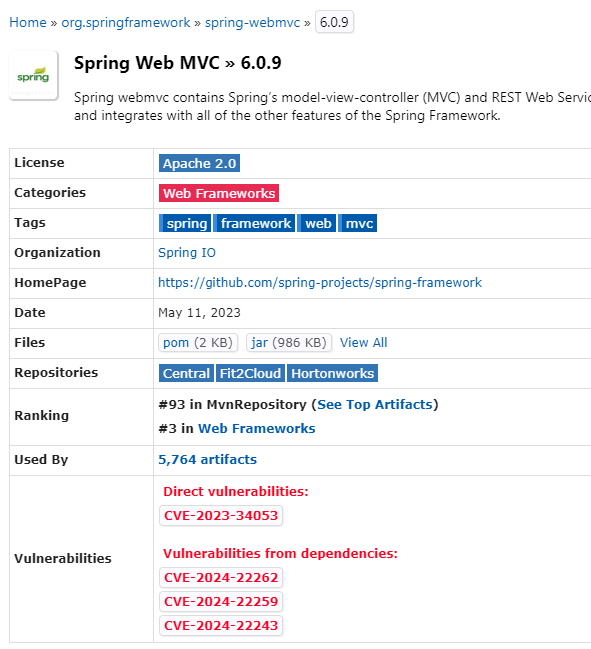
6.0.14
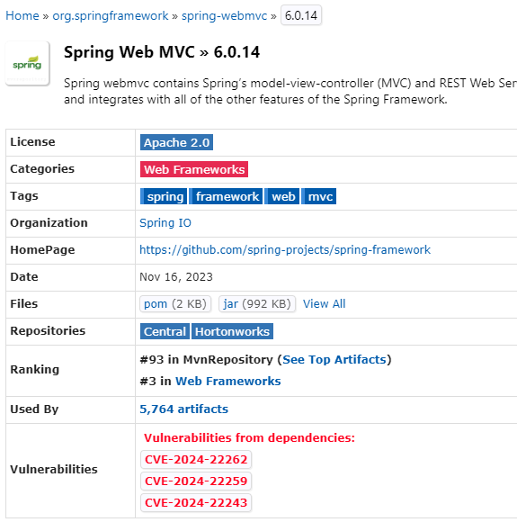

## spring-boot-actuator

3.0.7
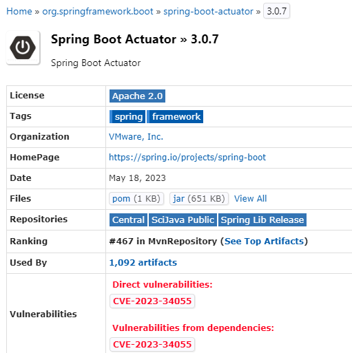
3.0.13
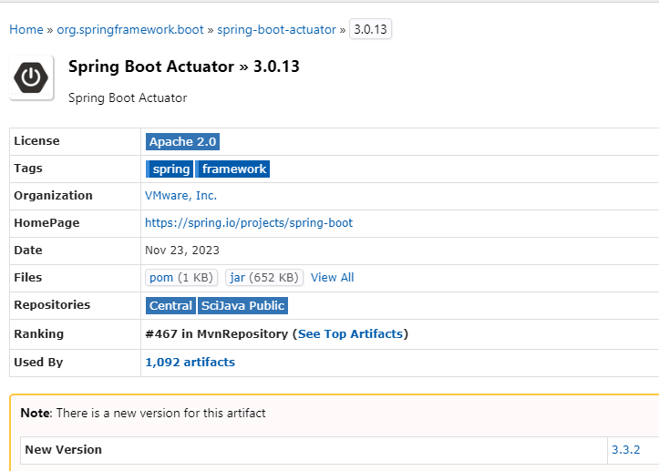

## tomcat-embed-core

10.1.8
- CVE-2024-34750
- CVE-2024-24549
- CVE-2023-46589
- CVE-2023-45648
- CVE-2023-44487
- CVE-2023-42795
- CVE-2023-41080
- CVE-2023-34981

- 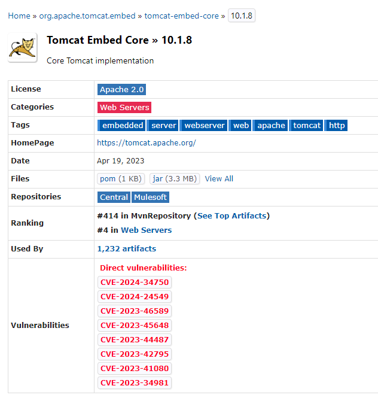

10.1.9
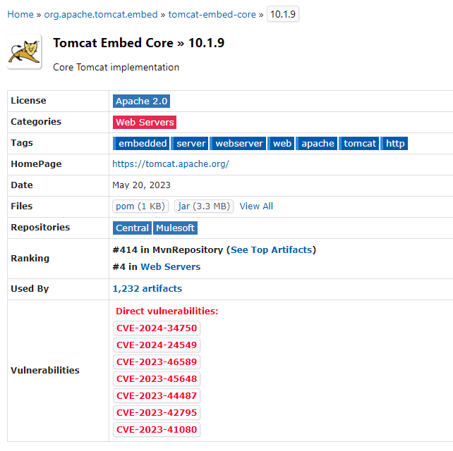

- CVE-2024-34750
- CVE-2024-24549
- CVE-2023-46589
- CVE-2023-45648
- CVE-2023-44487
- CVE-2023-42795
- CVE-2023-41080

10.1.13
- CVE-2024-34750
- CVE-2024-24549
- CVE-2023-46589
- CVE-2023-45648
- CVE-2023-44487
- CVE-2023-42795

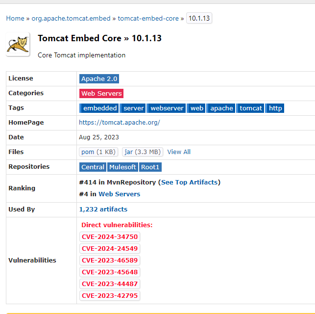

10.1.14
- CVE-2024-34750
- CVE-2024-24549
- CVE-2023-46589
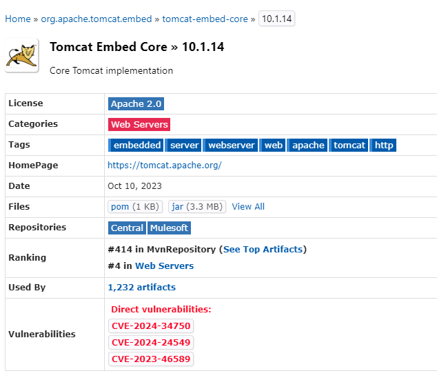

10.1.16
- CVE-2024-24549
- CVE-2024-34750

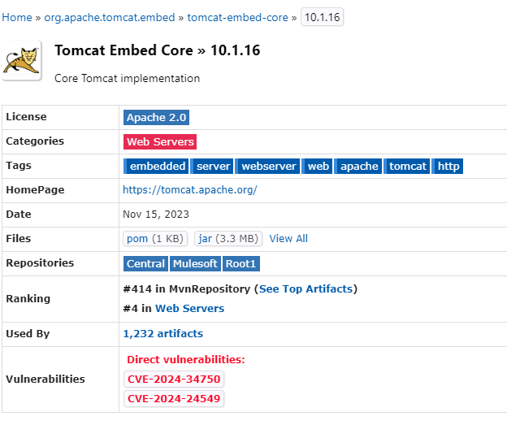

10.1.19
- CVE-2024-34750
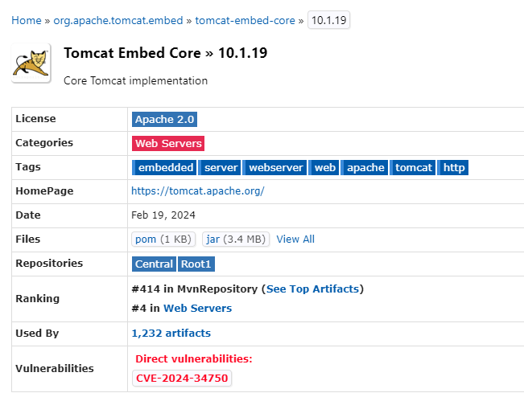

10.1.25

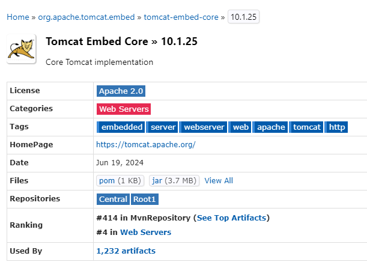

## tomcat-embed-websocket
10.1.8
- CVE-2024-23672
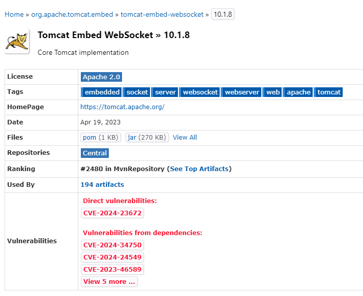
- 10.1.19
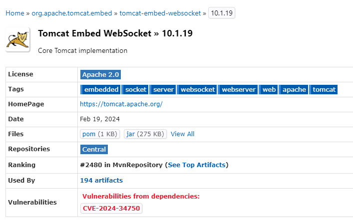

## logback-core
1.4.7
- CVE-2023-6378
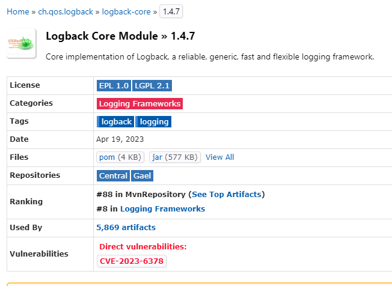
1.4.12
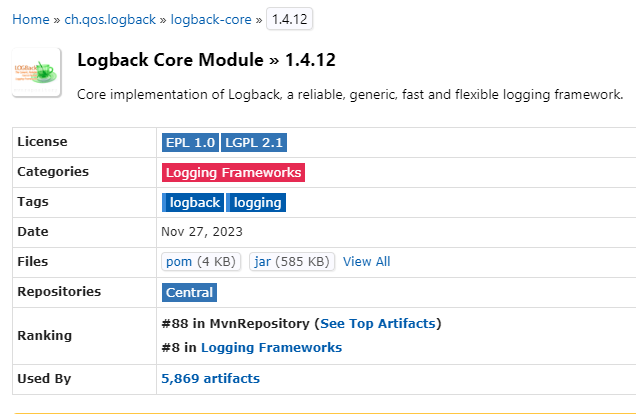

## logback-classic
1.4.7
- CVE-2023-6378
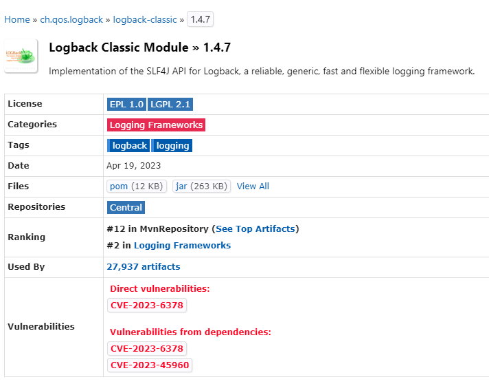

1.4.12
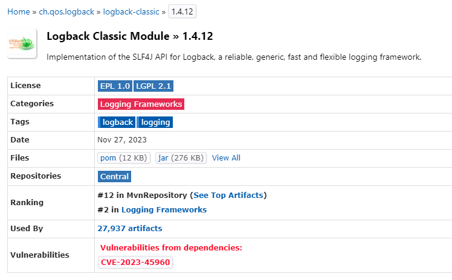


## snakeyaml

1.33

- CVE-2022-1471
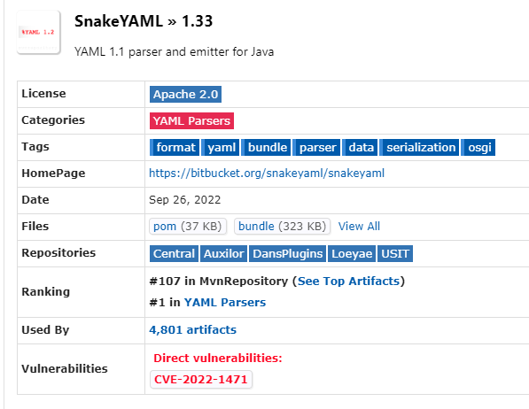

2.0
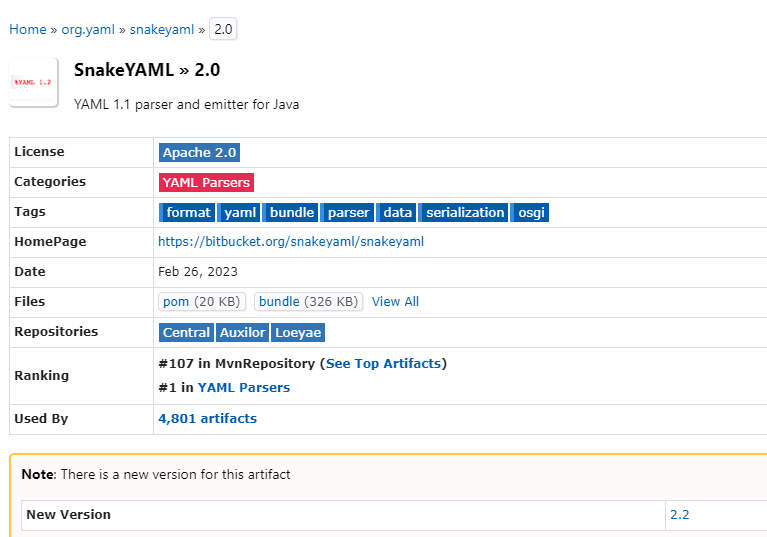